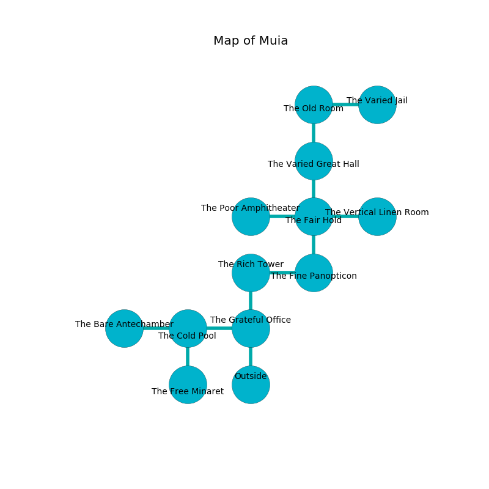

%Ruin Dogs

##Muia
###Overview
Muia is located under an alien city. Some areas of it are inaccessible. The ruin is collapsing slowly. It is occupied by Sahuagin. Willard Boyce The Interfering, a Druid is here. The Sahuagin have been charmed by Willard Boyce The Interfering. He  is trying to exploit [The Memorable Resort](#The-Memorable-Resort). 

###Artifact
####The Memorable Resort

The Memorable Resort has the form of a sharp gem. Power incinerates away from it. When rubbed it becomes a force of destiny. 

###Locations

####the grateful office
There are a Saber-Toothed Tiger and a Panther here. The floor is glossy. Gray mushrooms are growing from the ceiling. 

There is an engraving on the floor written in Sahuagin Script. 

> You are joyful
>
> deaf and empty
>
> A bone is a rebel
>
> yet cautious
>
> ever conservative
>
> visible, separate, fine
>
> We are corrupted
>
> ever rich
>
> poor, historical, childish
>
> You are joyful
>

* To the west a flooded walkway connects to [the cold pool](#the-cold-pool).
* To the north a dripping pathway connects to [the rich tower](#the-rich-tower).
* To the south is the entrance.

####the rich tower
The floor is cluttered with rocks. Green lichens are growing in broken urns. The crystal walls are scratched. 

* To the east a torchlit hallway opens to [the fine panopticon](#the-fine-panopticon).
* To the south a dripping pathway connects to [the grateful office](#the-grateful-office).

####the cold pool
There are a Bugbear and a Worg here. 

* To the west a torchlit path connects to [the bare antechamber](#the-bare-antechamber).
* To the east a flooded walkway connects to [the grateful office](#the-grateful-office).
* To the south a twisted threshold leads to [the free minaret](#the-free-minaret).

####the bare antechamber
Green mushrooms are swaying in a patch on the floor. The floor is flooded with three inch deep lukewarm water. 

* To the east a torchlit path opens to [the cold pool](#the-cold-pool).

####the fine panopticon
There is a trap here. When activated, a magical rune will extend a spring loaded spear. Yellow razorgrass is growing in cracks in the floor. 

* There is a sponge here.
* To the west a torchlit hallway opens to [the rich tower](#the-rich-tower).
* To the north a long path leads to [the fair hold](#the-fair-hold).

####the fair hold
The brick walls are pristine. The floor is bloodstained. 

* There is a snake here.
* There is a dagger here.
* [The Memorable Resort](#The-Memorable-Resort) is here.
* To the west a small cavern connects to [the poor amphitheater](#the-poor-amphitheater).
* To the east a dark hall opens to [the vertical linen room](#the-vertical-linen-room).
* To the north a windy cave leads to [the varied great hall](#the-varied-great-hall).
* To the south a long path connects to [the fine panopticon](#the-fine-panopticon).

####the poor amphitheater
The air tastes like tea here. There are a Goblin, a Goat, a Spider, and a Wererat here. The floor is cluttered with rocks. 

* There is a mug here.
* [Willard Boyce The Interfering](#Willard-Boyce-The-Interfering) is here.
* To the east a small cavern connects to [the fair hold](#the-fair-hold).

####the varied great hall
The crystal walls are bloodstained. The floor is glossy. There is a Peryton here. White lichens are decaying from the ceiling. 

There is an engraving on a stone written in Sahuagin Script. 

> I am lost in Muia.
>

* There is a key here.
* There is a whistle here.
* To the north a hazy walkway leads to [the old room](#the-old-room).
* To the south a windy cave opens to [the fair hold](#the-fair-hold).

####the old room
Red moss is decaying in cracks in the floor. There are a Tridrone and a Minotaur Skeleton here. 

* There is a carriage here.
* To the east a long opening connects to [the varied jail](#the-varied-jail).
* To the south a hazy walkway connects to [the varied great hall](#the-varied-great-hall).

####the free minaret
The floor is sticky. The air smells like oak wood here. 

There is an engraving on the floor written in common. 

> [The Memorable Resort](#The-Memorable-Resort)
>
> characteristic and lazy
>
> favorable and rough
>
> [The Memorable Resort](#The-Memorable-Resort)
>

* To the north a twisted threshold opens to [the cold pool](#the-cold-pool).

####the varied jail
The air smells like moss here. 

* To the west a long opening connects to [the old room](#the-old-room).

####the vertical linen room
Blue ferns are swaying in broken urns. There is a trap here. When activated, a tripwire will launch a ceiling pendulum. There are a Blink Dog and a Lizardfolk Shaman here. The air tastes like clary sage here. The floor is glossy. The stone walls are unsettled. 

* To the west a dark hall connects to [the fair hold](#the-fair-hold).

