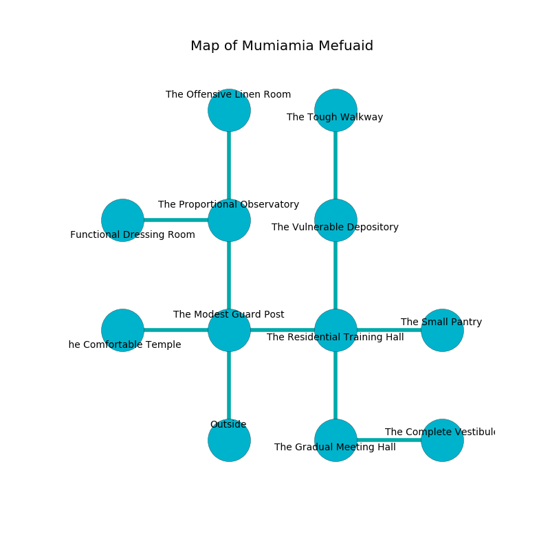

%Ruin Dogs

##Mumiamia Mefuaid
###Overview
Mumiamia Mefuaid is constructed on an alien city. Some rooms of it are unbearably cold. A battle between raiders is happening outside. It is occupied by Yuan-Ti. Sonny Mendoza The Moody, an Orc Eye of Gruumsh is here. The Yuan-Ti are the minions of Sonny Mendoza The Moody. He  is trying to understand [The Academic Experience](#The-Academic-Experience). 

###Artifact
####The Academic Experience

The Academic Experience has the form of a hard sphere. It smells like opoponax. When held it flies into the air. 

###Locations

####the modest guard post
The floor is cluttered with ashes. There is a trap here. When activated, a magical proximity detector will fire a scything blade. There are two Yuan-Ti Purebloods here. The Yuan-Ti are drunk. 

There is an engraving on the wall written in Yuan-Ti Script. 

> I am lost in Mumiamia Mefuaid.
>

* There is a belt here.
* To the west a dripping path leads to [the comfortable temple](#the-comfortable-temple).
* To the east a long walkway connects to [the residential training hall](#the-residential-training-hall).
* To the north a hazy artery leads to [the proportional observatory](#the-proportional-observatory).
* To the south is the entrance.

####the comfortable temple
The air tastes like valerian root here. Blue lichens are sprouting in a patch on the floor. The floor is cluttered with bones. There are a Thug, a Spined Devil, a Brass Dragon Wyrmling, and a Flying Sword here. 

There is an engraving on a tablet written in common. 

> Oh my fate is sadistic
>
> enjoyable, mobile, optimistic
>
> it is never open
>
> cruelty is optimistic
>

* To the east a dripping path connects to [the modest guard post](#the-modest-guard-post).

####the proportional observatory
The air smells like mandarin here. There are two Yuan-Ti Purebloods here. One of the Yuan-Ti is working a mechanism that can flood the room. 

* [Sonny Mendoza The Moody](#Sonny-Mendoza-The-Moody) is here.
* To the west a torchlit path connects to [the functional dressing room](#the-functional-dressing-room).
* To the north a dark gap leads to [the offensive linen room](#the-offensive-linen-room).
* To the south a hazy artery leads to [the modest guard post](#the-modest-guard-post).

####the residential training hall
The crystal walls are bloodstained. Gray moss is growing from the ceiling. There are two Yuan-Ti Purebloods here. The air smells like rain here. One of the Yuan-Ti is on watch, the rest are fighting amongst themselves. 

* To the west a long walkway opens to [the modest guard post](#the-modest-guard-post).
* To the east a small gap opens to [the small pantry](#the-small-pantry).
* To the north a dark cavern leads to [the vulnerable depository](#the-vulnerable-depository).
* To the south a long opening leads to [the gradual meeting hall](#the-gradual-meeting-hall).

####the offensive linen room
The air smells like camphoreous here. The metallic walls are unsettled. 

* To the south a dark gap opens to [the proportional observatory](#the-proportional-observatory).

####the vulnerable depository
There are a Hippogriff, a Gas Spore, a Bat, and a Jackalwere here. 

There is an engraving on the floor written in Yuan-Ti Script. 

> Oh my fate is poor
>
> gregarious, junior, obscure
>
> diplomatic, cheerful, cool
>
> hope is cruel
>

* There is a bucket here.
* [The Academic Experience](#The-Academic-Experience) is here.
* To the north a long passageway leads to [the tough walkway](#the-tough-walkway).
* To the south a dark cavern leads to [the residential training hall](#the-residential-training-hall).

####the functional dressing room
The air tastes like capers here. The concrete walls are caving in. There are a Spider and a Green Dragon Wyrmling here. 

* There is a sock here.
* To the east a torchlit path connects to [the proportional observatory](#the-proportional-observatory).

####the gradual meeting hall
There are a Lion and a Thri-Kreen here. Green moss is growing in a patch on the floor. The air tastes like cognac here. The floor is cluttered with shells. The glass walls are covered in mold. 

* To the east a torchlit passageway opens to [the complete vestibule](#the-complete-vestibule).
* To the north a long opening opens to [the residential training hall](#the-residential-training-hall).

####the complete vestibule
Yellow ferns are swaying in a patch on the floor. 

* To the west a torchlit passageway opens to [the gradual meeting hall](#the-gradual-meeting-hall).

####the small pantry
There are two Yuan-Ti Purebloods here. The brick walls are scratched. The air smells like potato chip here. The floor is flooded with one inch deep lukewarm water. The Yuan-Ti are berserk with rage. 

There is an engraving on a monolith written in Yuan-Ti Script. 

> I found Mumiamia Mefuaid.
>

* To the west a small gap leads to [the residential training hall](#the-residential-training-hall).

####the tough walkway
There are a Quasit, a Goblin Boss, and a Swarm of Insects here. The wooden walls are covered in mold. White moss is sprouting in a patch on the floor. The air tastes like humus here. 

* To the south a long passageway opens to [the vulnerable depository](#the-vulnerable-depository).

