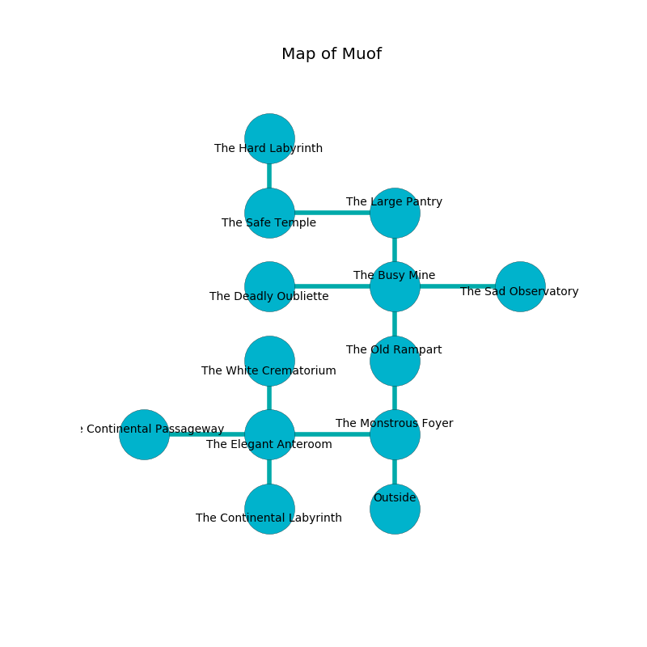

%Ruin Dogs

##Muof
###Overview
Muof is located under a giant plain. Regions of it are corrupted. A blizzard is happening outside. It is occupied by Kobolds. Burt Dutton The Compulsive, a Veteran is here. The Kobolds are ruled by Burt Dutton The Compulsive. He  is trying to destroy [Emmuomcabamd](#Emmuomcabamd). 

###Artifact
####Emmuomcabamd

Emmuomcabamd looks like a cold crystal. When rubbed it levitates those nearby. 

###Locations

####the monstrous foyer
There is a trap here. When activated, a magical rune will collapse a column. There are six Winged Kobolds and five Kobolds here. The floor is cluttered with bones. White mushrooms are sprouting from the walls. The air tastes like leek here. One of the Kobolds is on watch, the rest are caring for babies. 

* To the west a small passageway leads to [the elegant anteroom](#the-elegant-anteroom).
* To the north a small pathway leads to [the old rampart](#the-old-rampart).
* To the south is the entrance.

####the old rampart
The air tastes like powder here. Yellow mushrooms are swaying in cracks in the floor. There are a Drow, a Myconid Adult, a Giant Lizard, a Bugbear, a Mule, and a Bat here. 

* To the north a small threshold opens to [the busy mine](#the-busy-mine).
* To the south a small pathway opens to [the monstrous foyer](#the-monstrous-foyer).

####the busy mine
There is a Will-O’-Wisp here. White razorgrass is growing in broken urns. The air tastes like meat here. 

* To the west a narrow artery leads to [the deadly oubliette](#the-deadly-oubliette).
* To the east a narrow hall leads to [the sad observatory](#the-sad-observatory).
* To the north a narrow cave connects to [the large pantry](#the-large-pantry).
* To the south a small threshold opens to [the old rampart](#the-old-rampart).

####the elegant anteroom
Red ferns are sprouting from the walls. The air smells like tallow here. 

There is an engraving on the wall written in Kobolds Script. 

> Poor me! our fate is poor
>
> strict and pure
>
> subjective, mechanical, industrial
>
> cruelty is premature
>

* [Emmuomcabamd](#Emmuomcabamd) is here.
* [Burt Dutton The Compulsive](#Burt-Dutton-The-Compulsive) is here.
* To the west a narrow passageway opens to [the continental passageway](#the-continental-passageway).
* To the east a small passageway opens to [the monstrous foyer](#the-monstrous-foyer).
* To the north a flooded passageway opens to [the white crematorium](#the-white-crematorium).
* To the south a dark hall leads to [the continental labyrinth](#the-continental-labyrinth).

####the large pantry
The floor is bloodstained. There are five Winged Kobolds and six Kobolds here. The Kobolds are willing to negotiate. 

* There is a whip here.
* To the west a dripping artery opens to [the safe temple](#the-safe-temple).
* To the south a narrow cave connects to [the busy mine](#the-busy-mine).

####the safe temple
Green mushrooms are decaying from the ceiling. The air smells like must here. 

There is an engraving on the ceiling written in Kobolds Script. 

> I am hidden.
>
> I could not try fighting.
>

* To the east a dripping artery opens to [the large pantry](#the-large-pantry).
* To the north a dripping cavern opens to [the hard labyrinth](#the-hard-labyrinth).

####the deadly oubliette
There are five Winged Kobolds and six Kobolds here. The floor is glossy. The glass walls are pristine. The air tastes like toast here. Yellow ferns are sprouting in a patch on the floor. The Kobolds are performing a ritual. If not interrupted, the ruin dogs will be weakened. 

* To the east a narrow artery connects to [the busy mine](#the-busy-mine).

####the white crematorium
The brick walls are caving in. There are six Winged Kobolds and five Kobolds here. The Kobolds are performing a ritual. If not interrupted, the Kobolds will become more powerful. 

There is an engraving on the floor written in common. 

> Leave now.
>

* There is a skull here.
* To the south a flooded passageway connects to [the elegant anteroom](#the-elegant-anteroom).

####the continental labyrinth
There are seven Winged Kobolds and three Kobolds here. Green lichens are sprouting from the walls. The brick walls are covered in mold. One of the Kobolds is pointing a ballista at the entrance. 

There is an engraving on a tablet written in common. 

> I am free.
>

* There is a rod here.
* There is a bird here.
* There is a brick here.
* There is a cart here.
* To the north a dark hall opens to [the elegant anteroom](#the-elegant-anteroom).

####the hard labyrinth
The air tastes like fruit here. The concrete walls are pristine. Red mushrooms are sprouting in cracks in the floor. There are six Winged Kobolds and four Kobolds here. The Kobolds are performing a ritual. If not interrupted, the Kobolds will become more powerful. 

* To the south a dripping cavern opens to [the safe temple](#the-safe-temple).

####the sad observatory
The air smells like tangerine here. There are a Dust Mephit and a Berserker here. Green razorgrass is swaying in broken urns. The stone walls are scratched. The floor is sticky. 

* To the west a narrow hall connects to [the busy mine](#the-busy-mine).

####the continental passageway
Yellow moss is decaying in cracks in the floor. The floor is bloodstained. There is a Saber-Toothed Tiger here. 

There is an engraving on the wall written in common. 

> A trap ahead.
>

* There is a knot here.
* There is a bowl here.
* To the east a narrow passageway leads to [the elegant anteroom](#the-elegant-anteroom).

