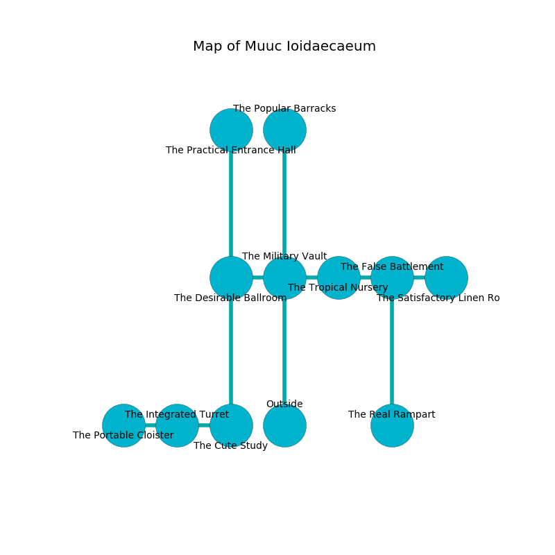

%Ruin Dogs

##Muuc Ioidaecaeum
###Overview
Muuc Ioidaecaeum is constructed on an alien mountain. Parts of Muuc Ioidaecaeum are corrupted. A massive storm is happening outside. It is occupied by Orc. Jude Samson The Bossy, a Bandit Captain is here. The Orc are the minions of Jude Samson The Bossy. She  is founding a new religion. 

###Artifact
####Duwi Cmaac

Duwi Cmaac looks like an opaque prism. Water slides around it. When carried it aids memory. 

###Locations

####the military vault
There are six Orcs here. The floor is glossy. The metallic walls are bloodstained. Gray razorgrass is sprouting from the walls. One of the Orc is working a mechanism that can engulf the room in a fiery blaze. 

There is an engraving on a tablet written in Orc Script. 

> They are frozen
>
> friendly, universal, current
>
> you will be eaten
>

* To the west a torchlit path opens to [the desirable ballroom](#the-desirable-ballroom).
* To the east a flooded cave opens to [the tropical nursery](#the-tropical-nursery).
* To the north a torchlit corridor opens to [the popular barracks](#the-popular-barracks).
* To the south is the entrance.

####the desirable ballroom
The air smells like bread crust here. There are a Veteran and a Piercer here. 

* To the east a torchlit path connects to [the military vault](#the-military-vault).
* To the north a small threshold leads to [the practical entrance hall](#the-practical-entrance-hall).
* To the south a narrow cavern connects to [the cute study](#the-cute-study).

####the popular barracks
The mirrored walls are caving in. 

* To the south a torchlit corridor opens to [the military vault](#the-military-vault).

####the cute study
The floor is sticky. The air tastes like bay here. Green lichens are decaying from the walls. There are six Orcs here. The stone walls are covered in mold. One of the Orc is pointing a ballista at the entrance. 

* To the west a small pathway leads to [the integrated turret](#the-integrated-turret).
* To the north a narrow cavern connects to [the desirable ballroom](#the-desirable-ballroom).

####the integrated turret
The air smells like sweet pea here. There are six Orcs here. The Orc are performing a ritual. If not interrupted, [Jude Samson](#Jude-Samson) will be magically alarmed. 

There is an engraving on the wall written in common. 

> O cruel soul
>
> healthy, archaeological, whole
>
> delicate, persistent, educational
>
> sadness is occupational
>

* [Jude Samson The Bossy](#Jude-Samson-The-Bossy) is here.
* To the west a windy cave opens to [the portable cloister](#the-portable-cloister).
* To the east a small pathway leads to [the cute study](#the-cute-study).

####the tropical nursery
The floor is glossy. White ferns are growing from the ceiling. The metallic walls are pristine. There are six Orcs here. The Orc are feasting. 

There is an engraving on the wall written in common. 

> [Duwi Cmaac](#Duwi-Cmaac)
>
> but never noisy
>
> you are eaten
>

* There is a goat here.
* To the west a flooded cave opens to [the military vault](#the-military-vault).
* To the east a narrow threshold leads to [the false battlement](#the-false-battlement).

####the portable cloister
Red moss is decaying from the ceiling. The floor is sticky. The air tastes like chicken coup here. There are an Azer and a Young Faerie Dragon here. 

There is an engraving on the wall written in common. 

> [Duwi Cmaac](#Duwi-Cmaac)
>
> rough, genuine, obvious
>
> An egg is an attention
>
> content, native, unique
>
> [Duwi Cmaac](#Duwi-Cmaac)
>

* To the east a windy cave opens to [the integrated turret](#the-integrated-turret).

####the false battlement
The air smells like cassia here. The concrete walls are covered in mold. 

There is an engraving on a stone written in common. 

> A cloud is a herd
>
> right, written, childish
>
> invisible and uneasy
>
> A cloud is a herd
>

* There is a salamander here.
* [Duwi Cmaac](#Duwi-Cmaac) is here.
* To the west a narrow threshold leads to [the tropical nursery](#the-tropical-nursery).
* To the east a hazy threshold opens to [the satisfactory linen room](#the-satisfactory-linen-room).
* To the south a narrow cave connects to [the real rampart](#the-real-rampart).

####the practical entrance hall
There are six Orcs here. Green moss is growing from the walls. The air smells like marigold here. The mirrored walls are caving in. If the Orc notice the Ruin Dogs, one of them will retreat and alert [Jude Samson](#Jude-Samson). 

* There is an arch here.
* To the south a small threshold opens to [the desirable ballroom](#the-desirable-ballroom).

####the real rampart
The floor is smooth. The air smells like roasted barley here. 

* To the north a narrow cave leads to [the false battlement](#the-false-battlement).

####the satisfactory linen room
The air tastes like acacia here. Gray ferns are decaying in cracks in the floor. There are a Griffon and an Ogre here. 

There is an engraving on a stone written in common. 

> Dig here.
>

* To the west a hazy threshold connects to [the false battlement](#the-false-battlement).

