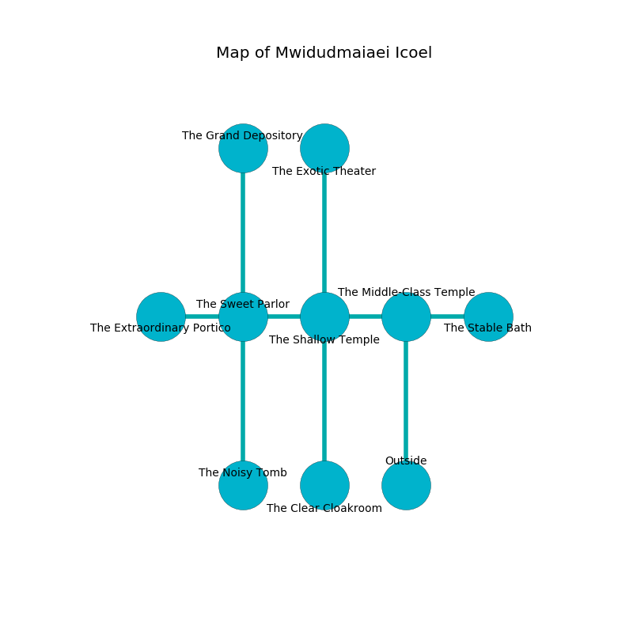

%Ruin Dogs

##Mwidudmaiaei Icoel
###Overview
Mwidudmaiaei Icoel is constructed on a crystal plain. Regions of it are frozen. A solar eclipse is happening outside. It is occupied by Gnolls. Kelvin Robison The Indecisive, a Hobgoblin Captain is here. The Gnolls are battling Kelvin Robison The Indecisive. He  is trying to discover [Aemaedaeedaeua](#Aemaedaeedaeua). 

###Artifact
####Aemaedaeedaeua

Aemaedaeedaeua is a powerful artifact in the shape of a broken crystal. When rubbed it floats in the air. 

###Locations

####the middle-class temple
The air tastes like shrimp here. The glass walls are bloodstained. The floor is bloodstained. 

* To the west a dripping corridor connects to [the shallow temple](#the-shallow-temple).
* To the east a windy cave opens to [the stable bath](#the-stable-bath).
* To the south is the entrance.

####the shallow temple
There is a Gnoll Pack Lord here. The air smells like tansy here. The floor is cluttered with bones. The Gnoll Pack Lord is defending this room from intruders. 

There is an engraving on the floor written in common. 

> All of us are damned
>
> yet never ethnic
>
> All of us are damned
>

* To the west a torchlit hallway connects to [the sweet parlor](#the-sweet-parlor).
* To the east a dripping corridor leads to [the middle-class temple](#the-middle-class-temple).
* To the north a long artery opens to [the exotic theater](#the-exotic-theater).
* To the south a small pathway opens to [the clear cloakroom](#the-clear-cloakroom).

####the exotic theater
The floor is bloodstained. The metallic walls are scratched. 

* To the south a long artery opens to [the shallow temple](#the-shallow-temple).

####the stable bath
The stone walls are scratched. White lichens are sprouting in cracks in the floor. 

* To the west a windy cave connects to [the middle-class temple](#the-middle-class-temple).

####the sweet parlor
There is a trap here. When activated, a magical sound detector will collapse a column. The glass walls are ruined. The air smells like seashore here. The floor is sticky. White razorgrass is growing from the walls. 

* [Aemaedaeedaeua](#Aemaedaeedaeua) is here.
* To the west a narrow hallway connects to [the extraordinary portico](#the-extraordinary-portico).
* To the east a torchlit hallway opens to [the shallow temple](#the-shallow-temple).
* To the north a twisted opening connects to [the grand depository](#the-grand-depository).
* To the south a torchlit cavern leads to [the noisy tomb](#the-noisy-tomb).

####the clear cloakroom
The metallic walls are ruined. Yellow lichens are growing in broken urns. There is a Gnoll Pack Lord here. The floor is cluttered with bones. The Gnoll Pack Lord is willing to fight to the death. 

* To the north a small pathway leads to [the shallow temple](#the-shallow-temple).

####the grand depository
The stone walls are covered in mold. There are a Warhorse, a Yuan-Ti Pureblood, and a Magmin here. 

There is an engraving on a stone written in common. 

> Poor me! sad fate
>
> dirty, unexpected, great
>
> mutual and retired
>
> cruelty is straight
>

* To the south a twisted opening opens to [the sweet parlor](#the-sweet-parlor).

####the noisy tomb
There are an Ankheg, a Kobold, and a Goblin Boss here. 

There is an engraving on the wall written in Gnolls Script. 

> O! meak you
>
> it is never automatic
>
> encouraging, viable, new
>
> everything is democratic
>

* [Kelvin Robison The Indecisive](#Kelvin-Robison-The-Indecisive) is here.
* To the north a torchlit cavern connects to [the sweet parlor](#the-sweet-parlor).

####the extraordinary portico
There is a trap here. When activated, a magical rune will shoot a lightning bolt. The floor is sticky. Blue razorgrass is sprouting from the walls. 

* There is a horse here.
* There is a plate here.
* To the east a narrow hallway leads to [the sweet parlor](#the-sweet-parlor).

