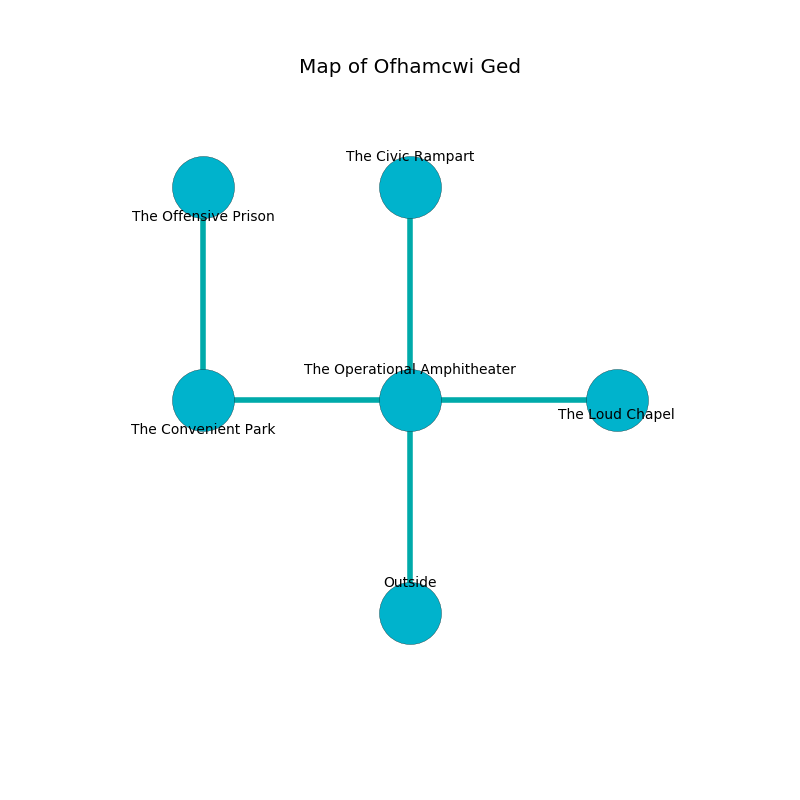

%Ruin Dogs

##Ofhamcwi Ged
###Overview
Ofhamcwi Ged is located on an alien tree. Some rooms of it are somewhat cold. The ruin is burning. It is occupied by Sahuagins. Jolene Boyce The Changeable, a Quaggoth Thonot is here. The Sahuagins are the slaves of Jolene Boyce The Changeable. She  is founding a new religion. 

###Artifact
####Cheaeb Maehmd

Cheaeb Maehmd has the form of a mushy monument. When smelled it flies into the air. 

###Locations

####the operational amphitheater
The floor is bloodstained. There are two Sahuagin Priestesses here. The Sahuagins are meditating. 

* [Cheaeb Maehmd](#Cheaeb-Maehmd) is here.
* [Jolene Boyce The Changeable](#Jolene-Boyce-The-Changeable) is here.
* To the west a small path connects to [the convenient park](#the-convenient-park).
* To the east a dark hallway connects to [the loud chapel](#the-loud-chapel).
* To the north a narrow threshold connects to [the civic rampart](#the-civic-rampart).
* To the south is the entrance.

####the convenient park

* To the east a small path leads to [the operational amphitheater](#the-operational-amphitheater).
* To the north a windy artery leads to [the offensive prison](#the-offensive-prison).

####the civic rampart
The concrete walls are unsettled. The air smells like tequila here. 

* To the south a narrow threshold opens to [the operational amphitheater](#the-operational-amphitheater).

####the offensive prison
Red moss is swaying from the ceiling. 

* To the south a windy artery opens to [the convenient park](#the-convenient-park).

####the loud chapel
There are a Sprite, a Swarm of Rats, a Hyena, a Shrieker, a Quaggoth Spore Servant, and an Owlbear here. The air smells like pine here. The obsidion walls are pristine. The floor is glossy. Yellow ferns are decaying from the ceiling. 

* To the west a dark hallway opens to [the operational amphitheater](#the-operational-amphitheater).

