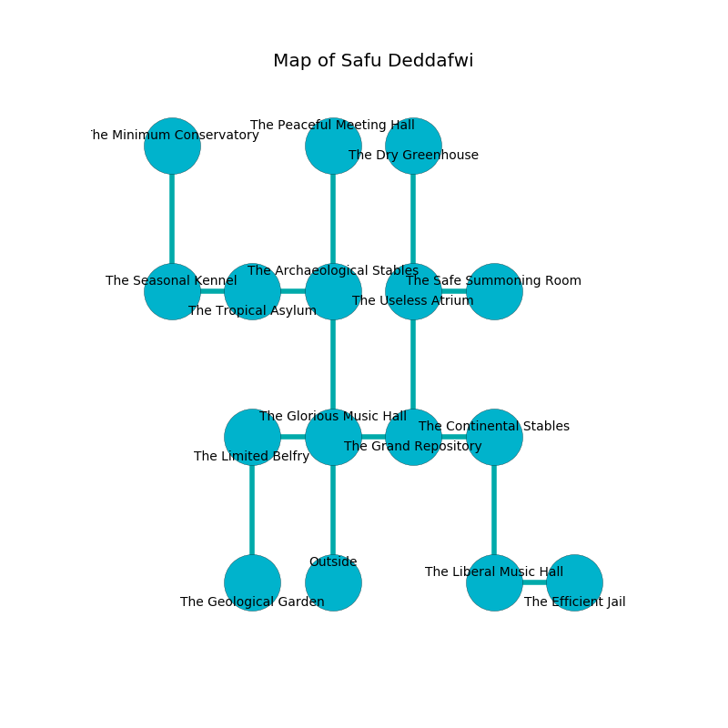

%Ruin Dogs

##Safu Deddafwi
###Overview
Safu Deddafwi is located under an alien mountain. Regions of Safu Deddafwi are corrupted. A lunar eclipse is happening outside. It is occupied by Myconids. Carly Bolduc The Sarcastic, a Fire Giant is here. The Myconids have been charmed by Carly Bolduc The Sarcastic. She  is founding a new religion. 

###Artifact
####Haehmd Aebeha

Haehmd Aebeha has the form of a glassy crystal. When gazed upon it destroys itself. 

###Locations

####the glorious music hall
The air smells like geranium here. Red lichens are swaying in a patch on the floor. The brick walls are scratched. 

* To the west a narrow corridor opens to [the limited belfry](#the-limited-belfry).
* To the east a flooded passageway opens to [the grand repository](#the-grand-repository).
* To the north a narrow cave leads to [the archaeological stables](#the-archaeological-stables).
* To the south is the entrance.

####the grand repository
The obsidion walls are scratched. There are four Myconid Sovereigns and three Myconid Adults here. The air tastes like storax here. The floor is smooth. The Myconids are sleeping. 

There is an engraving on a monolith written in Myconids Script. 

> Oh my life is woe
>
> occupational and low
>
> ample, interesting, talented
>
> death is low
>

* There is an orb here.
* There is a wheel here.
* To the west a flooded passageway leads to [the glorious music hall](#the-glorious-music-hall).
* To the east a dripping corridor opens to [the continental stables](#the-continental-stables).
* To the north a torchlit pathway opens to [the useless atrium](#the-useless-atrium).

####the archaeological stables
The brick walls are bloodstained. 

* To the west a twisted passageway opens to [the tropical asylum](#the-tropical-asylum).
* To the north a torchlit pathway connects to [the peaceful meeting hall](#the-peaceful-meeting-hall).
* To the south a narrow cave opens to [the glorious music hall](#the-glorious-music-hall).

####the continental stables

* [Carly Bolduc The Sarcastic](#Carly-Bolduc-The-Sarcastic) is here.
* To the west a dripping corridor leads to [the grand repository](#the-grand-repository).
* To the south a dripping pathway leads to [the liberal music hall](#the-liberal-music-hall).

####the useless atrium
Green ferns are decaying in cracks in the floor. There are a Tiger, an Owlbear, an Ettercap, and a Shadow Demon here. The floor is sticky. The glass walls are caving in. The air smells like lily of the valley here. 

* To the east a dripping pathway opens to [the safe summoning room](#the-safe-summoning-room).
* To the north a twisted pathway opens to [the dry greenhouse](#the-dry-greenhouse).
* To the south a torchlit pathway opens to [the grand repository](#the-grand-repository).

####the tropical asylum
The air tastes like currant here. 

* To the west a flooded corridor opens to [the seasonal kennel](#the-seasonal-kennel).
* To the east a twisted passageway opens to [the archaeological stables](#the-archaeological-stables).

####the limited belfry
The air smells like verbena here. The floor is cluttered with broken glass. There are a Young Brass Dragon and a Half-Red Dragon Veteran here. There is a trap here. When activated, a magical rune will blast flames. 

There is an engraving on a monolith written in Myconids Script. 

> [Haehmd Aebeha](#Haehmd-Aebeha)
>
> honest, compatible, musical
>
> but never meaningful
>
> due and tired
>
> [Haehmd Aebeha](#Haehmd-Aebeha)
>
> statistical and acceptable
>
> generous and optimistic
>
> yet accessible
>
> They are cursed
>
> molecular, full-time, fashionable
>
> you must never be returned
>

* To the east a narrow corridor connects to [the glorious music hall](#the-glorious-music-hall).
* To the south a hazy artery leads to [the geological garden](#the-geological-garden).

####the dry greenhouse
The air smells like honey here. Green lichens are sprouting from the walls. 

There is an engraving on a tablet written in common. 

> I found Safu Deddafwi.
>
> Leave now.
>

* To the south a twisted pathway opens to [the useless atrium](#the-useless-atrium).

####the peaceful meeting hall
The floor is smooth. Blue lichens are swaying in a patch on the floor. The brick walls are covered in mold. There are four Myconid Sovereigns and two Myconid Adults here. The Myconids are willing to negotiate. 

There is an engraving on a stone written in Myconids Script. 

> All of us are sorrowful
>
> close and acute
>
> first and thick
>
> All of us are sorrowful
>

* To the south a torchlit pathway leads to [the archaeological stables](#the-archaeological-stables).

####the geological garden
The floor is smooth. 

There is an engraving on a tablet written in common. 

> I thought about giving up.
>

* There is a flag here.
* To the north a hazy artery opens to [the limited belfry](#the-limited-belfry).

####the seasonal kennel

* To the east a flooded corridor connects to [the tropical asylum](#the-tropical-asylum).
* To the north a dripping pathway leads to [the minimum conservatory](#the-minimum-conservatory).

####the minimum conservatory
The air tastes like pomegranate here. There are a Pony, a Merfolk, a Giant Boar, a Giant Shark, a Thri-Kreen, and a Quadrone here. There is a trap here. When activated, a magical proximity detector will make the ceiling slowly lower. Gray lichens are decaying from the ceiling. 

* To the south a dripping pathway opens to [the seasonal kennel](#the-seasonal-kennel).

####the liberal music hall
The floor is sticky. The air tastes like humus here. 

There is an engraving on the floor written in Myconids Script. 

> I was injured in Safu Deddafwi.
>
> I could not try cowering.
>

* [Haehmd Aebeha](#Haehmd-Aebeha) is here.
* To the east a dark corridor connects to [the efficient jail](#the-efficient-jail).
* To the north a dripping pathway connects to [the continental stables](#the-continental-stables).

####the safe summoning room
The air smells like sawdust here. There is a trap here. When activated, a magical sound detector will fire a net. The crystal walls are caving in. Blue mushrooms are growing in cracks in the floor. 

* There is a basin here.
* There is a knot here.
* To the west a dripping pathway leads to [the useless atrium](#the-useless-atrium).

####the efficient jail
Yellow razorgrass is sprouting in a patch on the floor. There are a Chasme, a Gnoll, a Shadow, and a Young Remorhaz here. The floor is flooded with one inch deep scalding water. 

* To the west a dark corridor opens to [the liberal music hall](#the-liberal-music-hall).

