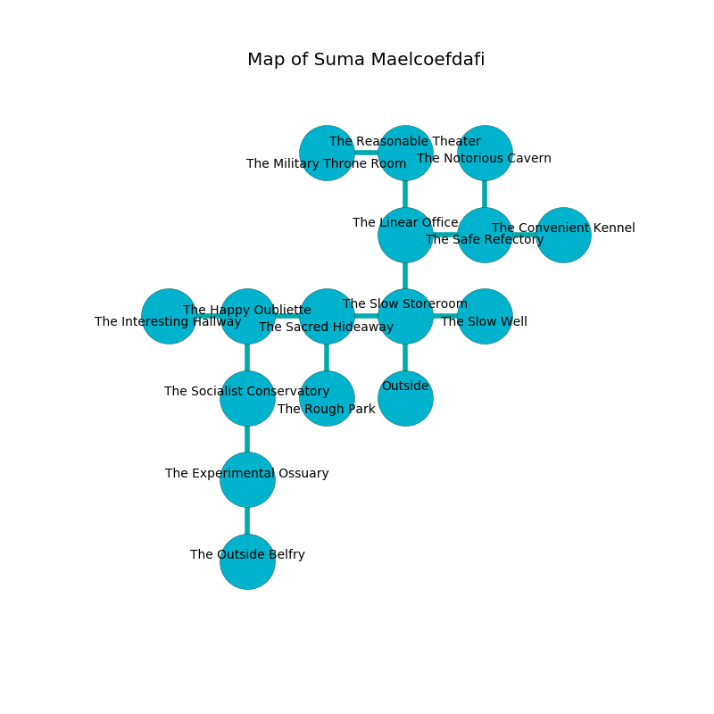

%Ruin Dogs

##Suma Maelcoefdafi
###Overview
Suma Maelcoefdafi is located in a spikey rift. Some rooms of it are flooded. The ruin is collapsing slowly. It is occupied by Harpies. Nadene Delossantos The Careless, a Lizardfolk Shaman is here. The Harpies are ruled by Nadene Delossantos The Careless. She  is trying to use [Baecfudmuma Cedaem](#Baecfudmuma-Cedaem). 

###Artifact
####Baecfudmuma Cedaem

Baecfudmuma Cedaem is a powerful artifact in the shape of a glassy blade. Water incinerates from it. It smells like leather. When gazed upon it glows with an eerie light. 

###Locations

####the slow storeroom
There is a trap here. When activated, a pressure plate will open a large pit in the floor. The mirrored walls are caving in. 

* There is a heart here.
* To the west a torchlit cave opens to [the sacred hideaway](#the-sacred-hideaway).
* To the east a hazy walkway leads to [the slow well](#the-slow-well).
* To the north a twisted gap leads to [the linear office](#the-linear-office).
* To the south is the entrance.

####the sacred hideaway
The mirrored walls are bloodstained. 

* There is a fowl here.
* To the west a dark gap leads to [the happy oubliette](#the-happy-oubliette).
* To the east a torchlit cave leads to [the slow storeroom](#the-slow-storeroom).
* To the south a twisted walkway opens to [the rough park](#the-rough-park).

####the linear office
The air smells like black currant here. 

* [Nadene Delossantos The Careless](#Nadene-Delossantos-The-Careless) is here.
* To the east a dark passageway leads to [the safe refectory](#the-safe-refectory).
* To the north a flooded walkway connects to [the reasonable theater](#the-reasonable-theater).
* To the south a twisted gap connects to [the slow storeroom](#the-slow-storeroom).

####the reasonable theater
The floor is glossy. White ferns are decaying in cracks in the floor. 

There is an engraving on a tablet written in common. 

> [Baecfudmuma Cedaem](#Baecfudmuma-Cedaem)
>
> automatic and integrated
>
> A throat is an item
>
> miserable, discreet, superior
>
> white, incredible, prolonged
>
> [Baecfudmuma Cedaem](#Baecfudmuma-Cedaem)
>
> yet never elegant
>

* To the west a hazy path opens to [the military throne room](#the-military-throne-room).
* To the south a flooded walkway connects to [the linear office](#the-linear-office).

####the military throne room
There are three Harpies here. The air tastes like dates here. The crystal walls are ruined. One of the Harpies is on watch, the rest are fighting amongst themselves. 

* To the east a hazy path opens to [the reasonable theater](#the-reasonable-theater).

####the safe refectory
White razorgrass is decaying from the ceiling. There are a Swarm of Rats, a Dust Mephit, a Crab, a Quasit, a Bugbear, and a Flying Sword here. 

There is an engraving on the wall written in Harpies Script. 

> [Baecfudmuma Cedaem](#Baecfudmuma-Cedaem)
>
> sound and enthusiastic
>
> always commercial
>
> All of us are love
>
> rare, sticky, available
>
> ever familiar
>

* To the west a dark passageway connects to [the linear office](#the-linear-office).
* To the east a small walkway leads to [the convenient kennel](#the-convenient-kennel).
* To the north a hazy walkway opens to [the notorious cavern](#the-notorious-cavern).

####the slow well
White lichens are sprouting in a patch on the floor. The air smells like filbert here. The concrete walls are caving in. There are three Harpies here. One of the Harpies is working a mechanism that can lock the exits. 

* To the west a hazy walkway leads to [the slow storeroom](#the-slow-storeroom).

####the rough park
There are a Hobgoblin Captain and a Draft Horse here. The floor is glossy. The air tastes like chicken coup here. The brick walls are bloodstained. 

* To the north a twisted walkway opens to [the sacred hideaway](#the-sacred-hideaway).

####the happy oubliette
There are three Harpies here. The air tastes like tequila here. The concrete walls are scratched. One of the Harpies is on watch, the rest are sleeping. 

* There is a pot here.
* To the west a torchlit path opens to [the interesting hallway](#the-interesting-hallway).
* To the east a dark gap leads to [the sacred hideaway](#the-sacred-hideaway).
* To the south a narrow passageway leads to [the socialist conservatory](#the-socialist-conservatory).

####the socialist conservatory
Gray ferns are swaying from the walls. The floor is flooded with nine inch deep cold water. 

There is an engraving on a stone written in Harpies Script. 

> I am hidden.
>
> Leave at once.
>

* To the north a narrow passageway connects to [the happy oubliette](#the-happy-oubliette).
* To the south a narrow hallway opens to [the experimental ossuary](#the-experimental-ossuary).

####the experimental ossuary
The floor is cluttered with ashes. The air tastes like cedarwood here. The glass walls are unsettled. 

There is an engraving on the wall written in Harpies Script. 

> [Baecfudmuma Cedaem](#Baecfudmuma-Cedaem)
>
> eager and active
>

* [Baecfudmuma Cedaem](#Baecfudmuma-Cedaem) is here.
* To the north a narrow hallway connects to [the socialist conservatory](#the-socialist-conservatory).
* To the south a torchlit cavern connects to [the outside belfry](#the-outside-belfry).

####the notorious cavern
Blue ferns are decaying from the ceiling. The floor is flooded with four inch deep scalding water. There is a Grell here. 

* To the south a hazy walkway leads to [the safe refectory](#the-safe-refectory).

####the convenient kennel
The floor is cluttered with ashes. The crystal walls are unsettled. There are a Swarm of Ravens and a Hell Hound here. 

* To the west a small walkway leads to [the safe refectory](#the-safe-refectory).

####the interesting hallway
There are three Harpies here. If the Harpies notice the Ruin Dogs, one of them will retreat and alert the others. 

There is an engraving on a stone written in common. 

> Poor me! my fate is sadistic
>
> it is always realistic
>
> it is never green
>
> cruelty is clean
>

* To the east a torchlit path opens to [the happy oubliette](#the-happy-oubliette).

####the outside belfry
The floor is sticky. The air smells like linden flower here. Gray mushrooms are sprouting from the ceiling. 

There is an engraving on a stone written in common. 

> O cruel god
>
> it is always odd
>
> closed and ambitious
>
> hope is vicious
>

* To the north a torchlit cavern leads to [the experimental ossuary](#the-experimental-ossuary).

