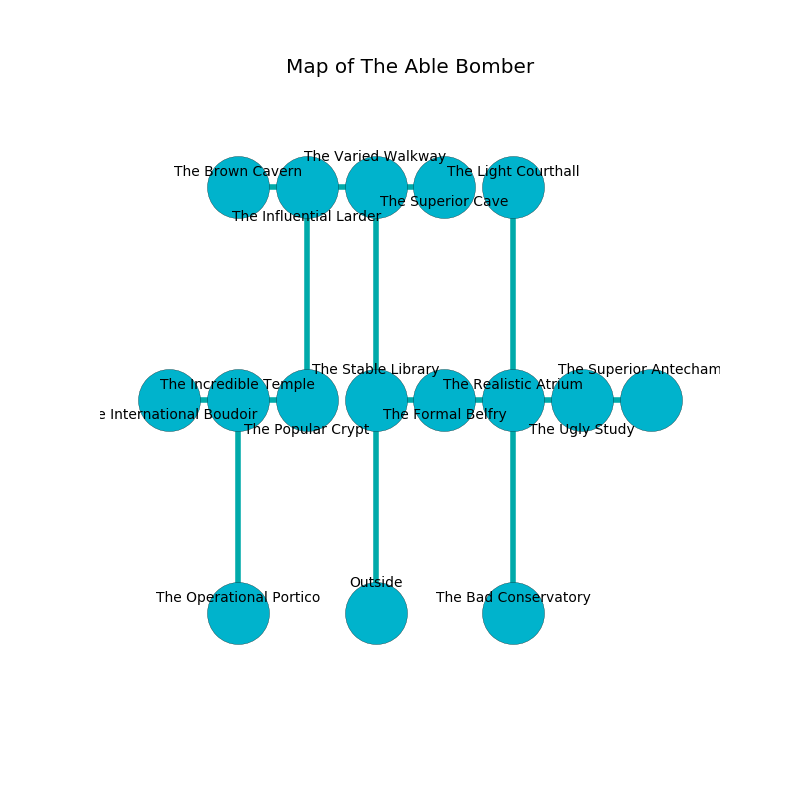

%Ruin Dogs

##The Able Bomber
###Overview
The Able Bomber is located in a giant mountain. Parts of The Able Bomber are cursed. A massive flood is happening outside. It is occupied by Troglodytes. Ilona Mcnally The Big-Headed, a Kuo-Toa Archpriest is here. The Troglodytes worship Ilona Mcnally The Big-Headed. She  is trying to recover [Lahfaa Gaecdaeum](#Lahfaa-Gaecdaeum). 

###Artifact
####Lahfaa Gaecdaeum

Lahfaa Gaecdaeum looks like a hard gem. Fire shifts away from it. It is a light red color. It smells like cocoa. When smelled it glows with an eerie light. 

###Locations

####the stable library
Gray lichens are sprouting in a patch on the floor. There are a Pony, a Yuan-Ti Malison, and a Berserker here. The air tastes like coffee here. The floor is sticky. 

* To the east a flooded walkway leads to [the formal belfry](#the-formal-belfry).
* To the north a dripping threshold connects to [the varied walkway](#the-varied-walkway).
* To the south is the entrance.

####the formal belfry
The floor is sticky. The air smells like seashore here. There are a Giant Toad, a Flumph, a Basilisk, and a Pegasus here. Red lichens are swaying in a patch on the floor. The crystal walls are bloodstained. 

* There is an eye here.
* [Ilona Mcnally The Big-Headed](#Ilona-Mcnally-The-Big-Headed) is here.
* To the west a flooded walkway opens to [the stable library](#the-stable-library).
* To the east a torchlit cavern leads to [the realistic atrium](#the-realistic-atrium).

####the varied walkway
The brick walls are bloodstained. The floor is flooded with six inch deep lukewarm water. 

There is an engraving on a tablet written in Troglodytes Script. 

> [Lahfaa Gaecdaeum](#Lahfaa-Gaecdaeum)
>
> just, inappropriate, huge
>
> accurate, superior, vocational
>
> responsible, active, imperial
>
> soft and abundant
>
> joint and official
>
> They are damned
>
> extraordinary and manual
>
> A stomach is an immigrant
>
> superior and childish
>
> yet never primary
>
> [Lahfaa Gaecdaeum](#Lahfaa-Gaecdaeum)
>
> unlawful and urban
>
> [Lahfaa Gaecdaeum](#Lahfaa-Gaecdaeum)
>

* To the west a narrow hallway connects to [the influential larder](#the-influential-larder).
* To the east a flooded passageway opens to [the superior cave](#the-superior-cave).
* To the south a dripping threshold leads to [the stable library](#the-stable-library).

####the influential larder
There are a Wight and a Mummy here. The air smells like pimenta here. Blue lichens are decaying in broken urns. 

* To the west a long cavern leads to [the brown cavern](#the-brown-cavern).
* To the east a narrow hallway connects to [the varied walkway](#the-varied-walkway).
* To the south a torchlit pathway opens to [the popular crypt](#the-popular-crypt).

####the superior cave
Blue lichens are sprouting in cracks in the floor. The mirrored walls are caving in. There are twenty Troglodytes here. The floor is cluttered with ashes. The air smells like toffee here. One of the Troglodytes is pointing a ballista at the entrance. 

There is an engraving on the floor written in common. 

> O! death is woe
>
> modest, characteristic, acute
>
> yet low
>
> cruelty is cute
>

* To the west a flooded passageway opens to [the varied walkway](#the-varied-walkway).

####the brown cavern
The air smells like banana here. 

* To the east a long cavern opens to [the influential larder](#the-influential-larder).

####the realistic atrium
White ferns are decaying from the ceiling. There are a Mud Mephit, a Giant Constrictor Snake, a Myconid Sovereign, an Orog, a Worg, and an Awakened Shrub here. 

* To the west a torchlit cavern leads to [the formal belfry](#the-formal-belfry).
* To the east a dark opening connects to [the ugly study](#the-ugly-study).
* To the north a dark pathway connects to [the light courthall](#the-light-courthall).
* To the south a twisted gap leads to [the bad conservatory](#the-bad-conservatory).

####the bad conservatory
Gray moss is sprouting in a patch on the floor. The stone walls are pristine. There are twenty Troglodytes here. The Troglodytes are defending this room from intruders. 

* To the north a twisted gap connects to [the realistic atrium](#the-realistic-atrium).

####the popular crypt
The floor is smooth. There is a trap here. When activated, a magical sound detector will make the walls close in. Blue lichens are growing in a patch on the floor. 

* There is a portrait here.
* There is a leprechaun here.
* To the west a flooded cave leads to [the incredible temple](#the-incredible-temple).
* To the north a torchlit pathway opens to [the influential larder](#the-influential-larder).

####the incredible temple
There is a trap here. When activated, a magical sound detector will launch a poison needle. There are twenty Troglodytes here. The Troglodytes are willing to negotiate. 

There is an engraving on a tablet written in Troglodytes Script. 

> Treasure here.
>

* [Lahfaa Gaecdaeum](#Lahfaa-Gaecdaeum) is here.
* To the west a flooded cavern connects to [the international boudoir](#the-international-boudoir).
* To the east a flooded cave leads to [the popular crypt](#the-popular-crypt).
* To the south a small cavern leads to [the operational portico](#the-operational-portico).

####the light courthall
There are a Troglodyte, a Priest, a Bat, a Harpy, and a Polar Bear here. 

* To the south a dark pathway leads to [the realistic atrium](#the-realistic-atrium).

####the ugly study
The air smells like dill here. The metallic walls are scratched. The floor is sticky. 

* There is an amulet here.
* There is a nut here.
* To the west a dark opening connects to [the realistic atrium](#the-realistic-atrium).
* To the east a flooded artery opens to [the superior antechamber](#the-superior-antechamber).

####the international boudoir
Green moss is swaying in a patch on the floor. There are a Cult Fanatic, a Frog, a Swarm of Ravens, a Merrow, and a Silver Dragon Wyrmling here. 

* To the east a flooded cavern leads to [the incredible temple](#the-incredible-temple).

####the superior antechamber
The floor is glossy. The air tastes like acacia here. There is a trap here. When activated, a magical rune will launch a poison needle. The obsidion walls are covered in mold. 

* To the west a flooded artery leads to [the ugly study](#the-ugly-study).

####the operational portico
White lichens are decaying from the ceiling. The glass walls are bloodstained. The air smells like tangerine here. 

There is an engraving on the ceiling written in common. 

> Run away.
>

* To the north a small cavern leads to [the incredible temple](#the-incredible-temple).

