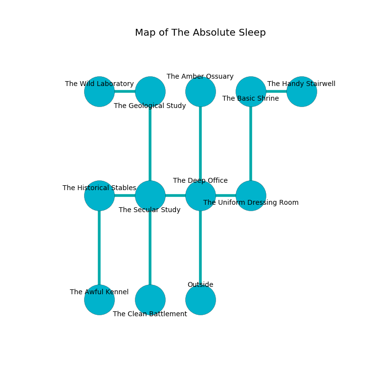

%Ruin Dogs

##The Absolute Sleep
###Overview
The Absolute Sleep is located on a volcanic city. Parts of it are flooded. A blizzard is happening outside. It is occupied by Thri-Kreens. Tona Hatfield The Big-Headed, a Fire Giant is here. The Thri-Kreens are ruled by Tona Hatfield The Big-Headed. She  is founding a new religion. 

###Artifact
####The Military Tunnel

The Military Tunnel looks like a transparent gem. It smells like asparagus. Fire flows towards it. When smelled it changes probabilities. 

###Locations

####the deep office
The air smells like fudge here. There is a trap here. When activated, a magical rune will make the ceiling slowly lower. 

There is an engraving on the floor written in common. 

> O death is sadistic
>
> yet artistic
>
> but toxic
>
> fate is artistic
>

* To the west a small threshold leads to [the secular study](#the-secular-study).
* To the east a long artery opens to [the uniform dressing room](#the-uniform-dressing-room).
* To the north a dark walkway opens to [the amber ossuary](#the-amber-ossuary).
* To the south is the entrance.

####the amber ossuary
White lichens are sprouting in a patch on the floor. There are ten Thri-Kreens here. One of the Thri-Kreens is on watch, the rest are meditating. 

* To the south a dark walkway opens to [the deep office](#the-deep-office).

####the secular study
The air tastes like tansy here. The wooden walls are caving in. There are ten Thri-Kreens here. The Thri-Kreens are defending this room from intruders. 

* There is a horse here.
* To the west a flooded path connects to [the historical stables](#the-historical-stables).
* To the east a small threshold opens to [the deep office](#the-deep-office).
* To the north a torchlit pathway opens to [the geological study](#the-geological-study).
* To the south a torchlit threshold leads to [the clean battlement](#the-clean-battlement).

####the uniform dressing room
The air smells like menthol here. The floor is glossy. There are a Rhinoceros, a Duergar, a Mammoth, and a Gladiator here. 

* There is a nail here.
* To the west a long artery opens to [the deep office](#the-deep-office).
* To the north a torchlit gap opens to [the basic shrine](#the-basic-shrine).

####the basic shrine
The concrete walls are ruined. The air tastes like starfruit here. 

* [The Military Tunnel](#The-Military-Tunnel) is here.
* To the east a long hall opens to [the handy stairwell](#the-handy-stairwell).
* To the south a torchlit gap opens to [the uniform dressing room](#the-uniform-dressing-room).

####the historical stables
The floor is flooded with five inch deep lukewarm water. Blue mushrooms are decaying in a patch on the floor. 

There is an engraving on a stone written in common. 

> Dear me! cruel fate
>
> interactive and straight
>
> but never straight
>
> cruelty is late
>

* To the east a flooded path connects to [the secular study](#the-secular-study).
* To the south a dark cave connects to [the awful kennel](#the-awful-kennel).

####the geological study
The air smells like oak wood here. Red razorgrass is growing from the ceiling. There are a Shadow, a Harpy, a Young White Dragon, a Giant Wasp, a Swarm of Quippers, and a Shambling Mound here. 

* To the west a flooded corridor connects to [the wild laboratory](#the-wild-laboratory).
* To the south a torchlit pathway opens to [the secular study](#the-secular-study).

####the clean battlement
The obsidion walls are scratched. There are ten Thri-Kreens here. The Thri-Kreens are willing to negotiate. 

* To the north a torchlit threshold connects to [the secular study](#the-secular-study).

####the awful kennel
The air tastes like thyme here. Red mushrooms are growing from the ceiling. 

* [Tona Hatfield The Big-Headed](#Tona-Hatfield-The-Big-Headed) is here.
* To the north a dark cave leads to [the historical stables](#the-historical-stables).

####the wild laboratory
The air tastes like tagette here. The floor is bloodstained. 

* To the east a flooded corridor opens to [the geological study](#the-geological-study).

####the handy stairwell
The air smells like beef here. Red lichens are swaying in cracks in the floor. The glass walls are ruined. There are a Hippogriff, a Kobold, an Ogre Zombie, a Sahuagin Baron, a Cultist, a Hobgoblin, a Barlgura, and a Baboon here. The floor is smooth. 

* There is a net here.
* To the west a long hall leads to [the basic shrine](#the-basic-shrine).

