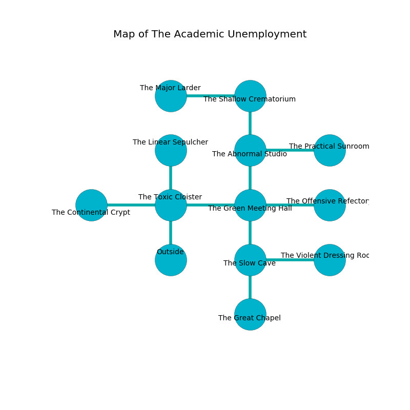

%Ruin Dogs

##The Academic Unemployment
###Overview
The Academic Unemployment is located under a flooded tree. Some areas of The Academic Unemployment are cursed. A massive storm is happening outside. It is occupied by Drows. Alisha Daly The Obstinate, a Cambion is here. The Drows are the minions of Alisha Daly The Obstinate. She  is trying to find [The Voluntary Consideration](#The-Voluntary-Consideration). 

###Artifact
####The Voluntary Consideration

The Voluntary Consideration is a powerful artifact in the shape of a cold monument. It is a pale gray color. It smells like cashew. When smelled it levitates surrounding objects. 

###Locations

####the toxic cloister
The floor is glossy. The air tastes like cognac here. There are twenty Drows here. The Drows are feasting. 

* To the west a dark path connects to [the continental crypt](#the-continental-crypt).
* To the east a long corridor connects to [the green meeting hall](#the-green-meeting-hall).
* To the north a dripping cave opens to [the linear sepulcher](#the-linear-sepulcher).
* To the south is the entrance.

####the green meeting hall
There are a Drow, a Swarm of Ravens, a Flumph, a Monodrone, a Hunter Shark, a Black Dragon Wyrmling, and a Constrictor Snake here. There is a trap here. When activated, a tripwire will open a large pit in the floor. Blue moss is decaying in cracks in the floor. The floor is cluttered with ashes. 

There is an engraving on a tablet written in Drows Script. 

> Oh life is inhumane
>
> it is always expected
>
> financial and main
>
> death is unexpected
>

* To the west a long corridor connects to [the toxic cloister](#the-toxic-cloister).
* To the east a narrow gap opens to [the offensive refectory](#the-offensive-refectory).
* To the north a dripping gap leads to [the abnormal studio](#the-abnormal-studio).
* To the south a narrow hall opens to [the slow cave](#the-slow-cave).

####the offensive refectory
There are a Winter Wolf, a Goblin, and a Lizardfolk Shaman here. White mushrooms are decaying from the ceiling. The floor is glossy. The air smells like blackberry here. 

There is an engraving on the floor written in common. 

> [The Voluntary Consideration](#The-Voluntary-Consideration)
>
> corporate and superior
>
> All of us are joyful
>
> considerable and insufficient
>
> fashionable, short, efficient
>

* There is a spear here.
* There is a bag here.
* To the west a narrow gap leads to [the green meeting hall](#the-green-meeting-hall).

####the slow cave
There are a Quaggoth Thonot and a Salamander here. 

There is an engraving on the ceiling written in Drows Script. 

> I want to find [The Voluntary Consideration](#The-Voluntary-Consideration).
>
> Go away.
>

* There is a nut here.
* To the east a torchlit path connects to [the violent dressing room](#the-violent-dressing-room).
* To the north a narrow hall opens to [the green meeting hall](#the-green-meeting-hall).
* To the south a twisted passageway connects to [the great chapel](#the-great-chapel).

####the violent dressing room
There are twenty Drows here. The air tastes like basil here. The wooden walls are pristine. The Drows are meditating. 

* To the west a torchlit path leads to [the slow cave](#the-slow-cave).

####the continental crypt
The floor is cluttered with broken glass. The air tastes like freshly cut hay here. The mirrored walls are covered in mold. 

* To the east a dark path opens to [the toxic cloister](#the-toxic-cloister).

####the abnormal studio
White moss is growing in broken urns. The air tastes like mimosa here. 

There is an engraving on the ceiling written in Drows Script. 

> [The Voluntary Consideration](#The-Voluntary-Consideration)
>
> noble and privileged
>
> you shall be frozen
>

* To the east a twisted walkway leads to [the practical sunroom](#the-practical-sunroom).
* To the north a windy corridor connects to [the shallow crematorium](#the-shallow-crematorium).
* To the south a dripping gap leads to [the green meeting hall](#the-green-meeting-hall).

####the practical sunroom
The concrete walls are bloodstained. Red mushrooms are decaying in cracks in the floor. There are a Sprite, a Swarm of Rats, an Orc War Chief, a Green Hag, a Pixie, and a Goblin here. The air tastes like sassafrass here. 

* To the west a twisted walkway leads to [the abnormal studio](#the-abnormal-studio).

####the shallow crematorium
There are twenty Drows here. The glass walls are scratched. Red moss is swaying from the ceiling. The air smells like pennyroyal here. The Drows are performing a ritual. If not interrupted, a powerful monster will be summoned. 

There is an engraving on a monolith written in Drows Script. 

> Try digging.
>

* [The Voluntary Consideration](#The-Voluntary-Consideration) is here.
* [Alisha Daly The Obstinate](#Alisha-Daly-The-Obstinate) is here.
* To the west a twisted hall connects to [the major larder](#the-major-larder).
* To the south a windy corridor connects to [the abnormal studio](#the-abnormal-studio).

####the linear sepulcher
The wooden walls are caving in. The air smells like toast here. The floor is glossy. 

* To the south a dripping cave opens to [the toxic cloister](#the-toxic-cloister).

####the great chapel
The air tastes like thyme here. The concrete walls are pristine. 

* To the north a twisted passageway leads to [the slow cave](#the-slow-cave).

####the major larder
The brick walls are unsettled. 

There is an engraving on a stone written in common. 

> I found [The Voluntary Consideration](#The-Voluntary-Consideration).
>
> Dig here.
>

* To the east a twisted hall connects to [the shallow crematorium](#the-shallow-crematorium).

