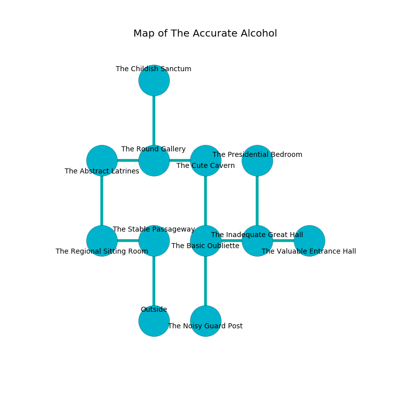

%Ruin Dogs

##The Accurate Alcohol
###Overview
The Accurate Alcohol is located in a cursed tree. Regions of it are unbearably cold. A massive storm is happening outside. It is occupied by Githyanki. Horace Weldon The Untrustworthy, a Barbed Devil is here. The Githyanki are battling Horace Weldon The Untrustworthy. He  is trying to find [Geohd](#Geohd). 

###Artifact
####Geohd

Geohd looks like a smooth crystal. It is a medium purple color. When cradled it becomes hot. 

###Locations

####the stable passageway
The floor is flooded with six inch deep lukewarm water. 

There is an engraving on a monolith written in common. 

> O! cruel god
>
> it is always odd
>
> but blank
>
> sadness is odd
>

* There is a fish here.
* [Horace Weldon The Untrustworthy](#Horace-Weldon-The-Untrustworthy) is here.
* To the west a small cave connects to [the regional sitting Room](#the-regional-sitting-Room).
* To the south is the entrance.

####the regional sitting Room
White razorgrass is sprouting in a patch on the floor. The floor is flooded with six inch deep hot water. The crystal walls are covered in mold. There are two Githyanki Warriors here. One of the Githyanki is pointing a ballista at the entrance. 

* To the east a small cave connects to [the stable passageway](#the-stable-passageway).
* To the north a narrow passageway connects to [the abstract latrines](#the-abstract-latrines).

####the abstract latrines
There are a Commoner, a Swarm of Insects, a Giant Bat, a Vine Blight, a Hobgoblin Captain, and an Awakened Tree here. The floor is bloodstained. 

* To the east a long hallway connects to [the round gallery](#the-round-gallery).
* To the south a narrow passageway opens to [the regional sitting Room](#the-regional-sitting-Room).

####the round gallery

* To the west a long hallway opens to [the abstract latrines](#the-abstract-latrines).
* To the east a flooded passageway connects to [the cute cavern](#the-cute-cavern).
* To the north a narrow gap opens to [the childish sanctum](#the-childish-sanctum).

####the cute cavern

* To the west a flooded passageway opens to [the round gallery](#the-round-gallery).
* To the south a long passageway leads to [the basic oubliette](#the-basic-oubliette).

####the basic oubliette
Green mushrooms are swaying in broken urns. The air smells like bacon here. The floor is glossy. 

There is an engraving on the floor written in common. 

> Go away.
>

* To the east a dark hallway leads to [the inadequate great hall](#the-inadequate-great-hall).
* To the north a long passageway leads to [the cute cavern](#the-cute-cavern).
* To the south a windy hall leads to [the noisy guard post](#the-noisy-guard-post).

####the inadequate great hall
The air smells like citronella here. The crystal walls are bloodstained. There are two Githyanki Warriors here. The Githyanki are performing a ritual. If not interrupted, the Githyanki will become more powerful. 

* There is a trophy here.
* [Geohd](#Geohd) is here.
* To the west a dark hallway leads to [the basic oubliette](#the-basic-oubliette).
* To the east a twisted pathway leads to [the valuable entrance hall](#the-valuable-entrance-hall).
* To the north a dark hallway leads to [the presidential bedroom](#the-presidential-bedroom).

####the presidential bedroom
Red ferns are swaying in cracks in the floor. 

There is an engraving on the wall written in Githyanki Script. 

> O the world is poor
>
> comparable and premature
>
> it is always intermediate
>
> sadness is premature
>

* There is a baby here.
* To the south a dark hallway leads to [the inadequate great hall](#the-inadequate-great-hall).

####the noisy guard post
The wooden walls are scratched. There are a Smoke Mephit, an Ogre Zombie, and an Air Elemental here. Gray ferns are swaying from the walls. The air smells like agarwood here. The floor is smooth. 

* To the north a windy hall connects to [the basic oubliette](#the-basic-oubliette).

####the childish sanctum
Gray mushrooms are growing from the ceiling. 

There is an engraving on the wall written in Githyanki Script. 

> I am defending The Accurate Alcohol.
>

* There is a belt here.
* There is a stick here.
* To the south a narrow gap leads to [the round gallery](#the-round-gallery).

####the valuable entrance hall
Blue moss is decaying in a patch on the floor. There are two Githyanki Warriors here. If the Githyanki notice the Ruin Dogs, one of them will retreat and alert [Horace Weldon](#Horace-Weldon). 

* To the west a twisted pathway connects to [the inadequate great hall](#the-inadequate-great-hall).

