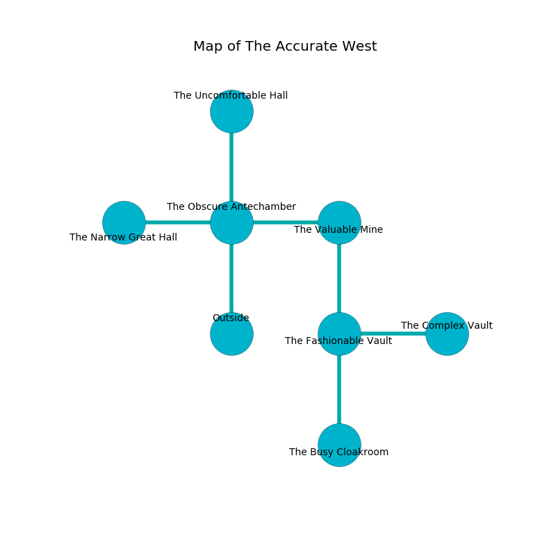

%Ruin Dogs

##The Accurate West
###Overview
The Accurate West is located under a poisoned city. Parts of The Accurate West are frozen. A solar eclipse is happening outside. It is occupied by Kuo-Toa. Man Brown The Foolhardy, a Cyclops is here. The Kuo-Toa are battling Man Brown The Foolhardy. He  is founding a new religion. 

###Artifact
####Uccodedaeum

Uccodedaeum is a powerful artifact in the shape of a glassy gem. It smells like vegetables. When eaten it dissappears. 

###Locations

####the obscure antechamber
The obsidion walls are ruined. There are a Kuo-Toa Monitor, a Kuo-Toa Archpriest, and a Kuo-Toa here. If the Kuo-Toa notice the Ruin Dogs, one of them will retreat and alert [Man Brown](#Man-Brown). 

* To the west a small path connects to [the narrow great hall](#the-narrow-great-hall).
* To the east a dark cavern leads to [the valuable mine](#the-valuable-mine).
* To the north a flooded artery opens to [the uncomfortable hall](#the-uncomfortable-hall).
* To the south is the entrance.

####the narrow great hall
The mirrored walls are ruined. The floor is sticky. Gray moss is swaying in cracks in the floor. 

* [Man Brown The Foolhardy](#Man-Brown-The-Foolhardy) is here.
* To the east a small path opens to [the obscure antechamber](#the-obscure-antechamber).

####the valuable mine
There are a Drow, an Ettin, and a Beholder Zombie here. Green ferns are swaying in a patch on the floor. The floor is flooded with two inch deep cold water. 

* To the west a dark cavern leads to [the obscure antechamber](#the-obscure-antechamber).
* To the south a dark hall leads to [the fashionable vault](#the-fashionable-vault).

####the uncomfortable hall
The air tastes like solvent here. The mirrored walls are scratched. Green lichens are decaying from the ceiling. 

* To the south a flooded artery opens to [the obscure antechamber](#the-obscure-antechamber).

####the fashionable vault
White razorgrass is sprouting in a patch on the floor. The concrete walls are bloodstained. 

There is an engraving on the wall written in Kuo-Toa Script. 

> Do not try swimming.
>

* [Uccodedaeum](#Uccodedaeum) is here.
* To the east a dark corridor connects to [the complex vault](#the-complex-vault).
* To the north a dark hall leads to [the valuable mine](#the-valuable-mine).
* To the south a twisted passageway opens to [the busy cloakroom](#the-busy-cloakroom).

####the busy cloakroom
The air smells like lettuce here. There are a Kuo-Toa Whip, a Kuo-Toa Archpriest, and a Kuo-Toa here. The floor is cluttered with shells. The Kuo-Toa are fighting amongst themselves. 

* To the north a twisted passageway connects to [the fashionable vault](#the-fashionable-vault).

####the complex vault
The floor is sticky. There are a Nightmare and an Orc War Chief here. The air smells like paint here. 

* To the west a dark corridor leads to [the fashionable vault](#the-fashionable-vault).

