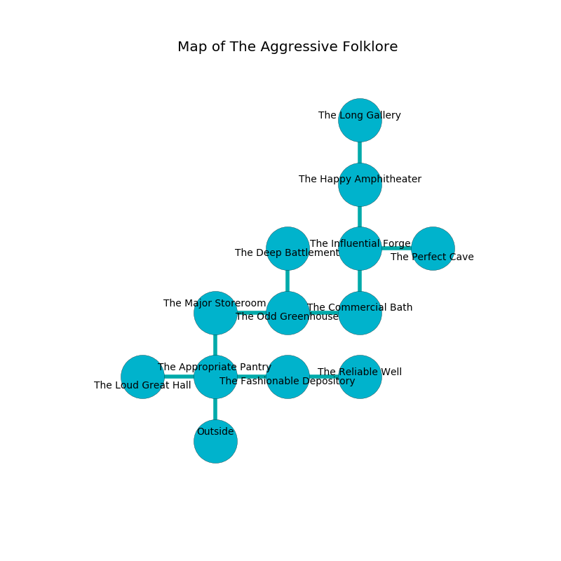

%Ruin Dogs

##The Aggressive Folklore
###Overview
The Aggressive Folklore is located under a flooded mountain. Regions of it are frozen. A blizzard is happening outside. It is occupied by Quaggoths. Vickie Ayres The Machiavellian, a Frost Giant is here. The Quaggoths are the minions of Vickie Ayres The Machiavellian. She  is trying to research [Iaufcimud Iaaemmaf](#Iaufcimud-Iaaemmaf). 

###Artifact
####Iaufcimud Iaaemmaf

Iaufcimud Iaaemmaf is a powerful artifact in the shape of a transparent crystal. Water slides near it. It smells like capers. It is a bright green color. When rubbed it becomes a deadly projectile. 

###Locations

####the appropriate pantry
The air tastes like mushroom here. 

There is an engraving on the ceiling written in common. 

> All of us are corrupted
>
> whole, beautiful, random
>
> All of us are corrupted
>
> related and unfair
>
> eager and just
>
> but assertive
>

* To the west a twisted artery opens to [the loud great hall](#the-loud-great-hall).
* To the east a torchlit walkway opens to [the fashionable depository](#the-fashionable-depository).
* To the north a torchlit passageway opens to [the major storeroom](#the-major-storeroom).
* To the south is the entrance.

####the major storeroom
The air tastes like brown sugar here. The metallic walls are pristine. White moss is sprouting in cracks in the floor. 

* To the east a dripping passageway leads to [the odd greenhouse](#the-odd-greenhouse).
* To the south a torchlit passageway connects to [the appropriate pantry](#the-appropriate-pantry).

####the fashionable depository
The floor is glossy. Red lichens are sprouting in cracks in the floor. 

* To the west a torchlit walkway leads to [the appropriate pantry](#the-appropriate-pantry).
* To the east a torchlit pathway connects to [the reliable well](#the-reliable-well).

####the loud great hall

There is an engraving on the floor written in Quaggoths Script. 

> They are hidden
>
> yet never mathematical
>
> clear, secular, unanimous
>
> historical and delicate
>
> A rat is an outlook
>
> certain, accurate, visual
>
> broken and unlawful
>
> We are frozen
>
> but never primary
>
> you are frozen
>

* To the east a twisted artery opens to [the appropriate pantry](#the-appropriate-pantry).

####the odd greenhouse
There is a Gray Slaad here. Gray moss is growing in broken urns. The metallic walls are caving in. 

* There is a feather here.
* [Vickie Ayres The Machiavellian](#Vickie-Ayres-The-Machiavellian) is here.
* To the west a dripping passageway connects to [the major storeroom](#the-major-storeroom).
* To the east a hazy walkway connects to [the commercial bath](#the-commercial-bath).
* To the north a windy walkway connects to [the deep battlement](#the-deep-battlement).

####the commercial bath
The floor is smooth. The air tastes like cologne here. Yellow lichens are growing in a patch on the floor. 

* To the west a hazy walkway leads to [the odd greenhouse](#the-odd-greenhouse).
* To the north a long artery leads to [the influential forge](#the-influential-forge).

####the reliable well
The concrete walls are ruined. Blue razorgrass is swaying from the ceiling. 

* To the west a torchlit pathway opens to [the fashionable depository](#the-fashionable-depository).

####the influential forge
The air smells like green tea here. The glass walls are ruined. Yellow ferns are sprouting from the ceiling. The floor is bloodstained. 

There is an engraving on a tablet written in common. 

> Leave at once.
>

* To the east a long threshold connects to [the perfect cave](#the-perfect-cave).
* To the north a flooded cavern connects to [the happy amphitheater](#the-happy-amphitheater).
* To the south a long artery opens to [the commercial bath](#the-commercial-bath).

####the deep battlement
There are a Cult Fanatic, a Sahuagin, a Chain Devil, and a Piercer here. The floor is glossy. The crystal walls are covered in mold. 

* To the south a windy walkway connects to [the odd greenhouse](#the-odd-greenhouse).

####the happy amphitheater
There are a Quipper, a Displacer Beast, a Tridrone, and a Drow Priestess of Lolth here. There is a trap here. When activated, a tripwire will collapse a wall. 

* There is a spear here.
* There is a spirit here.
* There is a head here.
* [Iaufcimud Iaaemmaf](#Iaufcimud-Iaaemmaf) is here.
* To the north a windy path leads to [the long gallery](#the-long-gallery).
* To the south a flooded cavern connects to [the influential forge](#the-influential-forge).

####the perfect cave
There are a Wolf, a Mummy, a Druid, a Homunculus, a Warhorse, and a Young Brass Dragon here. The wooden walls are unsettled. The floor is glossy. 

* To the west a long threshold opens to [the influential forge](#the-influential-forge).

####the long gallery
The floor is cluttered with ashes. The metallic walls are unsettled. The air tastes like mushroom here. Green ferns are growing from the ceiling. 

There is an engraving on the floor written in Quaggoths Script. 

> I am lost in The Aggressive Folklore.
>

* To the south a windy path connects to [the happy amphitheater](#the-happy-amphitheater).

