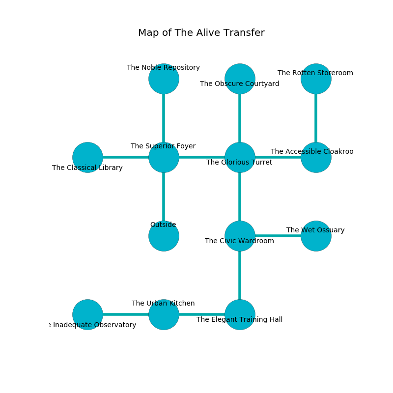

%Ruin Dogs

##The Alive Transfer
###Overview
The Alive Transfer is located on an obsidion mountain. Some areas of The Alive Transfer are corrupted. A lunar eclipse is happening outside. It is occupied by Sahuagins. Jolanda Dudley The Impatient, a Cloud Giant is here. The Sahuagins are the slaves of Jolanda Dudley The Impatient. She  is trying to recover [The Federal Lack](#The-Federal-Lack). 

###Artifact
####The Federal Lack

The Federal Lack looks like a sharp sphere. It is a pale white color. It smells like ham. When worshipped it changes probabilities. 

###Locations

####the superior foyer
Blue ferns are swaying in cracks in the floor. There are a Gnoll Fang of Yeenoghu, an Ogre, an Owlbear, a Mimic, and a Worg here. The air smells like capers here. The wooden walls are scratched. 

There is an engraving on the floor written in Sahuagins Script. 

> Do not try dying.
>

* To the west a dripping gap opens to [the classical library](#the-classical-library).
* To the east a flooded opening opens to [the glorious turret](#the-glorious-turret).
* To the north a long gap leads to [the noble repository](#the-noble-repository).
* To the south is the entrance.

####the glorious turret
The air tastes like fir needle here. There are four Sahuagin Priestesses here. One of the Sahuagins is pointing a ballista at the entrance. 

* There is a shirt here.
* To the west a flooded opening connects to [the superior foyer](#the-superior-foyer).
* To the east a twisted artery opens to [the accessible cloakroom](#the-accessible-cloakroom).
* To the north a flooded corridor leads to [the obscure courtyard](#the-obscure-courtyard).
* To the south a hazy walkway opens to [the civic wardroom](#the-civic-wardroom).

####the civic wardroom
There are a Drow Mage, a Duodrone, and a Rug of Smothering here. 

* To the east a hazy artery connects to [the wet ossuary](#the-wet-ossuary).
* To the north a hazy walkway leads to [the glorious turret](#the-glorious-turret).
* To the south a dark cave opens to [the elegant training hall](#the-elegant-training-hall).

####the obscure courtyard
There is a trap here. When activated, a pressure plate will flood the room with water. Green lichens are sprouting from the walls. There are a Zombie, a Triceratops, a Hippogriff, an Ettercap, a Magma Mephit, and a Giant Wasp here. The floor is smooth. 

* There is a feather here.
* [Jolanda Dudley The Impatient](#Jolanda-Dudley-The-Impatient) is here.
* To the south a flooded corridor opens to [the glorious turret](#the-glorious-turret).

####the accessible cloakroom
Gray mushrooms are sprouting from the ceiling. 

* There is a nut here.
* To the west a twisted artery connects to [the glorious turret](#the-glorious-turret).
* To the north a twisted cave opens to [the rotten storeroom](#the-rotten-storeroom).

####the noble repository
There are four Sahuagin Priestesses here. The floor is flooded with eight inch deep scalding water. The air tastes like sausage here. The Sahuagins are willing to negotiate. 

* To the south a long gap leads to [the superior foyer](#the-superior-foyer).

####the elegant training hall
There are four Sahuagin Priestesses here. The wooden walls are caving in. The Sahuagins are willing to negotiate. 

There is an engraving on the floor written in Sahuagins Script. 

> Maybe try digging.
>

* To the west a windy walkway connects to [the urban kitchen](#the-urban-kitchen).
* To the north a dark cave connects to [the civic wardroom](#the-civic-wardroom).

####the wet ossuary
There are four Sahuagin Priestesses here. The metallic walls are unsettled. The Sahuagins are performing a ritual. If not interrupted, [Jolanda Dudley](#Jolanda-Dudley) will be magically alarmed. 

* To the west a hazy artery leads to [the civic wardroom](#the-civic-wardroom).

####the classical library
The air smells like huckleberry here. 

There is an engraving on a monolith written in common. 

> A thread is an interface
>
> present and fragrant
>
> [The Federal Lack](#The-Federal-Lack)
>
> but never active
>
> enjoyable and healthy
>
> [The Federal Lack](#The-Federal-Lack)
>
> small and pregnant
>
> [The Federal Lack](#The-Federal-Lack)
>
> organic, grateful, magnetic
>
> you must never be frozen
>

* To the east a dripping gap leads to [the superior foyer](#the-superior-foyer).

####the rotten storeroom
There are four Sahuagin Priestesses here. The air smells like ocean here. Blue ferns are decaying from the ceiling. The wooden walls are caving in. One of the Sahuagins is on watch, the rest are celebrating. 

* To the south a twisted cave connects to [the accessible cloakroom](#the-accessible-cloakroom).

####the urban kitchen
The floor is sticky. 

* There is a boot here.
* [The Federal Lack](#The-Federal-Lack) is here.
* To the west a dark gap leads to [the inadequate observatory](#the-inadequate-observatory).
* To the east a windy walkway leads to [the elegant training hall](#the-elegant-training-hall).

####the inadequate observatory
Yellow razorgrass is growing in a patch on the floor. The mirrored walls are scratched. There is a trap here. When activated, a magical sound detector will open a large pit in the floor. 

* To the east a dark gap leads to [the urban kitchen](#the-urban-kitchen).

