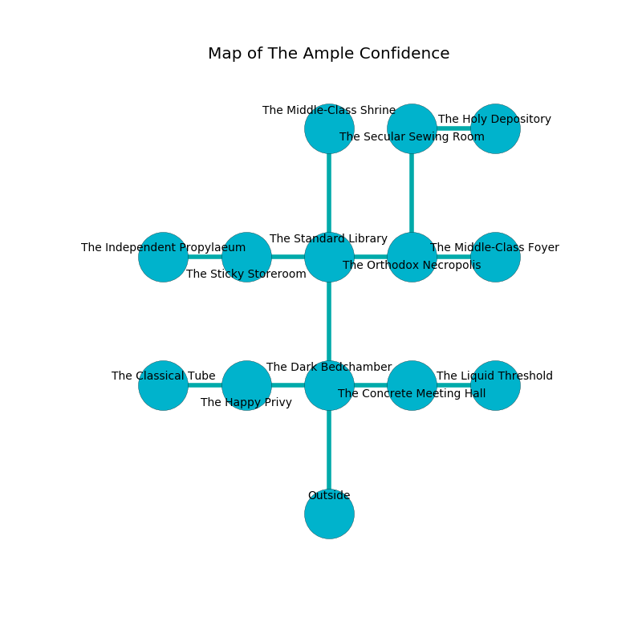

%Ruin Dogs

##The Ample Confidence
###Overview
The Ample Confidence is located under a poisoned tree. Regions of The Ample Confidence are flooded. The ruin is sinking into the earth. It is occupied by Ogres. Thanh Varela The Clinging, a Hill Giant is here. The Ogres are ruled by Thanh Varela The Clinging. He  is founding a new religion. 

###Artifact
####The Monthly Thigh

The Monthly Thigh has the form of a mushy figurine. Light flows around it. It is a shifting gray color. It smells like wax. When worshipped it becomes a force of destiny. 

###Locations

####the dark bedchamber
The floor is flooded with nine inch deep lukewarm water. The stone walls are bloodstained. There are a Thri-Kreen, an Ochre Jelly, an Allosaurus, and a Tridrone here. 

* To the west a twisted opening opens to [the happy privy](#the-happy-privy).
* To the east a dark corridor leads to [the concrete meeting hall](#the-concrete-meeting-hall).
* To the north a dripping walkway opens to [the standard library](#the-standard-library).
* To the south is the entrance.

####the standard library
The air tastes like absinthe here. There are two Half-Ogres and an Ogre here. The obsidion walls are ruined. One of the Ogres is on watch, the rest are caring for babies. 

* To the west a small passageway leads to [the sticky storeroom](#the-sticky-storeroom).
* To the east a torchlit corridor opens to [the orthodox necropolis](#the-orthodox-necropolis).
* To the north a hazy gap opens to [the middle-class shrine](#the-middle-class-shrine).
* To the south a dripping walkway opens to [the dark bedchamber](#the-dark-bedchamber).

####the orthodox necropolis
White mushrooms are decaying in broken urns. The air tastes like cedar here. 

* To the west a torchlit corridor opens to [the standard library](#the-standard-library).
* To the east a twisted threshold connects to [the middle-class foyer](#the-middle-class-foyer).
* To the north a small artery leads to [the secular sewing room](#the-secular-sewing-room).

####the happy privy
The concrete walls are bloodstained. There are a Half-Ogre and two Ogres here. The air tastes like the fresh outdoors here. One of the Ogres is on watch, the rest are caring for babies. 

* To the west a torchlit hallway leads to [the classical tube](#the-classical-tube).
* To the east a twisted opening connects to [the dark bedchamber](#the-dark-bedchamber).

####the sticky storeroom
The floor is smooth. The crystal walls are bloodstained. There are a Kuo-Toa Monitor, a Panther, a Green Dragon Wyrmling, and a Rat here. White ferns are swaying from the walls. 

* To the west a hazy threshold connects to [the independent propylaeum](#the-independent-propylaeum).
* To the east a small passageway opens to [the standard library](#the-standard-library).

####the middle-class shrine
There are four Half-Ogres here. The concrete walls are ruined. One of the Ogres is working a mechanism that can open a trapodoor in the floor. 

* There is a casket here.
* To the south a hazy gap opens to [the standard library](#the-standard-library).

####the independent propylaeum
White razorgrass is decaying in broken urns. The air tastes like agarwood here. The floor is bloodstained. 

There is an engraving on the wall written in common. 

> All of us are frozen
>
> civilian, sophisticated, tender
>

* To the east a hazy threshold connects to [the sticky storeroom](#the-sticky-storeroom).

####the concrete meeting hall
The air tastes like barley here. The floor is sticky. 

* [The Monthly Thigh](#The-Monthly-Thigh) is here.
* To the west a dark corridor connects to [the dark bedchamber](#the-dark-bedchamber).
* To the east a torchlit artery opens to [the liquid threshold](#the-liquid-threshold).

####the secular sewing room
There are a Banshee and a Half-Ogre here. Gray lichens are growing in broken urns. The floor is smooth. 

* To the east a small corridor leads to [the holy depository](#the-holy-depository).
* To the south a small artery connects to [the orthodox necropolis](#the-orthodox-necropolis).

####the middle-class foyer

* To the west a twisted threshold leads to [the orthodox necropolis](#the-orthodox-necropolis).

####the classical tube
The crystal walls are covered in mold. 

* To the east a torchlit hallway leads to [the happy privy](#the-happy-privy).

####the holy depository
There are two Half-Ogres and an Ogre here. The metallic walls are ruined. The Ogres are performing a ritual. If not interrupted, a powerful monster will be summoned. 

* [Thanh Varela The Clinging](#Thanh-Varela-The-Clinging) is here.
* To the west a small corridor leads to [the secular sewing room](#the-secular-sewing-room).

####the liquid threshold
There are four Half-Ogres here. The floor is glossy. The Ogres are performing a ritual. If not interrupted, [Thanh Varela](#Thanh-Varela) will be magically alarmed. 

* To the west a torchlit artery leads to [the concrete meeting hall](#the-concrete-meeting-hall).

