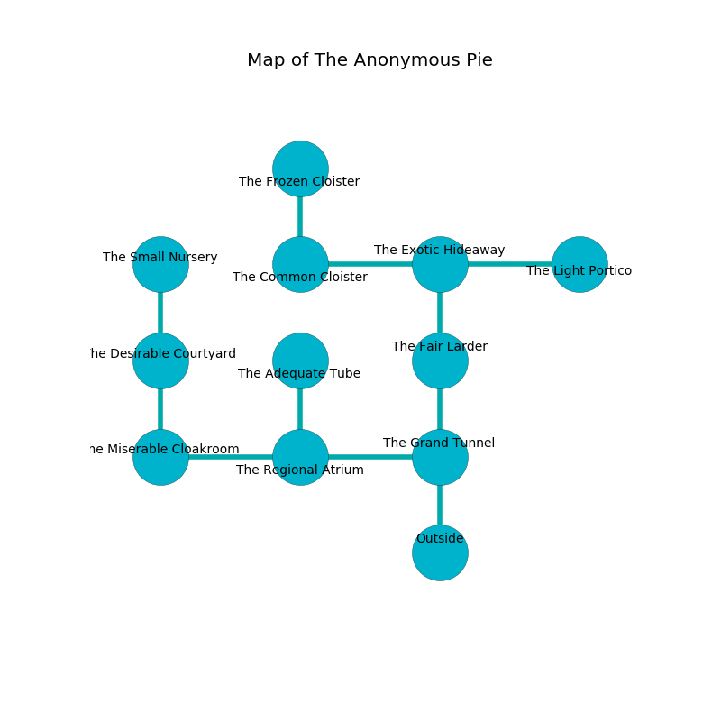

%Ruin Dogs

##The Anonymous Pie
###Overview
The Anonymous Pie is located under a flooded tree. Some areas of it are cursed. The ruin is collapsing slowly. It is occupied by Giants. Winfred Morrill The Clinging, a Drow Mage is here. The Giants are the minions of Winfred Morrill The Clinging. He  is trying to use [The Skilled Secret](#The-Skilled-Secret). 

###Artifact
####The Skilled Secret

The Skilled Secret is a powerful artifact in the shape of a transparent meteorite. It smells like starfruit. It is a dark orange color. When picked up it levitates surrounding objects. 

###Locations

####the grand tunnel
The air smells like carrot seed here. The wooden walls are pristine. The floor is sticky. Red moss is decaying from the ceiling. There is a trap here. When activated, a tripwire will launch a hail of needles. 

There is an engraving on the ceiling written in common. 

> I thought about swimming.
>

* To the west a small opening opens to [the regional atrium](#the-regional-atrium).
* To the north a narrow threshold connects to [the fair larder](#the-fair-larder).
* To the south is the entrance.

####the regional atrium
The crystal walls are scratched. Gray mushrooms are swaying from the ceiling. There are a Hill Giant and a Stone Giant here. The Giants are willing to negotiate. 

* To the west a narrow corridor leads to [the miserable cloakroom](#the-miserable-cloakroom).
* To the east a small opening leads to [the grand tunnel](#the-grand-tunnel).
* To the north a narrow cavern opens to [the adequate tube](#the-adequate-tube).

####the fair larder
There is a Stone Giant here. The air smells like seashore here. Green moss is growing in broken urns. If the Stone Giant notice the Ruin Dogs, one of them will retreat and alert the others. 

* There is a pig here.
* There is a spade here.
* There is a ring here.
* There is a dress here.
* To the north a narrow passageway connects to [the exotic hideaway](#the-exotic-hideaway).
* To the south a narrow threshold leads to [the grand tunnel](#the-grand-tunnel).

####the adequate tube
Green mushrooms are growing from the walls. The air tastes like almond here. There is a Stone Giant here. The crystal walls are unsettled. The Stone Giant is willing to negotiate. 

* To the south a narrow cavern leads to [the regional atrium](#the-regional-atrium).

####the exotic hideaway
There are a Helmed Horror and a Nightmare here. The mirrored walls are covered in mold. The air tastes like buttery	cabbage here. 

* To the west a long threshold leads to [the common cloister](#the-common-cloister).
* To the east a flooded hall opens to [the light portico](#the-light-portico).
* To the south a narrow passageway connects to [the fair larder](#the-fair-larder).

####the miserable cloakroom
There is a Stone Giant here. The air tastes like fig here. The Stone Giant is willing to negotiate. 

* To the east a narrow corridor opens to [the regional atrium](#the-regional-atrium).
* To the north a hazy threshold connects to [the desirable courtyard](#the-desirable-courtyard).

####the desirable courtyard
The obsidion walls are ruined. The floor is bloodstained. The air tastes like coriander here. 

* There is a dragon here.
* To the north a flooded threshold connects to [the small nursery](#the-small-nursery).
* To the south a hazy threshold connects to [the miserable cloakroom](#the-miserable-cloakroom).

####the common cloister
There are a Revenant and a Troll here. The floor is glossy. Red razorgrass is growing from the ceiling. 

* [The Skilled Secret](#The-Skilled-Secret) is here.
* To the east a long threshold leads to [the exotic hideaway](#the-exotic-hideaway).
* To the north a small opening connects to [the frozen cloister](#the-frozen-cloister).

####the small nursery
The air tastes like pomegranate here. There are two Hill Giants here. The Giants are crazy with bloodlust. 

* To the south a flooded threshold opens to [the desirable courtyard](#the-desirable-courtyard).

####the light portico
There are a Hill Giant and a Stone Giant here. The metallic walls are scratched. Blue razorgrass is sprouting from the walls. The floor is smooth. The Giants are performing a ritual. If not interrupted, the Giants will become more powerful. 

* There is a pot here.
* [Winfred Morrill The Clinging](#Winfred-Morrill-The-Clinging) is here.
* To the west a flooded hall connects to [the exotic hideaway](#the-exotic-hideaway).

####the frozen cloister
The air tastes like roasted chicken here. The floor is bloodstained. 

* There is a comb here.
* To the south a small opening leads to [the common cloister](#the-common-cloister).

