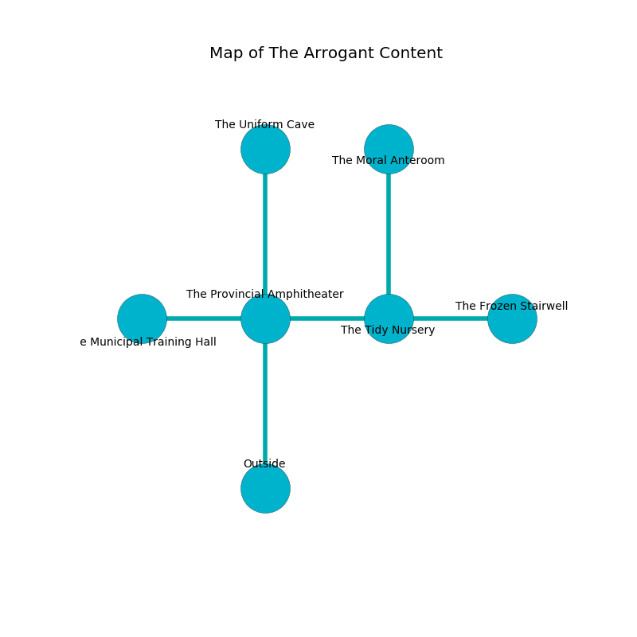

%Ruin Dogs

##The Arrogant Content
###Overview
The Arrogant Content is constructed on an alien rift. Parts of it are foggy. A blizzard is happening outside. It is occupied by Quaggoths. Mickey Neville The Vengeful, a Cloud Giant is here. The Quaggoths are ruled by Mickey Neville The Vengeful. He  is trying to exploit [Imucc Gufca](#Imucc-Gufca). 

###Artifact
####Imucc Gufca

Imucc Gufca has the form of an opaque spear. It smells like bergamot. It is a sickly green color. When thrown it dissappears. 

###Locations

####the provincial amphitheater
The air smells like ocean here. There are three Quaggoth Thonots here. There is a trap here. When activated, a magical rune will open a large pit in the floor. One of the Quaggoths is working a mechanism that can pour acid from the ceiling. 

* There is an imp here.
* To the west a dripping path leads to [the municipal training hall](#the-municipal-training-hall).
* To the east a windy path leads to [the tidy nursery](#the-tidy-nursery).
* To the north a small cave connects to [the uniform cave](#the-uniform-cave).
* To the south is the entrance.

####the municipal training hall

* To the east a dripping path leads to [the provincial amphitheater](#the-provincial-amphitheater).

####the tidy nursery
The wooden walls are unsettled. The floor is bloodstained. 

* [Imucc Gufca](#Imucc-Gufca) is here.
* To the west a windy path opens to [the provincial amphitheater](#the-provincial-amphitheater).
* To the east a hazy opening connects to [the frozen stairwell](#the-frozen-stairwell).
* To the north a small opening opens to [the moral anteroom](#the-moral-anteroom).

####the uniform cave
The floor is smooth. 

* [Mickey Neville The Vengeful](#Mickey-Neville-The-Vengeful) is here.
* To the south a small cave leads to [the provincial amphitheater](#the-provincial-amphitheater).

####the frozen stairwell
Gray mushrooms are growing from the ceiling. The air smells like tagette here. The floor is sticky. 

* To the west a hazy opening opens to [the tidy nursery](#the-tidy-nursery).

####the moral anteroom
The floor is flooded with one inch deep cold water. The air smells like eggs here. 

* To the south a small opening leads to [the tidy nursery](#the-tidy-nursery).

