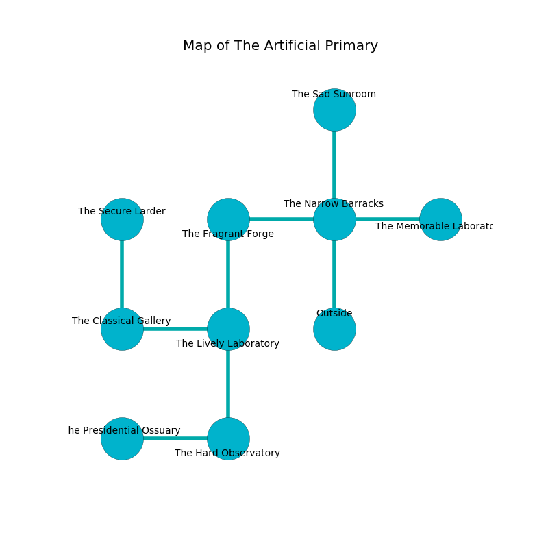

%Ruin Dogs

##The Artificial Primary
###Overview
The Artificial Primary is constructed on a haunted plain. Some rooms of The Artificial Primary are incredibly hot. A battle between raiders is happening outside. It is occupied by Deep Gnomes. Lawanna Casas The Pompous, a Yuan-Ti Abomination is here. The Deep Gnomes worship Lawanna Casas The Pompous. She  is trying to find [Fahfad](#Fahfad). 

###Artifact
####Fahfad

Fahfad has the form of a transparent monument. Water incinerates around it. It is a light green color. When worshipped it curses all nearby. 

###Locations

####the narrow barracks
The air tastes like chestnut here. Red mushrooms are sprouting from the ceiling. 

* To the west a flooded opening leads to [the fragrant forge](#the-fragrant-forge).
* To the east a twisted artery opens to [the memorable laboratory](#the-memorable-laboratory).
* To the north a twisted pathway opens to [the sad sunroom](#the-sad-sunroom).
* To the south is the entrance.

####the fragrant forge
There are fourteen Deep Gnomes here. One of the Deep Gnomes is pointing a ballista at the entrance. 

* To the east a flooded opening leads to [the narrow barracks](#the-narrow-barracks).
* To the south a dripping gap leads to [the lively laboratory](#the-lively-laboratory).

####the lively laboratory
White ferns are growing in broken urns. The mirrored walls are covered in mold. There is a trap here. When activated, a magical sound detector will shoot a lightning bolt. The floor is glossy. The air tastes like melon here. 

* To the west a twisted hall opens to [the classical gallery](#the-classical-gallery).
* To the north a dripping gap opens to [the fragrant forge](#the-fragrant-forge).
* To the south a small pathway connects to [the hard observatory](#the-hard-observatory).

####the classical gallery
Green mushrooms are growing in cracks in the floor. 

* To the east a twisted hall connects to [the lively laboratory](#the-lively-laboratory).
* To the north a windy passageway connects to [the secure larder](#the-secure-larder).

####the sad sunroom
The brick walls are scratched. 

There is an engraving on a monolith written in Deep Gnomes Script. 

> A trap ahead.
>

* To the south a twisted pathway connects to [the narrow barracks](#the-narrow-barracks).

####the memorable laboratory
Blue mushrooms are swaying from the walls. The air smells like dried apple here. 

* There is a stocking here.
* There is a diamond here.
* To the west a twisted artery opens to [the narrow barracks](#the-narrow-barracks).

####the hard observatory
The stone walls are covered in mold. Blue ferns are sprouting in cracks in the floor. 

* There is a rowboat here.
* [Fahfad](#Fahfad) is here.
* To the west a twisted artery opens to [the presidential ossuary](#the-presidential-ossuary).
* To the north a small pathway leads to [the lively laboratory](#the-lively-laboratory).

####the secure larder
Green lichens are sprouting from the walls. The air tastes like dill here. There are fourteen Deep Gnomes here. The Deep Gnomes are willing to negotiate. 

* To the south a windy passageway connects to [the classical gallery](#the-classical-gallery).

####the presidential ossuary
White moss is swaying from the ceiling. There are fourteen Deep Gnomes here. The air tastes like lovage here. If the Deep Gnomes notice the Ruin Dogs, one of them will retreat and alert [Lawanna Casas](#Lawanna-Casas). 

There is an engraving on the floor written in Deep Gnomes Script. 

> An apple is a vitamin
>
> subsequent, constructive, encouraging
>
> An apple is a vitamin
>

* There is a hare here.
* [Lawanna Casas The Pompous](#Lawanna-Casas-The-Pompous) is here.
* To the east a twisted artery opens to [the hard observatory](#the-hard-observatory).

