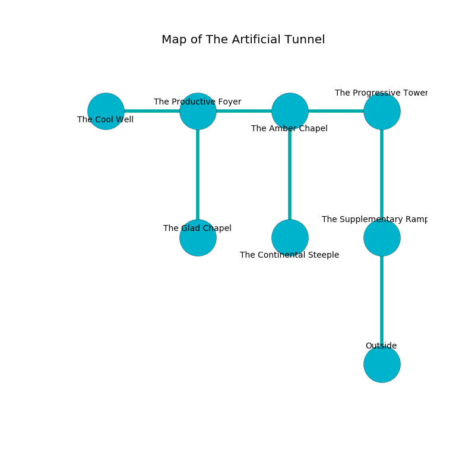

%Ruin Dogs

##The Artificial Tunnel
###Overview
The Artificial Tunnel is located in a haunted city. Some rooms of The Artificial Tunnel are flooded. The ruin is collapsing slowly. It is occupied by Troglodytes. Luana Wagner The Nasty, a Succubus is here. The Troglodytes have been charmed by Luana Wagner The Nasty. She  is founding a new religion. 

###Artifact
####Uiamafimaed Muda

Uiamafimaed Muda looks like a transparent amulet. Cacophony pours around it. When rubbed it floats above the ground. 

###Locations

####the supplementary rampart
The metallic walls are unsettled. 

* There is a brick here.
* To the north a twisted hall opens to [the progressive tower](#the-progressive-tower).
* To the south is the entrance.

####the progressive tower
The floor is bloodstained. 

* There is a cord here.
* To the west a twisted passageway leads to [the amber chapel](#the-amber-chapel).
* To the south a twisted hall opens to [the supplementary rampart](#the-supplementary-rampart).

####the amber chapel
The air smells like mastic here. Blue lichens are decaying in broken urns. 

* [Luana Wagner The Nasty](#Luana-Wagner-The-Nasty) is here.
* To the west a dripping cavern leads to [the productive foyer](#the-productive-foyer).
* To the east a twisted passageway connects to [the progressive tower](#the-progressive-tower).
* To the south a dripping corridor opens to [the continental steeple](#the-continental-steeple).

####the productive foyer
There are a Winter Wolf and an Orc War Chief here. 

* There is a fly here.
* [Uiamafimaed Muda](#Uiamafimaed-Muda) is here.
* To the west a dripping opening leads to [the cool well](#the-cool-well).
* To the east a dripping cavern connects to [the amber chapel](#the-amber-chapel).
* To the south a flooded gap opens to [the glad chapel](#the-glad-chapel).

####the cool well
There are two Aarakocras, a Young Faerie Dragon, a Succubus, and  here. The air smells like clove here. Red moss is swaying from the walls. The floor is glossy. 

There is an engraving on the wall written in common. 

> I am lost in The Artificial Tunnel.
>

* To the east a dripping opening leads to [the productive foyer](#the-productive-foyer).

####the continental steeple
The brick walls are covered in mold. 

* To the north a dripping corridor connects to [the amber chapel](#the-amber-chapel).

####the glad chapel
The wooden walls are pristine. Gray lichens are swaying in cracks in the floor. 

* There is a fowl here.
* To the north a flooded gap leads to [the productive foyer](#the-productive-foyer).

