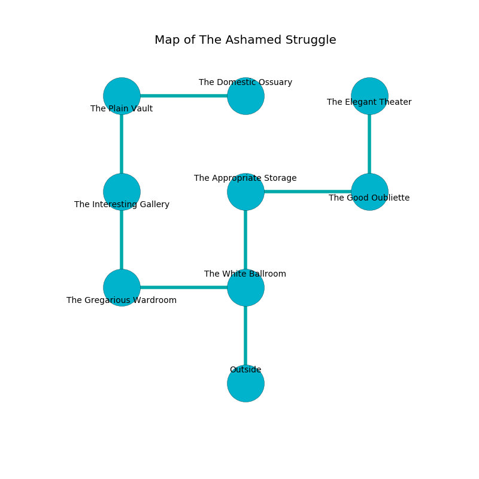

%Ruin Dogs

##The Ashamed Struggle
###Overview
The Ashamed Struggle is located on a broken plain. Parts of it are cursed. The ruin is coming to life. It is occupied by Gnolls. Kate Lanham The Unreliable, a Yuan-Ti Abomination is here. The Gnolls have been charmed by Kate Lanham The Unreliable. She  is trying to research [Icmuuh](#Icmuuh). 

###Artifact
####Icmuuh

Icmuuh looks like a hard prism. It smells like paint. When rubbed it frightens children. 

###Locations

####the white ballroom
The air smells like sand here. There are a Gnoll Fang of Yeenoghu, a Gnoll, two Gnoll Pack Lords, and  here. The floor is glossy. One of the Gnolls is pointing a ballista at the entrance. 

* [Kate Lanham The Unreliable](#Kate-Lanham-The-Unreliable) is here.
* To the west a flooded passageway opens to [the gregarious wardroom](#the-gregarious-wardroom).
* To the north a torchlit hallway opens to [the appropriate storage](#the-appropriate-storage).
* To the south is the entrance.

####the gregarious wardroom
Green mushrooms are decaying in broken urns. 

* To the east a flooded passageway opens to [the white ballroom](#the-white-ballroom).
* To the north a narrow opening leads to [the interesting gallery](#the-interesting-gallery).

####the interesting gallery
The floor is sticky. 

* There is a ghost here.
* To the north a small corridor leads to [the plain vault](#the-plain-vault).
* To the south a narrow opening leads to [the gregarious wardroom](#the-gregarious-wardroom).

####the appropriate storage
The air smells like seashore here. There is a trap here. When activated, a pressure plate will launch a rolling boulder. Gray lichens are swaying from the walls. 

* To the east a torchlit walkway connects to [the good oubliette](#the-good-oubliette).
* To the south a torchlit hallway opens to [the white ballroom](#the-white-ballroom).

####the good oubliette

There is an engraving on a monolith written in common. 

> Leave now.
>

* To the west a torchlit walkway opens to [the appropriate storage](#the-appropriate-storage).
* To the north a torchlit gap opens to [the elegant theater](#the-elegant-theater).

####the elegant theater
The floor is flooded with four inch deep hot water. 

* There is a knife here.
* There is a drake here.
* To the south a torchlit gap connects to [the good oubliette](#the-good-oubliette).

####the plain vault
Green moss is swaying from the ceiling. The mirrored walls are caving in. 

* [Icmuuh](#Icmuuh) is here.
* To the east a narrow cave leads to [the domestic ossuary](#the-domestic-ossuary).
* To the south a small corridor opens to [the interesting gallery](#the-interesting-gallery).

####the domestic ossuary
The stone walls are ruined. Blue ferns are growing from the ceiling. The air tastes like wax here. 

* To the west a narrow cave connects to [the plain vault](#the-plain-vault).

