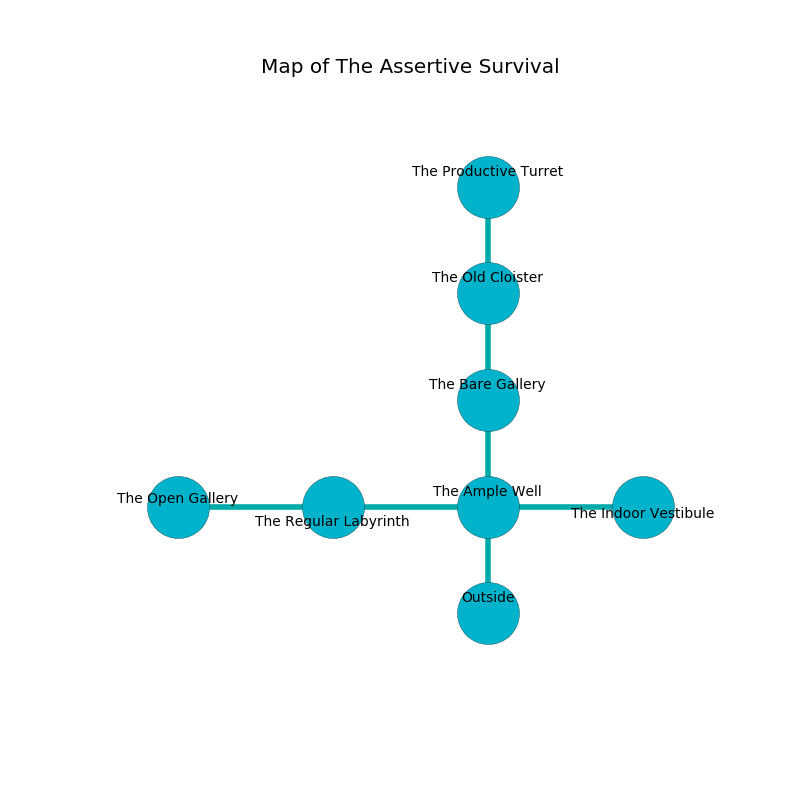

%Ruin Dogs

##The Assertive Survival
###Overview
The Assertive Survival is located under an alien rift. Parts of it are foggy. A battle between raiders is happening outside. It is occupied by Humans. Vern Rhoden The Obstinate, a Mind Flayer Arcanist is here. The Humans are ruled by Vern Rhoden The Obstinate. He  is founding a new religion. 

###Artifact
####The Exact Film

The Exact Film looks like a smooth cube. When worshipped it tunnels into the earth. 

###Locations

####the ample well
The brick walls are caving in. The air tastes like almond here. The floor is smooth. 

* To the west a torchlit path opens to [the regular labyrinth](#the-regular-labyrinth).
* To the east a torchlit cavern connects to [the indoor vestibule](#the-indoor-vestibule).
* To the north a narrow corridor leads to [the bare gallery](#the-bare-gallery).
* To the south is the entrance.

####the indoor vestibule
There are a Cult Fanatic, an Assassin, a Commoner, a Scout, an Acolyte, a Bandit Captain, and a Priest here. White lichens are growing from the walls. The air tastes like cornmint here. One of the Humans is on watch, the rest are drunk. 

* To the west a torchlit cavern connects to [the ample well](#the-ample-well).

####the regular labyrinth
White razorgrass is growing from the walls. The mirrored walls are ruined. The air smells like phenolic here. There are a Giant Eagle, a Flumph, a Werewolf, a Tiger, and an Orc War Chief here. 

* To the west a dark path connects to [the open gallery](#the-open-gallery).
* To the east a torchlit path leads to [the ample well](#the-ample-well).

####the bare gallery
The floor is cluttered with shells. Green lichens are growing from the ceiling. There are a Vampire Spawn and a Flameskull here. 

* To the north a small threshold opens to [the old cloister](#the-old-cloister).
* To the south a narrow corridor opens to [the ample well](#the-ample-well).

####the open gallery
There are a Mage and a Berserker here. The mirrored walls are pristine. There is a trap here. When activated, a magical rune will launch a poison dart. The Humans are feasting. 

* To the east a dark path opens to [the regular labyrinth](#the-regular-labyrinth).

####the old cloister
The crystal walls are ruined. The air tastes like corn here. There are two Thugs, two Cult Fanatics, a Mage, three Scouts,  here. The Humans are performing a ritual. If not interrupted, [Vern Rhoden](#Vern-Rhoden) will be magically alarmed. 

* [The Exact Film](#The-Exact-Film) is here.
* [Vern Rhoden The Obstinate](#Vern-Rhoden-The-Obstinate) is here.
* To the north a twisted walkway connects to [the productive turret](#the-productive-turret).
* To the south a small threshold leads to [the bare gallery](#the-bare-gallery).

####the productive turret
There are a Flameskull and a Mage here. The floor is flooded with nine inch deep cool water. 

There is an engraving on a monolith written in Humans Script. 

> Treasure here.
>

* To the south a twisted walkway leads to [the old cloister](#the-old-cloister).

