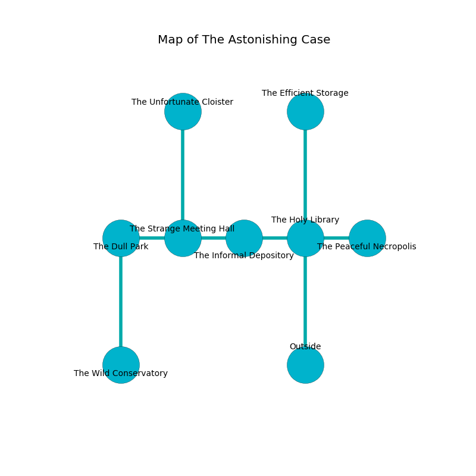

%Ruin Dogs

##The Astonishing Case
###Overview
The Astonishing Case is constructed on an obsidion plain. Parts of The Astonishing Case are cursed. A lunar eclipse is happening outside. It is occupied by Drows. Carlos Montano The Finicky, an Orc War Chief is here. The Drows are the minions of Carlos Montano The Finicky. He  is founding a new religion. 

###Artifact
####Aebdufd

Aebdufd has the form of a wet figurine. It is a shifting brown color. When eaten it grants a wish. 

###Locations

####the holy library
The floor is smooth. The crystal walls are unsettled. There are a Giant Wolf Spider, a Grell, and an Awakened Tree here. The air smells like sage here. 

There is an engraving on a tablet written in Drows Script. 

> I hid something in this place.
>
> Leave at once.
>

* [Carlos Montano The Finicky](#Carlos-Montano-The-Finicky) is here.
* To the west a dripping artery connects to [the informal depository](#the-informal-depository).
* To the east a windy hallway leads to [the peaceful necropolis](#the-peaceful-necropolis).
* To the north a torchlit corridor leads to [the efficient storage](#the-efficient-storage).
* To the south is the entrance.

####the informal depository
The air tastes like naphthyl here. The floor is sticky. Yellow lichens are growing from the ceiling. 

* To the west a twisted gap opens to [the strange meeting hall](#the-strange-meeting-hall).
* To the east a dripping artery leads to [the holy library](#the-holy-library).

####the efficient storage
Red ferns are swaying in broken urns. There is a trap here. When activated, a magical proximity detector will blast flames. The floor is smooth. 

* To the south a torchlit corridor leads to [the holy library](#the-holy-library).

####the peaceful necropolis
There is a trap here. When activated, a magical proximity detector will collapse a wall. The floor is cluttered with broken glass. 

There is an engraving on a monolith written in common. 

> Leave at once.
>

* To the west a windy hallway leads to [the holy library](#the-holy-library).

####the strange meeting hall
The floor is sticky. There are a Quaggoth, a Merfolk, and an Orc Eye of Gruumsh here. The crystal walls are caving in. 

There is an engraving on the ceiling written in Drows Script. 

> I found [Aebdufd](#Aebdufd).
>
> I thought about fighting.
>

* [Aebdufd](#Aebdufd) is here.
* To the west a windy cavern opens to [the dull park](#the-dull-park).
* To the east a twisted gap connects to [the informal depository](#the-informal-depository).
* To the north a torchlit gap opens to [the unfortunate cloister](#the-unfortunate-cloister).

####the dull park
The floor is glossy. The brick walls are ruined. Blue moss is decaying in broken urns. 

* To the east a windy cavern connects to [the strange meeting hall](#the-strange-meeting-hall).
* To the south a small threshold opens to [the wild conservatory](#the-wild-conservatory).

####the wild conservatory
The floor is smooth. The air tastes like lily of the valley here. 

* To the north a small threshold opens to [the dull park](#the-dull-park).

####the unfortunate cloister
White mushrooms are growing in broken urns. The obsidion walls are caving in. There are a Kuo-Toa Monitor, a Dust Mephit, and a Rat here. The air smells like chamomile here. 

* There is a wall here.
* To the south a torchlit gap leads to [the strange meeting hall](#the-strange-meeting-hall).

