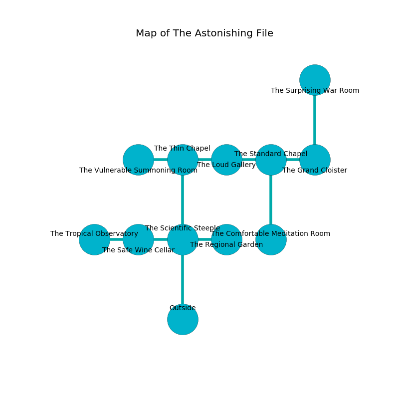

%Ruin Dogs

##The Astonishing File
###Overview
The Astonishing File is located on a broken city. Some rooms of The Astonishing File are cursed. The ruin is coming to life. It is occupied by Kenku. Tawanda Shull The Inflexible, a Gnoll Pack Lord is here. The Kenku are the slaves of Tawanda Shull The Inflexible. She  is founding a new religion. 

###Artifact
####Becmaema Ghuuf

Becmaema Ghuuf is a powerful artifact in the shape of a sharp figurine. Water slips near it. It smells like white chocolate. When held it burns the mind. 

###Locations

####the scientific steeple
Blue mushrooms are sprouting in cracks in the floor. The stone walls are scratched. 

* To the west a narrow threshold opens to [the safe wine cellar](#the-safe-wine-cellar).
* To the east a twisted gap leads to [the regional garden](#the-regional-garden).
* To the north a flooded gap opens to [the thin chapel](#the-thin-chapel).
* To the south is the entrance.

####the thin chapel
White lichens are sprouting in broken urns. The air tastes like roasted hazelnut here. 

* To the west a hazy opening leads to [the vulnerable summoning room](#the-vulnerable-summoning-room).
* To the east a flooded hall connects to [the loud gallery](#the-loud-gallery).
* To the south a flooded gap leads to [the scientific steeple](#the-scientific-steeple).

####the vulnerable summoning room
The obsidion walls are scratched. There are twelve Kenkus here. The floor is smooth. One of the Kenku is on watch, the rest are fighting amongst themselves. 

* [Tawanda Shull The Inflexible](#Tawanda-Shull-The-Inflexible) is here.
* To the east a hazy opening connects to [the thin chapel](#the-thin-chapel).

####the loud gallery
The wooden walls are covered in mold. 

* To the west a flooded hall leads to [the thin chapel](#the-thin-chapel).
* To the east a hazy corridor leads to [the standard chapel](#the-standard-chapel).

####the standard chapel
Gray razorgrass is sprouting in broken urns. There are twelve Kenkus here. The Kenku are feasting. 

* [Becmaema Ghuuf](#Becmaema-Ghuuf) is here.
* To the west a hazy corridor leads to [the loud gallery](#the-loud-gallery).
* To the east a twisted pathway connects to [the grand cloister](#the-grand-cloister).
* To the south a dark path leads to [the comfortable meditation room](#the-comfortable-meditation-room).

####the regional garden
The floor is flooded with five inch deep cool water. There are a Sprite, a Giant Rat, a Gas Spore, and a Water Weird here. White moss is swaying in a patch on the floor. 

There is an engraving on a stone written in Kenku Script. 

> A fish is a width
>
> yet perfect
>
> but never honorable
>
> but never comparable
>
> conservative and viable
>
> yet handy
>
> colourful, tolerant, handy
>
> incapable, rational, social
>
> A fish is a width
>

* To the west a twisted gap connects to [the scientific steeple](#the-scientific-steeple).

####the safe wine cellar
There is a trap here. When activated, a magical sound detector will launch a rolling boulder. The stone walls are ruined. There are twelve Kenkus here. Green lichens are decaying in cracks in the floor. The Kenku are performing a ritual. If not interrupted, the ruin dogs will be weakened. 

* To the west a dripping hall opens to [the tropical observatory](#the-tropical-observatory).
* To the east a narrow threshold connects to [the scientific steeple](#the-scientific-steeple).

####the grand cloister
There is a Bearded Devil here. The air tastes like rose tea here. 

* To the west a twisted pathway connects to [the standard chapel](#the-standard-chapel).
* To the north a flooded cave opens to [the surprising war Room](#the-surprising-war-Room).

####the surprising war Room
There are twelve Kenkus here. The floor is sticky. One of the Kenku is working a mechanism that can engulf the room in a fiery blaze. 

* To the south a flooded cave opens to [the grand cloister](#the-grand-cloister).

####the tropical observatory
There is a trap here. When activated, a pressure plate will launch a poison dart. Green mushrooms are sprouting in broken urns. 

* To the east a dripping hall connects to [the safe wine cellar](#the-safe-wine-cellar).

####the comfortable meditation room
Blue ferns are sprouting in broken urns. There are a Magma Mephit and a Minotaur here. 

* To the north a dark path opens to [the standard chapel](#the-standard-chapel).

