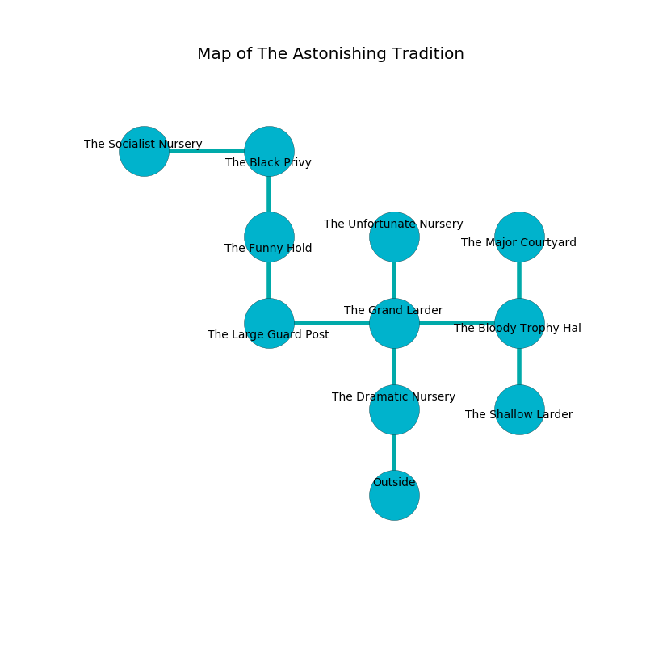

%Ruin Dogs

##The Astonishing Tradition
###Overview
The Astonishing Tradition is located in a cursed rift. Regions of The Astonishing Tradition are inaccessible. The ruin is sinking into the earth. It is occupied by Duergars. Belle Fielder The Vulgar, a Druid is here. The Duergars are the soldiers of Belle Fielder The Vulgar. She  is founding a new religion. 

###Artifact
####Defehhah Hedufedufwi

Defehhah Hedufedufwi has the form of a soft amulet. When held it grants a wish. 

###Locations

####the dramatic nursery
Red mushrooms are swaying in broken urns. The wooden walls are caving in. 

* To the north a flooded cave leads to [the grand larder](#the-grand-larder).
* To the south is the entrance.

####the grand larder
There are two Duergars here. The metallic walls are covered in mold. The floor is bloodstained. One of the Duergars is on watch, the rest are celebrating. 

* There is a rail here.
* To the west a narrow pathway leads to [the large guard post](#the-large-guard-post).
* To the east a torchlit pathway leads to [the bloody trophy hall](#the-bloody-trophy-hall).
* To the north a torchlit cave leads to [the unfortunate nursery](#the-unfortunate-nursery).
* To the south a flooded cave opens to [the dramatic nursery](#the-dramatic-nursery).

####the large guard post
Gray mushrooms are swaying from the ceiling. The floor is cluttered with ashes. 

* There is a triptych here.
* To the east a narrow pathway opens to [the grand larder](#the-grand-larder).
* To the north a windy threshold leads to [the funny hold](#the-funny-hold).

####the funny hold
The crystal walls are unsettled. There are two Duergars here. One of the Duergars is working a mechanism that can lock the exits. 

* To the north a hazy artery leads to [the black privy](#the-black-privy).
* To the south a windy threshold leads to [the large guard post](#the-large-guard-post).

####the bloody trophy hall
The brick walls are caving in. Red razorgrass is decaying in cracks in the floor. There are two Duergars here. If the Duergars notice the Ruin Dogs, one of them will retreat and alert the others. 

There is an engraving on the floor written in common. 

> O! the memory of you is poor
>
> strategic, viable, pure
>
> it is always viable
>
> hope is reliable
>

* To the west a torchlit pathway opens to [the grand larder](#the-grand-larder).
* To the north a dark cavern opens to [the major courtyard](#the-major-courtyard).
* To the south a narrow walkway leads to [the shallow larder](#the-shallow-larder).

####the unfortunate nursery
Yellow mushrooms are swaying from the walls. 

* To the south a torchlit cave opens to [the grand larder](#the-grand-larder).

####the major courtyard
Red lichens are growing from the walls. The air smells like salmon here. There are a Spined Devil and a Commoner here. The metallic walls are bloodstained. The floor is cluttered with broken glass. 

* There is a frame here.
* To the south a dark cavern connects to [the bloody trophy hall](#the-bloody-trophy-hall).

####the black privy
The air smells like sap here. The floor is sticky. 

* [Defehhah Hedufedufwi](#Defehhah-Hedufedufwi) is here.
* [Belle Fielder The Vulgar](#Belle-Fielder-The-Vulgar) is here.
* To the west a torchlit hallway opens to [the socialist nursery](#the-socialist-nursery).
* To the south a hazy artery opens to [the funny hold](#the-funny-hold).

####the shallow larder
The floor is flooded with six inch deep scalding water. The stone walls are ruined. There are two Duergars here. The air smells like juice here. The Duergars are willing to negotiate. 

* To the north a narrow walkway leads to [the bloody trophy hall](#the-bloody-trophy-hall).

####the socialist nursery
There are two Duergars here. Yellow ferns are swaying from the ceiling. The air tastes like freshly cut hay here. The floor is sticky. The Duergars are meditating. 

* To the east a torchlit hallway opens to [the black privy](#the-black-privy).

