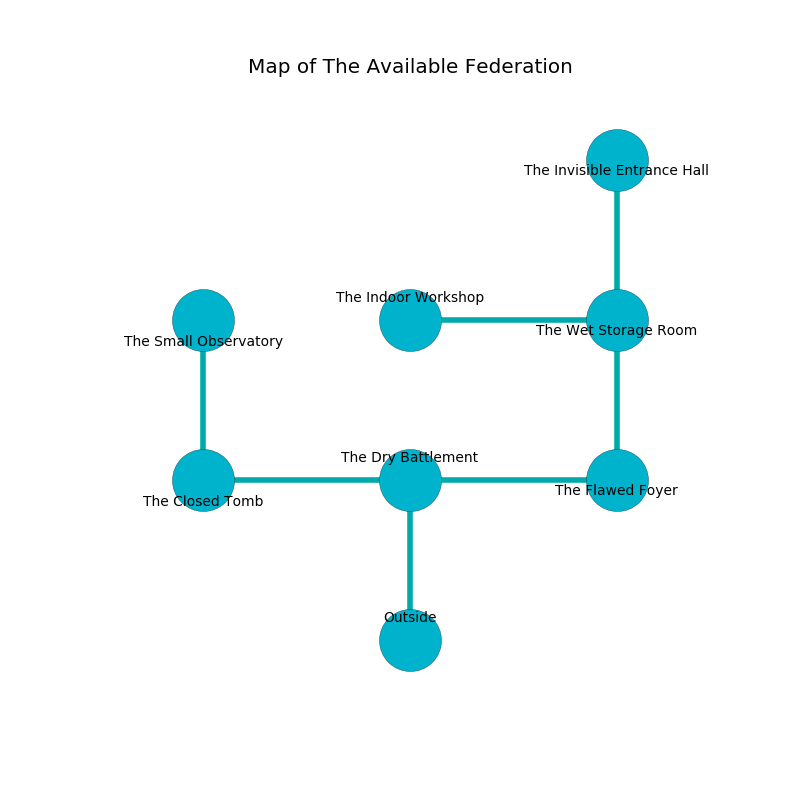

%Ruin Dogs

##The Available Federation
###Overview
The Available Federation is located under a flooded mountain. Some areas of it are incredibly hot. The ruin is burning. It is occupied by Dryads. Elijah Faber The Vengeful, an Orc War Chief is here. The Dryads are ruled by Elijah Faber The Vengeful. He  is trying to find [Asmaedaedaeum](#Asmaedaedaeum). 

###Artifact
####Asmaedaedaeum

Asmaedaedaeum has the form of a sharp prism. Magic slides away from it. When thrown it changes the past. 

###Locations

####the dry battlement
The air tastes like bergamot here. Gray ferns are decaying in cracks in the floor. The floor is flooded with seven inch deep hot water. 

There is an engraving on a stone written in common. 

> I found this place.
>

* To the west a torchlit hall leads to [the closed tomb](#the-closed-tomb).
* To the east a narrow gap leads to [the flawed foyer](#the-flawed-foyer).
* To the south is the entrance.

####the flawed foyer
The concrete walls are caving in. 

* There is a girl here.
* There is a spring here.
* There is a mug here.
* To the west a narrow gap connects to [the dry battlement](#the-dry-battlement).
* To the north a windy hallway leads to [the wet storage room](#the-wet-storage-room).

####the closed tomb
Green lichens are sprouting from the walls. The floor is cluttered with bones. 

* To the east a torchlit hall leads to [the dry battlement](#the-dry-battlement).
* To the north a long gap connects to [the small observatory](#the-small-observatory).

####the wet storage room

* [Asmaedaedaeum](#Asmaedaedaeum) is here.
* To the west a small opening leads to [the indoor workshop](#the-indoor-workshop).
* To the north a dark threshold connects to [the invisible entrance hall](#the-invisible-entrance-hall).
* To the south a windy hallway connects to [the flawed foyer](#the-flawed-foyer).

####the small observatory
There is a Water Elemental here. Gray razorgrass is decaying in a patch on the floor. 

* To the south a long gap leads to [the closed tomb](#the-closed-tomb).

####the indoor workshop
The air tastes like elderflower here. There is a trap here. When activated, a magical sound detector will launch a hail of needles. The mirrored walls are caving in. Blue mushrooms are sprouting from the walls. 

* To the east a small opening connects to [the wet storage room](#the-wet-storage-room).

####the invisible entrance hall
Red ferns are sprouting from the walls. The air tastes like brown sugar here. The crystal walls are unsettled. 

* There is a screw here.
* [Elijah Faber The Vengeful](#Elijah-Faber-The-Vengeful) is here.
* To the south a dark threshold leads to [the wet storage room](#the-wet-storage-room).

