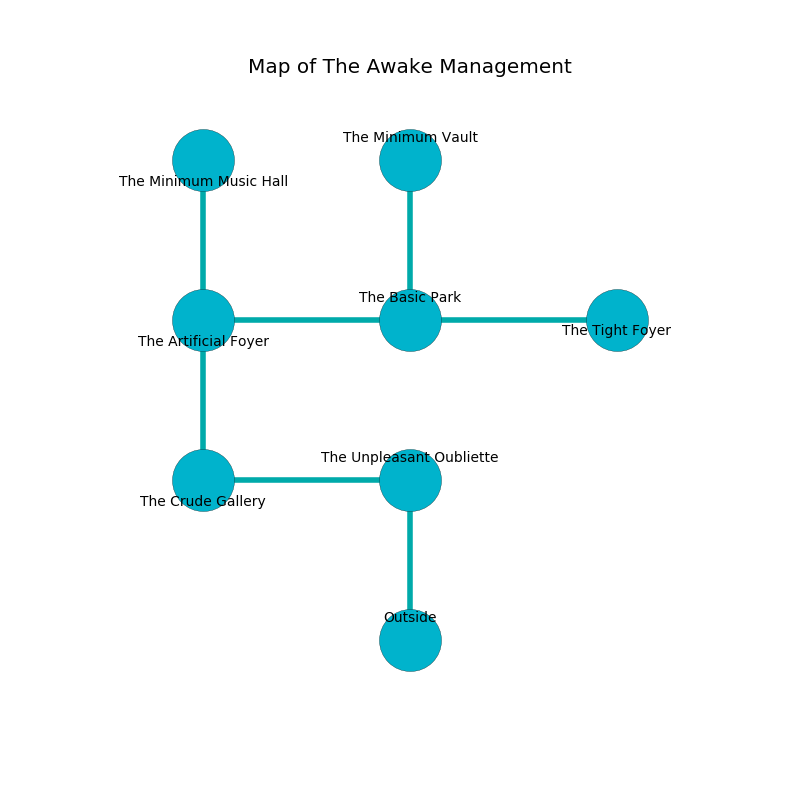

%Ruin Dogs

##The Awake Management
###Overview
The Awake Management is located on a ruined mountain. Some areas of it are cursed. The ruin is coming to life. It is occupied by Gnolls. Daina Kerns The Vengeful, a Mind Flayer Arcanist is here. The Gnolls are the slaves of Daina Kerns The Vengeful. She  is trying to steal [Fadaefabamd](#Fadaefabamd). 

###Artifact
####Fadaefabamd

Fadaefabamd has the form of a wet prism. Psychic energy slips from it. When worn it becomes a force of destiny. 

###Locations

####the unpleasant oubliette
The air tastes like rhubarb here. The obsidion walls are pristine. 

* [Daina Kerns The Vengeful](#Daina-Kerns-The-Vengeful) is here.
* To the west a small hallway connects to [the crude gallery](#the-crude-gallery).
* To the south is the entrance.

####the crude gallery
White ferns are growing in cracks in the floor. The floor is glossy. 

There is an engraving on the floor written in Gnolls Script. 

> O the memory of you is poor
>
> vague, awful, steady
>
> vigorous, marine, secure
>
> death is ready
>

* To the east a small hallway connects to [the unpleasant oubliette](#the-unpleasant-oubliette).
* To the north a flooded artery connects to [the artificial foyer](#the-artificial-foyer).

####the artificial foyer
There is a trap here. When activated, a magical sound detector will launch an arrow. The air smells like medicine here. Blue lichens are growing from the ceiling. There are two Gnoll Fangs of Yeenoghu, three Gnolls, a Gnoll Pack Lord,  here. The Gnolls are drunk. 

There is an engraving on the floor written in common. 

> Try digging.
>

* To the east a torchlit cave opens to [the basic park](#the-basic-park).
* To the north a dripping corridor leads to [the minimum music hall](#the-minimum-music-hall).
* To the south a flooded artery connects to [the crude gallery](#the-crude-gallery).

####the basic park
Blue mushrooms are swaying in cracks in the floor. The air tastes like beef here. 

* There is a trousers here.
* [Fadaefabamd](#Fadaefabamd) is here.
* To the west a torchlit cave opens to [the artificial foyer](#the-artificial-foyer).
* To the east a twisted cave opens to [the tight foyer](#the-tight-foyer).
* To the north a dripping hall connects to [the minimum vault](#the-minimum-vault).

####the minimum vault
White lichens are growing from the walls. 

* To the south a dripping hall opens to [the basic park](#the-basic-park).

####the minimum music hall
There are a Gnoll Fang of Yeenoghu, two Gnolls, two Gnoll Pack Lords,  here. Blue mushrooms are sprouting from the ceiling. The mirrored walls are caving in. The Gnolls are performing a ritual. If not interrupted, [Daina Kerns](#Daina-Kerns) will be magically alarmed. 

There is an engraving on the floor written in common. 

> Oh dire we
>
> federal and free
>
> comprehensive and content
>
> life is free
>

* To the south a dripping corridor leads to [the artificial foyer](#the-artificial-foyer).

####the tight foyer
Green razorgrass is sprouting in broken urns. The floor is sticky. 

* To the west a twisted cave leads to [the basic park](#the-basic-park).

