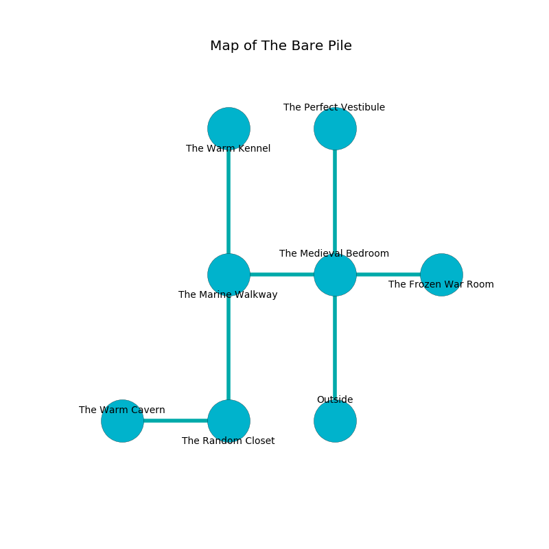

%Ruin Dogs

##The Bare Pile
###Overview
The Bare Pile is located under a ruined city. Some areas of The Bare Pile are flooded. A solar eclipse is happening outside. It is occupied by Satyrs. Tanja Ornelas The Vain, a Quaggoth Thonot is here. The Satyrs are the minions of Tanja Ornelas The Vain. She  is trying to hide [The Agile Version](#The-Agile-Version). 

###Artifact
####The Agile Version

The Agile Version has the form of a smooth orb. It smells like papaya. When touched it repels insects. 

###Locations

####the medieval bedroom
Red razorgrass is decaying from the walls. The floor is flooded with one inch deep cool water. 

* [The Agile Version](#The-Agile-Version) is here.
* To the west a long passageway connects to [the marine walkway](#the-marine-walkway).
* To the east a long cavern connects to [the frozen war Room](#the-frozen-war-Room).
* To the north a dark gap leads to [the perfect vestibule](#the-perfect-vestibule).
* To the south is the entrance.

####the marine walkway

* To the east a long passageway opens to [the medieval bedroom](#the-medieval-bedroom).
* To the north a narrow corridor leads to [the warm kennel](#the-warm-kennel).
* To the south a dark hallway opens to [the random closet](#the-random-closet).

####the warm kennel
The air smells like green tea here. Green moss is growing in broken urns. The concrete walls are scratched. 

* There is a flag here.
* To the south a narrow corridor connects to [the marine walkway](#the-marine-walkway).

####the frozen war Room
The floor is bloodstained. The wooden walls are bloodstained. 

* To the west a long cavern opens to [the medieval bedroom](#the-medieval-bedroom).

####the random closet
The floor is cluttered with ashes. There are eight Satyrs here. The air tastes like bell pepper here. The Satyrs are celebrating. 

* To the west a dark artery opens to [the warm cavern](#the-warm-cavern).
* To the north a dark hallway connects to [the marine walkway](#the-marine-walkway).

####the warm cavern
The glass walls are scratched. The air tastes like pennyroyal here. There are eight Satyrs here. The Satyrs are fighting amongst themselves. 

There is an engraving on the wall written in common. 

> I was injured in The Bare Pile.
>

* [Tanja Ornelas The Vain](#Tanja-Ornelas-The-Vain) is here.
* To the east a dark artery connects to [the random closet](#the-random-closet).

####the perfect vestibule
The air tastes like roasted hazelnut here. The stone walls are pristine. The floor is sticky. 

There is an engraving on a stone written in Satyrs Script. 

> Oh sorry god
>
> it is never fair
>
> exotic and odd
>
> the world is aware
>

* To the south a dark gap opens to [the medieval bedroom](#the-medieval-bedroom).

