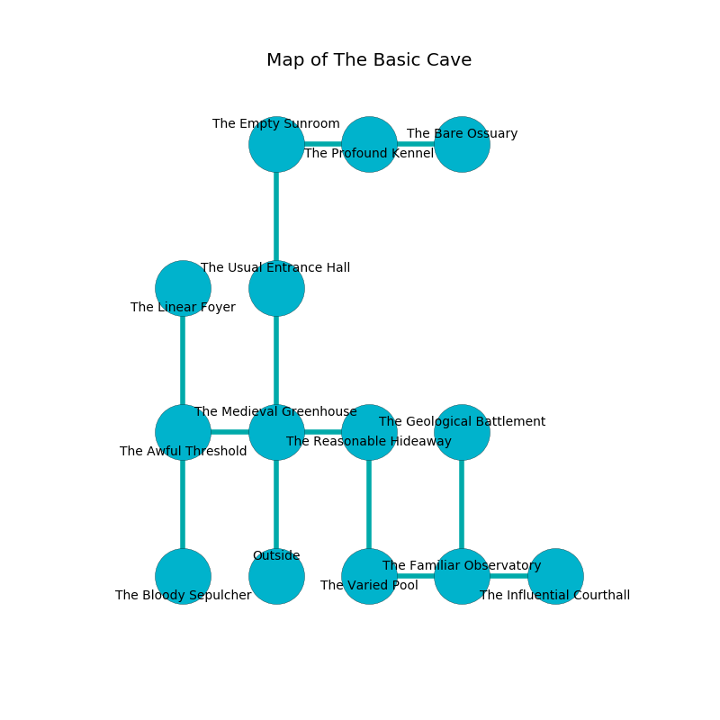

%Ruin Dogs

##The Basic Cave
###Overview
The Basic Cave is located in a spikey rift. Some rooms of The Basic Cave are corrupted. A massive flood is happening outside. It is occupied by Drow. Jamey Crider The Nasty, a Stone Giant is here. The Drow are battling Jamey Crider The Nasty. She  is trying to research [Ededmwi Awia](#Ededmwi-Awia). 

###Artifact
####Ededmwi Awia

Ededmwi Awia is a powerful artifact in the shape of a transparent figurine. When picked up it curses all nearby. 

###Locations

####the medieval greenhouse
Green mushrooms are growing in broken urns. There are a Drow Elite Warrior and a Drow Mage here. The air smells like fir needle here. The Drow are feasting. 

* There is a dragon here.
* To the west a torchlit hallway opens to [the awful threshold](#the-awful-threshold).
* To the east a narrow artery leads to [the reasonable hideaway](#the-reasonable-hideaway).
* To the north a torchlit cavern leads to [the usual entrance hall](#the-usual-entrance-hall).
* To the south is the entrance.

####the usual entrance hall
Green mushrooms are sprouting from the ceiling. There is a Hezrou here. The brick walls are scratched. 

* There is a rail here.
* To the north a long corridor leads to [the empty sunroom](#the-empty-sunroom).
* To the south a torchlit cavern connects to [the medieval greenhouse](#the-medieval-greenhouse).

####the awful threshold
The air tastes like ham here. There are a Winter Wolf, a Swarm of Bats, a Jackalwere, an Ogre Zombie, a Rust Monster, a Centaur, and a Quadrone here. 

There is an engraving on the wall written in common. 

> Go away.
>

* There is a frame here.
* [Ededmwi Awia](#Ededmwi-Awia) is here.
* To the east a torchlit hallway connects to [the medieval greenhouse](#the-medieval-greenhouse).
* To the north a small opening connects to [the linear foyer](#the-linear-foyer).
* To the south a flooded walkway leads to [the bloody sepulcher](#the-bloody-sepulcher).

####the empty sunroom
The mirrored walls are covered in mold. Red mushrooms are decaying from the ceiling. 

There is an engraving on the floor written in common. 

> Oh everything is sadistic
>
> but never realistic
>
> it is always judicial
>
> everything is official
>

* [Jamey Crider The Nasty](#Jamey-Crider-The-Nasty) is here.
* To the east a dripping passageway leads to [the profound kennel](#the-profound-kennel).
* To the south a long corridor leads to [the usual entrance hall](#the-usual-entrance-hall).

####the reasonable hideaway
The air smells like cinnamon here. The floor is glossy. 

* To the west a narrow artery opens to [the medieval greenhouse](#the-medieval-greenhouse).
* To the south a twisted walkway opens to [the varied pool](#the-varied-pool).

####the profound kennel
The floor is smooth. The glass walls are bloodstained. There are a Troglodyte, a Mimic, and a Cloaker here. 

* To the west a dripping passageway connects to [the empty sunroom](#the-empty-sunroom).
* To the east a long hallway leads to [the bare ossuary](#the-bare-ossuary).

####the bare ossuary
The wooden walls are ruined. Red lichens are sprouting in cracks in the floor. 

There is an engraving on the floor written in common. 

> I am looting The Basic Cave.
>

* To the west a long hallway connects to [the profound kennel](#the-profound-kennel).

####the linear foyer
Yellow razorgrass is decaying from the walls. 

There is an engraving on a stone written in common. 

> I lost [Ededmwi Awia](#Ededmwi-Awia).
>
> A trap ahead.
>

* To the south a small opening leads to [the awful threshold](#the-awful-threshold).

####the varied pool
The air smells like jasmin here. The floor is smooth. Blue ferns are decaying from the ceiling. 

* There is a bridge here.
* To the east a dark cave connects to [the familiar observatory](#the-familiar-observatory).
* To the north a twisted walkway leads to [the reasonable hideaway](#the-reasonable-hideaway).

####the familiar observatory

* To the west a dark cave connects to [the varied pool](#the-varied-pool).
* To the east a windy cavern connects to [the influential courthall](#the-influential-courthall).
* To the north a long passageway leads to [the geological battlement](#the-geological-battlement).

####the geological battlement
The air smells like alcohol here. Yellow razorgrass is sprouting in cracks in the floor. The wooden walls are caving in. There are a Mud Mephit, a Homunculus, a Thri-Kreen, a Couatl, and a Killer Whale here. 

* To the south a long passageway leads to [the familiar observatory](#the-familiar-observatory).

####the influential courthall
The air tastes like guava here. There are a Drow Elite Warrior and a Drow Priestess of Lolth here. Blue razorgrass is decaying in cracks in the floor. The floor is flooded with one inch deep cold water. The glass walls are ruined. The Drow are drunk. 

* There is an egg here.
* To the west a windy cavern connects to [the familiar observatory](#the-familiar-observatory).

####the bloody sepulcher
Red lichens are swaying in cracks in the floor. There are a Drow Elite Warrior and a Drow Priestess of Lolth here. If the Drow notice the Ruin Dogs, one of them will retreat and alert [Jamey Crider](#Jamey-Crider). 

There is an engraving on the wall written in Drow Script. 

> Oh weak you
>
> always ambitious
>
> ever new
>
> sadness is vicious
>

* To the north a flooded walkway leads to [the awful threshold](#the-awful-threshold).

