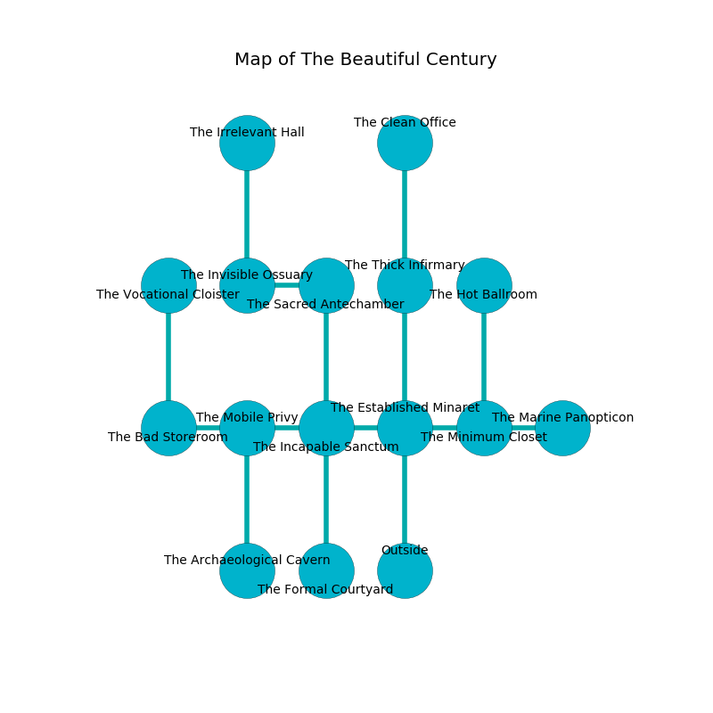

%Ruin Dogs

##The Beautiful Century
###Overview
The Beautiful Century is located on a cursed mountain. Some areas of it are unbearably hot. A windstorm is happening outside. It is occupied by Centaurs. Kylee North The Changeable, a Mind Flayer is here. The Centaurs are the soldiers of Kylee North The Changeable. She  is trying to exploit [Iaufcaf](#Iaufcaf). 

###Artifact
####Iaufcaf

Iaufcaf is a powerful artifact in the shape of a soft blade. It is a sickly green color. When gazed upon it grants psychic powers. 

###Locations

####the established minaret
Gray lichens are decaying from the walls. 

* [Kylee North The Changeable](#Kylee-North-The-Changeable) is here.
* To the west a flooded cave leads to [the incapable sanctum](#the-incapable-sanctum).
* To the east a dark passageway connects to [the minimum closet](#the-minimum-closet).
* To the north a long gap leads to [the thick infirmary](#the-thick-infirmary).
* To the south is the entrance.

####the minimum closet
The glass walls are ruined. 

* There is a parcel here.
* To the west a dark passageway leads to [the established minaret](#the-established-minaret).
* To the east a windy hall opens to [the marine panopticon](#the-marine-panopticon).
* To the north a small artery leads to [the hot ballroom](#the-hot-ballroom).

####the thick infirmary
The floor is smooth. Gray lichens are swaying in broken urns. The air smells like coriander here. 

* To the north a narrow path leads to [the clean office](#the-clean-office).
* To the south a long gap connects to [the established minaret](#the-established-minaret).

####the hot ballroom

There is an engraving on the ceiling written in Centaurs Script. 

> I thought about leaving.
>

* To the south a small artery leads to [the minimum closet](#the-minimum-closet).

####the incapable sanctum
The concrete walls are unsettled. There are three Centaurs here. One of the Centaurs is on watch, the rest are feasting. 

There is an engraving on a monolith written in Centaurs Script. 

> O terrible you
>
> main, written, due
>
> it is never senior
>
> nothing is new
>

* To the west a windy cave opens to [the mobile privy](#the-mobile-privy).
* To the east a flooded cave connects to [the established minaret](#the-established-minaret).
* To the north a narrow cave opens to [the sacred antechamber](#the-sacred-antechamber).
* To the south a narrow passageway leads to [the formal courtyard](#the-formal-courtyard).

####the sacred antechamber
Green moss is growing in a patch on the floor. The air tastes like juice here. The glass walls are pristine. There are three Centaurs here. If the Centaurs notice the Ruin Dogs, one of them will retreat and alert the others. 

There is an engraving on the ceiling written in common. 

> I am lost in The Beautiful Century.
>
> Do not try hiding.
>

* To the west a dark walkway opens to [the invisible ossuary](#the-invisible-ossuary).
* To the south a narrow cave leads to [the incapable sanctum](#the-incapable-sanctum).

####the clean office
There are an Otyugh, a Centaur, and a Cat here. White mushrooms are swaying in broken urns. 

There is an engraving on the floor written in common. 

> We are lost
>
> competent and satisfied
>
> you are not returned
>

* To the south a narrow path connects to [the thick infirmary](#the-thick-infirmary).

####the mobile privy
There are three Centaurs here. One of the Centaurs is working a mechanism that can launch acid at the Ruin Dogs. 

There is an engraving on a tablet written in common. 

> I discovered [Iaufcaf](#Iaufcaf).
>

* There is a whip here.
* To the west a windy corridor leads to [the bad storeroom](#the-bad-storeroom).
* To the east a windy cave opens to [the incapable sanctum](#the-incapable-sanctum).
* To the south a flooded hallway leads to [the archaeological cavern](#the-archaeological-cavern).

####the invisible ossuary
The floor is smooth. The air smells like vegetables here. 

* [Iaufcaf](#Iaufcaf) is here.
* To the east a dark walkway connects to [the sacred antechamber](#the-sacred-antechamber).
* To the north a dark artery opens to [the irrelevant hall](#the-irrelevant-hall).

####the bad storeroom
The floor is smooth. The crystal walls are pristine. 

* To the east a windy corridor opens to [the mobile privy](#the-mobile-privy).
* To the north a flooded hall connects to [the vocational cloister](#the-vocational-cloister).

####the vocational cloister
The crystal walls are caving in. Yellow lichens are swaying in cracks in the floor. The floor is smooth. 

* To the south a flooded hall leads to [the bad storeroom](#the-bad-storeroom).

####the formal courtyard
Gray moss is sprouting in broken urns. The air smells like tangerine here. 

There is an engraving on the floor written in common. 

> Go away.
>

* To the north a narrow passageway leads to [the incapable sanctum](#the-incapable-sanctum).

####the archaeological cavern
The stone walls are covered in mold. There is a trap here. When activated, a magical proximity detector will extend a spring loaded spear. White razorgrass is decaying in a patch on the floor. 

* To the north a flooded hallway opens to [the mobile privy](#the-mobile-privy).

####the marine panopticon
There are a Hook Horror, a Flameskull, and a Crab here. The glass walls are covered in mold. The floor is smooth. The air tastes like graham cracker here. 

There is an engraving on a tablet written in common. 

> I hid something in this place.
>
> Go away.
>

* To the west a windy hall connects to [the minimum closet](#the-minimum-closet).

####the irrelevant hall
Gray ferns are growing from the walls. 

There is an engraving on the floor written in common. 

> [Iaufcaf](#Iaufcaf)
>
> due, acceptable, implicit
>

* To the south a dark artery leads to [the invisible ossuary](#the-invisible-ossuary).

