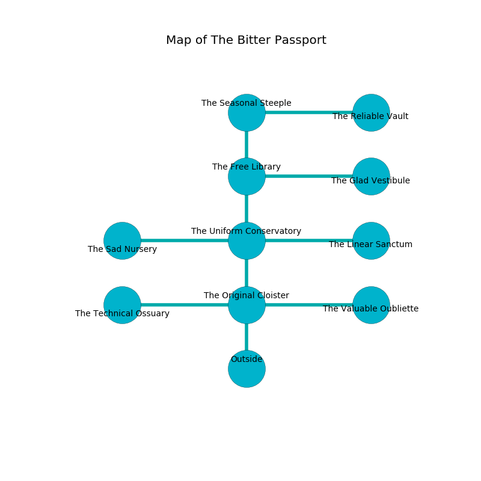

%Ruin Dogs

##The Bitter Passport
###Overview
The Bitter Passport is located on a poisoned plain. Regions of The Bitter Passport are foggy. A massive flood is happening outside. It is occupied by Satyrs. Jacquetta Grove The Cantankerous, a Bulette is here. The Satyrs are the minions of Jacquetta Grove The Cantankerous. She  is trying to hide [The Lucky Identity](#The-Lucky-Identity). 

###Artifact
####The Lucky Identity

The Lucky Identity is a powerful artifact in the shape of a soft meteorite. It is a shifting orange color. When touched it repels insects. 

###Locations

####the original cloister
Green mushrooms are sprouting in broken urns. The air tastes like cooked apple here. The floor is bloodstained. 

There is an engraving on a tablet written in common. 

> Dear me! my fate is poor
>
> it is never secure
>
> yet socialist
>
> death is premature
>

* To the west a dripping cave leads to [the technical ossuary](#the-technical-ossuary).
* To the east a hazy passageway leads to [the valuable oubliette](#the-valuable-oubliette).
* To the north a twisted hallway leads to [the uniform conservatory](#the-uniform-conservatory).
* To the south is the entrance.

####the uniform conservatory
The air smells like hazelnut here. The floor is cluttered with ashes. The stone walls are unsettled. 

There is an engraving on a stone written in common. 

> I worship [The Lucky Identity](#The-Lucky-Identity).
>
> Do not try digging.
>

* To the west a twisted path opens to [the sad nursery](#the-sad-nursery).
* To the east a twisted threshold connects to [the linear sanctum](#the-linear-sanctum).
* To the north a small threshold opens to [the free library](#the-free-library).
* To the south a twisted hallway opens to [the original cloister](#the-original-cloister).

####the valuable oubliette
The wooden walls are pristine. There are eight Satyrs here. Red moss is decaying in cracks in the floor. One of the Satyrs is on watch, the rest are drunk. 

* There is a basket here.
* To the west a hazy passageway connects to [the original cloister](#the-original-cloister).

####the linear sanctum
The floor is bloodstained. The air smells like styrene here. 

* [Jacquetta Grove The Cantankerous](#Jacquetta-Grove-The-Cantankerous) is here.
* To the west a twisted threshold leads to [the uniform conservatory](#the-uniform-conservatory).

####the sad nursery
There are eight Satyrs here. Gray ferns are sprouting in a patch on the floor. The air tastes like thyme here. The floor is sticky. The Satyrs are willing to negotiate. 

* To the east a twisted path leads to [the uniform conservatory](#the-uniform-conservatory).

####the technical ossuary
The floor is cluttered with bones. There is a trap here. When activated, a magical sound detector will open a large pit in the floor. The brick walls are scratched. There are eight Satyrs here. The Satyrs are defending this room from intruders. 

* To the east a dripping cave connects to [the original cloister](#the-original-cloister).

####the free library
There are eight Satyrs here. The crystal walls are ruined. The air smells like plum skin here. The Satyrs are willing to negotiate. 

There is an engraving on a tablet written in common. 

> Treasure here.
>

* [The Lucky Identity](#The-Lucky-Identity) is here.
* To the east a twisted corridor connects to [the glad vestibule](#the-glad-vestibule).
* To the north a narrow passageway connects to [the seasonal steeple](#the-seasonal-steeple).
* To the south a small threshold connects to [the uniform conservatory](#the-uniform-conservatory).

####the seasonal steeple
The crystal walls are pristine. 

* There is a lock here.
* To the east a long artery connects to [the reliable vault](#the-reliable-vault).
* To the south a narrow passageway leads to [the free library](#the-free-library).

####the reliable vault
The stone walls are scratched. The air tastes like sugar here. The floor is glossy. There are eight Satyrs here. The Satyrs are defending this room from intruders. 

* To the west a long artery leads to [the seasonal steeple](#the-seasonal-steeple).

####the glad vestibule
The floor is glossy. There is a trap here. When activated, a magical rune will launch a swinging block. 

There is an engraving on a monolith written in common. 

> Try hiding.
>

* To the west a twisted corridor leads to [the free library](#the-free-library).

