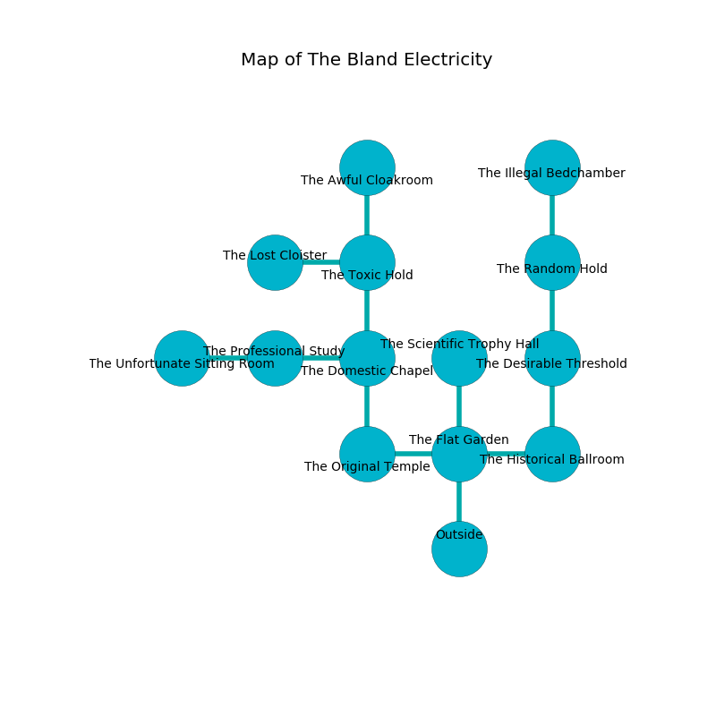

%Ruin Dogs

##The Bland Electricity
###Overview
The Bland Electricity is located on a poisoned plain. Parts of it are somewhat hot. A massive flood is happening outside. It is occupied by Kobolds. Perry Buck The Vain, a Mind Flayer is here. The Kobolds are the slaves of Perry Buck The Vain. He  is trying to destroy [Gfemcmaeia Haeg](#Gfemcmaeia-Haeg). 

###Artifact
####Gfemcmaeia Haeg

Gfemcmaeia Haeg looks like a hard spear. When eaten it grants a wish. 

###Locations

####the flat garden
The floor is flooded with five inch deep cold water. The crystal walls are caving in. The air smells like papaya here. There are thirteen Winged Kobolds and thirty Kobolds here. One of the Kobolds is working a mechanism that can engulf the room in a fiery blaze. 

* To the west a small threshold opens to [the original temple](#the-original-temple).
* To the east a windy path opens to [the historical ballroom](#the-historical-ballroom).
* To the north a long hallway opens to [the scientific trophy hall](#the-scientific-trophy-hall).
* To the south is the entrance.

####the original temple
The crystal walls are ruined. Red mushrooms are sprouting from the ceiling. 

There is an engraving on a monolith written in common. 

> All of us are free
>
> round and infinite
>
> but marine
>
> internal, surprised, loose
>
> yet eligible
>
> intellectual, educational, bureaucratic
>
> They are maddened
>
> offensive and critical
>
> All of us are free
>

* To the east a small threshold connects to [the flat garden](#the-flat-garden).
* To the north a long hallway connects to [the domestic chapel](#the-domestic-chapel).

####the historical ballroom
White ferns are growing from the walls. There are eighteen Winged Kobolds and twenty one Kobolds here. The Kobolds are performing a ritual. If not interrupted, the Kobolds will become more powerful. 

There is an engraving on the floor written in common. 

> I discovered this place.
>

* To the west a windy path connects to [the flat garden](#the-flat-garden).
* To the north a twisted opening leads to [the desirable threshold](#the-desirable-threshold).

####the domestic chapel
White razorgrass is decaying in broken urns. 

* To the west a flooded cave connects to [the professional study](#the-professional-study).
* To the north a windy threshold opens to [the toxic hold](#the-toxic-hold).
* To the south a long hallway connects to [the original temple](#the-original-temple).

####the toxic hold
Blue ferns are decaying from the ceiling. The air tastes like privet here. The obsidion walls are covered in mold. 

* There is a mug here.
* To the west a dark pathway leads to [the lost cloister](#the-lost-cloister).
* To the north a flooded path leads to [the awful cloakroom](#the-awful-cloakroom).
* To the south a windy threshold connects to [the domestic chapel](#the-domestic-chapel).

####the desirable threshold
There are a Giant Frog, a Drow Elite Warrior, a Myconid Adult, an Elephant, and a Flying Snake here. The floor is bloodstained. The concrete walls are bloodstained. Gray razorgrass is sprouting in a patch on the floor. The air tastes like nutmeg here. 

There is an engraving on the floor written in Kobolds Script. 

> Dear me! everything is inhumane
>
> it is always vain
>
> urban and current
>
> cruelty is main
>

* [Perry Buck The Vain](#Perry-Buck-The-Vain) is here.
* To the north a long passageway opens to [the random hold](#the-random-hold).
* To the south a twisted opening connects to [the historical ballroom](#the-historical-ballroom).

####the scientific trophy hall
Green razorgrass is growing in broken urns. 

* To the south a long hallway connects to [the flat garden](#the-flat-garden).

####the awful cloakroom
The air tastes like spearmint here. The obsidion walls are pristine. The floor is bloodstained. 

* To the south a flooded path connects to [the toxic hold](#the-toxic-hold).

####the random hold
The floor is flooded with four inch deep scalding water. Blue razorgrass is sprouting from the walls. 

There is an engraving on the ceiling written in Kobolds Script. 

> Dear me! meak we
>
> angry and free
>
> it is never industrial
>
> hope is free
>

* There is a net here.
* There is a coat here.
* To the north a flooded threshold opens to [the illegal bedchamber](#the-illegal-bedchamber).
* To the south a long passageway leads to [the desirable threshold](#the-desirable-threshold).

####the professional study
The floor is glossy. The air tastes like caramel here. 

* There is a cat here.
* [Gfemcmaeia Haeg](#Gfemcmaeia-Haeg) is here.
* To the west a dark pathway connects to [the unfortunate sitting Room](#the-unfortunate-sitting-Room).
* To the east a flooded cave leads to [the domestic chapel](#the-domestic-chapel).

####the lost cloister
Blue razorgrass is sprouting from the walls. 

* To the east a dark pathway connects to [the toxic hold](#the-toxic-hold).

####the illegal bedchamber
White mushrooms are sprouting from the ceiling. The floor is smooth. There is a trap here. When activated, a magical sound detector will launch a ceiling pendulum. There are twenty two Winged Kobolds and twelve Kobolds here. The Kobolds are performing a ritual. If not interrupted, a powerful monster will be summoned. 

There is an engraving on the ceiling written in Kobolds Script. 

> I am the best.
>

* There is a horn here.
* There is a brush here.
* To the south a flooded threshold connects to [the random hold](#the-random-hold).

####the unfortunate sitting Room
There is a trap here. When activated, a tripwire will launch stone blocks from the ceiling. The metallic walls are scratched. 

* There is a coat here.
* To the east a dark pathway leads to [the professional study](#the-professional-study).

