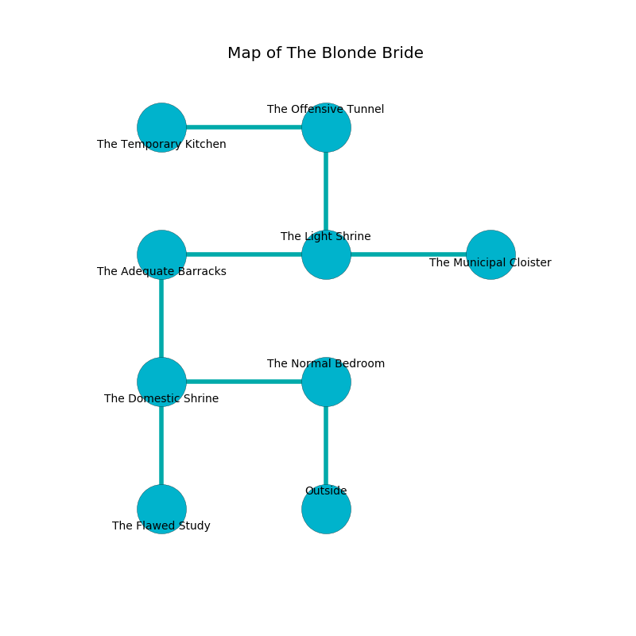

%Ruin Dogs

##The Blonde Bride
###Overview
The Blonde Bride is located on a volcanic plain. Regions of it are foggy. The ruin is burning. It is occupied by Goblins. Mikel Johns The Belligerent, a Knight is here. The Goblins are the soldiers of Mikel Johns The Belligerent. He  is founding a new religion. 

###Artifact
####The Tidy Winter

The Tidy Winter looks like a hard orb. It smells like sage. Fire pours from it. When carried it repels insects. 

###Locations

####the normal bedroom
The floor is glossy. The air tastes like wormwood here. The concrete walls are bloodstained. 

* [Mikel Johns The Belligerent](#Mikel-Johns-The-Belligerent) is here.
* To the west a dark walkway connects to [the domestic shrine](#the-domestic-shrine).
* To the south is the entrance.

####the domestic shrine
The floor is bloodstained. The crystal walls are scratched. The air tastes like meat here. There are two Goblins and three Hobgoblins here. The Goblins are performing a ritual. If not interrupted, a powerful monster will be summoned. 

There is an engraving on a tablet written in common. 

> Dig here.
>

* To the east a dark walkway opens to [the normal bedroom](#the-normal-bedroom).
* To the north a narrow hallway opens to [the adequate barracks](#the-adequate-barracks).
* To the south a dark corridor connects to [the flawed study](#the-flawed-study).

####the adequate barracks
Red mushrooms are sprouting from the ceiling. The floor is bloodstained. There are four Hobgoblins here. The metallic walls are unsettled. The Goblins are performing a ritual. If not interrupted, the ruin dogs will be weakened. 

* To the east a dark artery opens to [the light shrine](#the-light-shrine).
* To the south a narrow hallway connects to [the domestic shrine](#the-domestic-shrine).

####the light shrine
The mirrored walls are bloodstained. The air smells like butterscotch here. 

* To the west a dark artery leads to [the adequate barracks](#the-adequate-barracks).
* To the east a narrow cavern leads to [the municipal cloister](#the-municipal-cloister).
* To the north a dark gap opens to [the offensive tunnel](#the-offensive-tunnel).

####the offensive tunnel
Green razorgrass is growing in cracks in the floor. The metallic walls are scratched. The floor is flooded with six inch deep lukewarm water. There are two Goblins and three Hobgoblins here. The Goblins are meditating. 

* [The Tidy Winter](#The-Tidy-Winter) is here.
* To the west a torchlit hallway connects to [the temporary kitchen](#the-temporary-kitchen).
* To the south a dark gap opens to [the light shrine](#the-light-shrine).

####the municipal cloister
The mirrored walls are pristine. The floor is bloodstained. 

* There is a picture here.
* To the west a narrow cavern connects to [the light shrine](#the-light-shrine).

####the flawed study
There are two Goblins and three Hobgoblins here. The floor is glossy. The Goblins are crazy with bloodlust. 

* To the north a dark corridor opens to [the domestic shrine](#the-domestic-shrine).

####the temporary kitchen
There are two Goblins and three Hobgoblins here. The floor is sticky. White mushrooms are swaying in broken urns. The Goblins are performing a ritual. If not interrupted, a powerful monster will be summoned. 

* There is a bell here.
* To the east a torchlit hallway opens to [the offensive tunnel](#the-offensive-tunnel).

