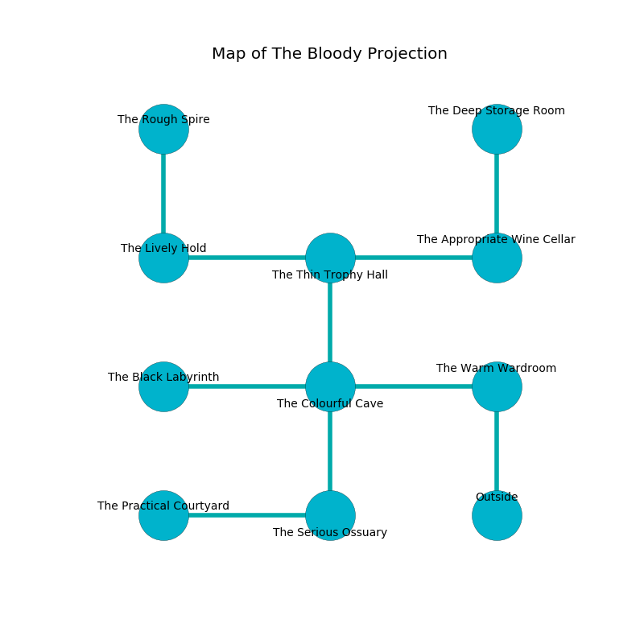

%Ruin Dogs

##The Bloody Projection
###Overview
The Bloody Projection is constructed on a cursed tree. Some rooms of it are inaccessible. The ruin is flooding. It is occupied by Pixies. Lucien Tinker The Indecisive, a Fire Giant is here. The Pixies have been charmed by Lucien Tinker The Indecisive. He  is trying to recover [The Responsible Foot](#The-Responsible-Foot). 

###Artifact
####The Responsible Foot

The Responsible Foot has the form of a soft amulet. Light slips away from it. It smells like praline. When touched it repels insects. 

###Locations

####the warm wardroom
The stone walls are caving in. 

There is an engraving on a monolith written in common. 

> I am a coward.
>

* There is an orange here.
* To the west a flooded walkway opens to [the colourful cave](#the-colourful-cave).
* To the south is the entrance.

####the colourful cave
There are a Githyanki Warrior, a Githzerai Monk, and a Chain Devil here. Yellow moss is decaying in cracks in the floor. The air tastes like pistachio here. The floor is cluttered with debris. The metallic walls are covered in mold. 

* To the west a twisted gap connects to [the black labyrinth](#the-black-labyrinth).
* To the east a flooded walkway opens to [the warm wardroom](#the-warm-wardroom).
* To the north a windy threshold connects to [the thin trophy hall](#the-thin-trophy-hall).
* To the south a hazy pathway opens to [the serious ossuary](#the-serious-ossuary).

####the thin trophy hall
Red ferns are growing in a patch on the floor. There are forty Pixies here. If the Pixies notice the Ruin Dogs, one of them will retreat and alert [Lucien Tinker](#Lucien-Tinker). 

* To the west a torchlit cave connects to [the lively hold](#the-lively-hold).
* To the east a hazy pathway opens to [the appropriate wine cellar](#the-appropriate-wine-cellar).
* To the south a windy threshold leads to [the colourful cave](#the-colourful-cave).

####the appropriate wine cellar
The brick walls are unsettled. 

There is an engraving on the wall written in common. 

> I was injured in The Bloody Projection.
>

* To the west a hazy pathway leads to [the thin trophy hall](#the-thin-trophy-hall).
* To the north a flooded pathway opens to [the deep storage room](#the-deep-storage-room).

####the deep storage room
The floor is bloodstained. The mirrored walls are scratched. The air tastes like lettuce here. 

* To the south a flooded pathway connects to [the appropriate wine cellar](#the-appropriate-wine-cellar).

####the black labyrinth
The air tastes like hyssop here. The wooden walls are unsettled. The floor is smooth. 

There is an engraving on a stone written in Pixies Script. 

> Go away.
>

* There is a girl here.
* To the east a twisted gap leads to [the colourful cave](#the-colourful-cave).

####the serious ossuary
The floor is flooded with six inch deep cold water. There are forty Pixies here. The air tastes like basil here. Blue mushrooms are sprouting in cracks in the floor. The Pixies are willing to negotiate. 

There is an engraving on a stone written in Pixies Script. 

> You are sorrowful
>
> but archaeological
>

* To the west a long cavern opens to [the practical courtyard](#the-practical-courtyard).
* To the north a hazy pathway connects to [the colourful cave](#the-colourful-cave).

####the lively hold
Blue moss is swaying in a patch on the floor. There are a Drow, a Quaggoth Thonot, a Monodrone, a Black Bear, a Commoner, a Rust Monster, a Thug, a Deep Gnome, a Werewolf, and a Quaggoth here. The floor is flooded with two inch deep hot water. 

* [The Responsible Foot](#The-Responsible-Foot) is here.
* To the east a torchlit cave connects to [the thin trophy hall](#the-thin-trophy-hall).
* To the north a windy hall leads to [the rough spire](#the-rough-spire).

####the practical courtyard

There is an engraving on the wall written in common. 

> [The Responsible Foot](#The-Responsible-Foot)
>
> distinct, balanced, clean
>

* To the east a long cavern connects to [the serious ossuary](#the-serious-ossuary).

####the rough spire
There are a Quasit, a Sahuagin, an Assassin, an Octopus, and a Pegasus here. The floor is smooth. 

There is an engraving on a tablet written in Pixies Script. 

> I am free.
>

* There is a carriage here.
* There is a fork here.
* [Lucien Tinker The Indecisive](#Lucien-Tinker-The-Indecisive) is here.
* To the south a windy hall connects to [the lively hold](#the-lively-hold).

