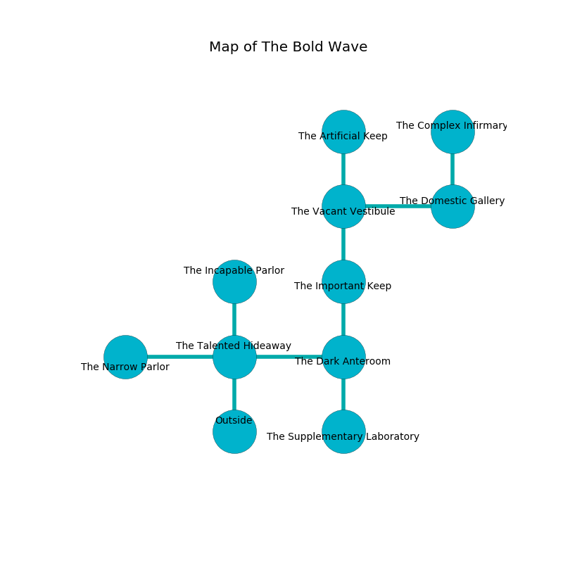

%Ruin Dogs

##The Bold Wave
###Overview
The Bold Wave is located under a flooded plain. Parts of it are unbearably hot. The ruin is burning. It is occupied by Orcs. Bethanie Steen The Foolhardy, a Gnoll Fang of Yeenoghu is here. The Orcs are ruled by Bethanie Steen The Foolhardy. She  is trying to research [The Graphic Musician](#The-Graphic-Musician). 

###Artifact
####The Graphic Musician

The Graphic Musician looks like an opaque doll. It is a dark pink color. It smells like calamus. When smelled it curses all nearby. 

###Locations

####the talented hideaway
The floor is glossy. 

* To the west a flooded passageway opens to [the narrow parlor](#the-narrow-parlor).
* To the east a windy hall opens to [the dark anteroom](#the-dark-anteroom).
* To the north a twisted hallway opens to [the incapable parlor](#the-incapable-parlor).
* To the south is the entrance.

####the narrow parlor
The floor is sticky. The air tastes like ocean here. 

* [Bethanie Steen The Foolhardy](#Bethanie-Steen-The-Foolhardy) is here.
* To the east a flooded passageway leads to [the talented hideaway](#the-talented-hideaway).

####the dark anteroom
Gray razorgrass is growing from the ceiling. The concrete walls are pristine. The air tastes like berry here. 

There is an engraving on a monolith written in common. 

> I was injured in The Bold Wave.
>
> Leave now.
>

* To the west a windy hall opens to [the talented hideaway](#the-talented-hideaway).
* To the north a twisted corridor connects to [the important keep](#the-important-keep).
* To the south a twisted artery connects to [the supplementary laboratory](#the-supplementary-laboratory).

####the incapable parlor
The air tastes like grape skin here. The floor is sticky. Gray razorgrass is decaying in a patch on the floor. The obsidion walls are covered in mold. There are an Orc War Chief and an Orc Eye of Gruumsh here. The Orcs are celebrating. 

* To the south a twisted hallway connects to [the talented hideaway](#the-talented-hideaway).

####the important keep
The floor is glossy. Red razorgrass is growing in broken urns. The air tastes like sweat here. 

There is an engraving on the ceiling written in Orcs Script. 

> I thought about dying.
>

* To the north a flooded artery leads to [the vacant vestibule](#the-vacant-vestibule).
* To the south a twisted corridor opens to [the dark anteroom](#the-dark-anteroom).

####the vacant vestibule
Yellow moss is sprouting in cracks in the floor. There are a Gelatinous Cube, a Bugbear, and a Phase Spider here. The air smells like orchid here. 

There is an engraving on a monolith written in Orcs Script. 

> I am powerful.
>
> Try giving up.
>

* To the east a small path leads to [the domestic gallery](#the-domestic-gallery).
* To the north a small corridor opens to [the artificial keep](#the-artificial-keep).
* To the south a flooded artery connects to [the important keep](#the-important-keep).

####the artificial keep
There are three Orc Eyes of Gruumsh here. Gray mushrooms are swaying from the ceiling. The air smells like liver here. If the Orcs notice the Ruin Dogs, one of them will retreat and alert [Bethanie Steen](#Bethanie-Steen). 

* To the south a small corridor leads to [the vacant vestibule](#the-vacant-vestibule).

####the supplementary laboratory
There are a Black Pudding and a White Dragon Wyrmling here. The air smells like red apple here. 

There is an engraving on the wall written in common. 

> Oh our fate is sadistic
>
> it is never artistic
>
> it is never sufficient
>
> all is optimistic
>

* There is a diamond here.
* To the north a twisted artery opens to [the dark anteroom](#the-dark-anteroom).

####the domestic gallery
The air tastes like burnt sugar here. White razorgrass is growing from the walls. There is an Earth Elemental here. The floor is cluttered with broken glass. 

* There is a crystal here.
* [The Graphic Musician](#The-Graphic-Musician) is here.
* To the west a small path connects to [the vacant vestibule](#the-vacant-vestibule).
* To the north a dripping gap opens to [the complex infirmary](#the-complex-infirmary).

####the complex infirmary
Red mushrooms are growing in cracks in the floor. The stone walls are scratched. The air tastes like currant bud here. The floor is sticky. 

* There is a drake here.
* There is a sword here.
* To the south a dripping gap opens to [the domestic gallery](#the-domestic-gallery).

