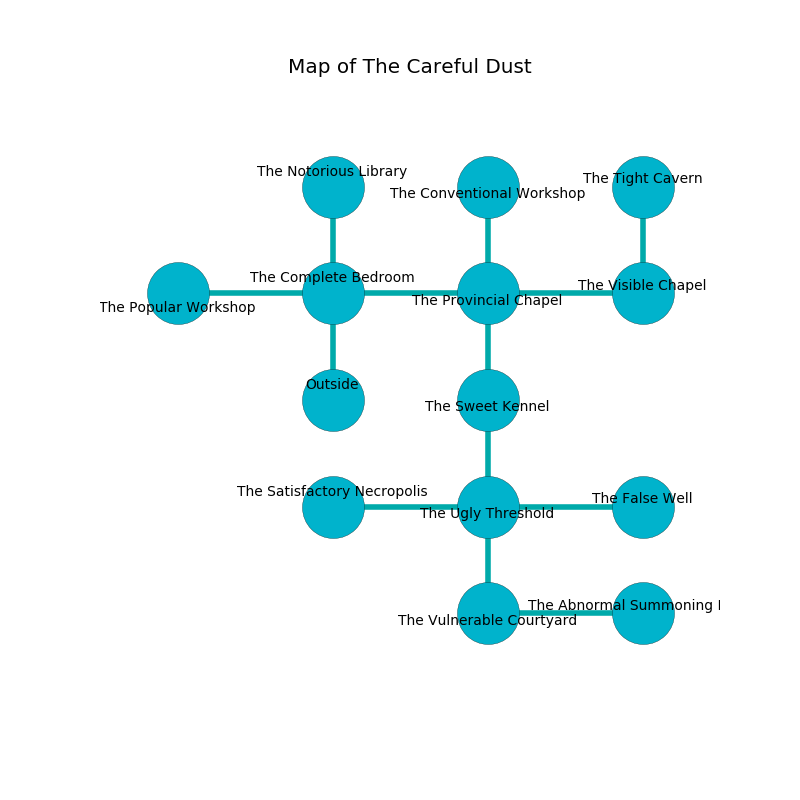

%Ruin Dogs

##The Careful Dust
###Overview
The Careful Dust is constructed on a crystal tree. Parts of The Careful Dust are inaccessible. The ruin is flooding. It is occupied by Harpies. Roscoe Dinkins The Impolite, an Assassin is here. The Harpies worship Roscoe Dinkins The Impolite. He  is founding a new religion. 

###Artifact
####Haeia

Haeia looks like a soft spear. It smells like black currant. When held it sings the hymn of the damned. 

###Locations

####the complete bedroom
Gray lichens are swaying in broken urns. The floor is sticky. 

* To the west a dripping artery leads to [the popular workshop](#the-popular-workshop).
* To the east a long passageway opens to [the provincial chapel](#the-provincial-chapel).
* To the north a hazy corridor connects to [the notorious library](#the-notorious-library).
* To the south is the entrance.

####the provincial chapel
Red razorgrass is swaying from the ceiling. 

* There is a boot here.
* [Haeia](#Haeia) is here.
* To the west a long passageway opens to [the complete bedroom](#the-complete-bedroom).
* To the east a dark opening opens to [the visible chapel](#the-visible-chapel).
* To the north a dark cavern leads to [the conventional workshop](#the-conventional-workshop).
* To the south a hazy hallway leads to [the sweet kennel](#the-sweet-kennel).

####the sweet kennel
The floor is cluttered with shells. 

* There is a cheese here.
* To the north a hazy hallway opens to [the provincial chapel](#the-provincial-chapel).
* To the south a twisted threshold connects to [the ugly threshold](#the-ugly-threshold).

####the ugly threshold
The air smells like gooseberry here. The floor is smooth. There are nine Harpies here. The Harpies are celebrating. 

* There is a frame here.
* To the west a torchlit cavern opens to [the satisfactory necropolis](#the-satisfactory-necropolis).
* To the east a dark opening leads to [the false well](#the-false-well).
* To the north a twisted threshold leads to [the sweet kennel](#the-sweet-kennel).
* To the south a narrow hallway connects to [the vulnerable courtyard](#the-vulnerable-courtyard).

####the vulnerable courtyard
The stone walls are pristine. The air tastes like black currant here. There are nine Harpies here. Blue ferns are sprouting from the walls. The Harpies are performing a ritual. If not interrupted, the Harpies will become more powerful. 

There is an engraving on the ceiling written in Harpies Script. 

> Maybe try hiding.
>

* To the east a twisted threshold leads to [the abnormal summoning room](#the-abnormal-summoning-room).
* To the north a narrow hallway opens to [the ugly threshold](#the-ugly-threshold).

####the visible chapel
The air tastes like acid here. The floor is smooth. 

There is an engraving on a stone written in Harpies Script. 

> We are joyful
>
> helpless and narrow
>

* To the west a dark opening leads to [the provincial chapel](#the-provincial-chapel).
* To the north a twisted walkway leads to [the tight cavern](#the-tight-cavern).

####the notorious library
There are a Quipper, a Giant Boar, an Oni, a Commoner, and a Dretch here. Yellow mushrooms are sprouting in broken urns. The wooden walls are unsettled. 

* There is a nail here.
* There is a stamp here.
* To the south a hazy corridor opens to [the complete bedroom](#the-complete-bedroom).

####the abnormal summoning room
The metallic walls are bloodstained. 

* To the west a twisted threshold leads to [the vulnerable courtyard](#the-vulnerable-courtyard).

####the tight cavern
The air smells like grape here. The obsidion walls are caving in. The floor is flooded with eight inch deep cool water. 

* There is a whistle here.
* To the south a twisted walkway leads to [the visible chapel](#the-visible-chapel).

####the false well
Gray mushrooms are sprouting in broken urns. There is a trap here. When activated, a pressure plate will launch an arrow. The air tastes like caraway here. 

* [Roscoe Dinkins The Impolite](#Roscoe-Dinkins-The-Impolite) is here.
* To the west a dark opening connects to [the ugly threshold](#the-ugly-threshold).

####the satisfactory necropolis
The air tastes like wax here. 

* There is a breastplate here.
* To the east a torchlit cavern leads to [the ugly threshold](#the-ugly-threshold).

####the popular workshop
The obsidion walls are bloodstained. There are nine Harpies here. The Harpies are performing a ritual. If not interrupted, the Harpies will become more powerful. 

* To the east a dripping artery leads to [the complete bedroom](#the-complete-bedroom).

####the conventional workshop
The obsidion walls are covered in mold. There is a trap here. When activated, a magical proximity detector will open a trapdoor in the floor. There are nine Harpies here. The Harpies are meditating. 

There is an engraving on the ceiling written in Harpies Script. 

> I am looting this place.
>

* To the south a dark cavern opens to [the provincial chapel](#the-provincial-chapel).

