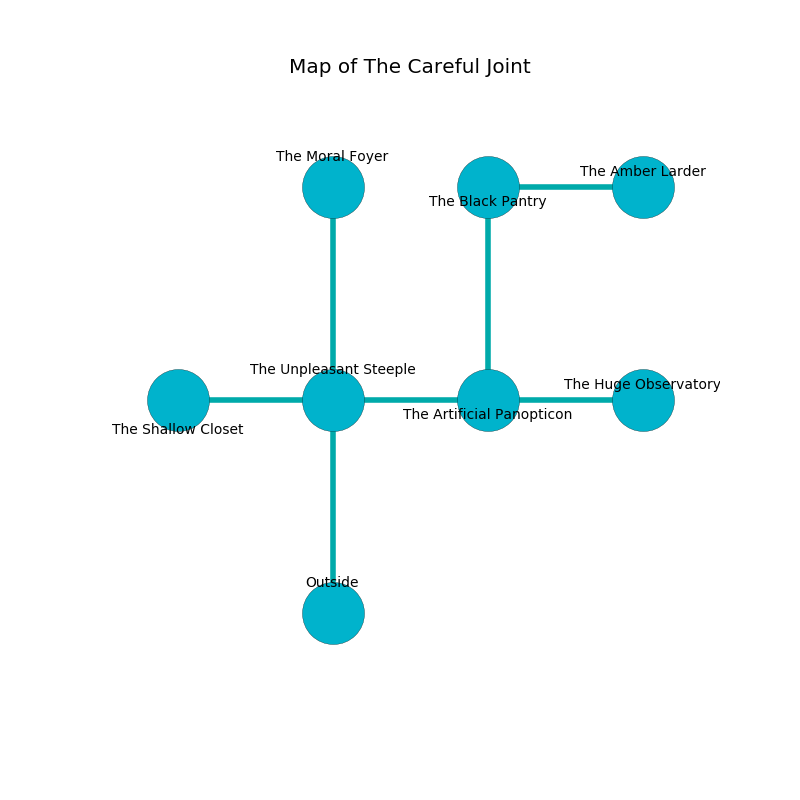

%Ruin Dogs

##The Careful Joint
###Overview
The Careful Joint is located under a poisoned mountain. Parts of it are corrupted. The ruin is burning. It is occupied by Yuan-Ti. Olympia Carranza The Sneaky, a Stone Giant is here. The Yuan-Ti are battling Olympia Carranza The Sneaky. She  is trying to use [The Last Master](#The-Last-Master). 

###Artifact
####The Last Master

The Last Master is a powerful artifact in the shape of a soft rock. It is a medium green color. Air flows towards it. When eaten it turns surrounding objects to ashes. 

###Locations

####the unpleasant steeple
White lichens are decaying from the walls. There are a Ghost, a Giant Eagle, and a Gold Dragon Wyrmling here. 

There is an engraving on a tablet written in common. 

> Maybe try cowering.
>

* There is an apple here.
* To the west a dark walkway opens to [the shallow closet](#the-shallow-closet).
* To the east a dripping path opens to [the artificial panopticon](#the-artificial-panopticon).
* To the north a dark path connects to [the moral foyer](#the-moral-foyer).
* To the south is the entrance.

####the shallow closet
There are a Mud Mephit, a Slaad Tadpole, a Flumph, a Gibbering Mouther, a Kobold, a Rat, a Sahuagin, a Gelatinous Cube, a Fire Snake, and a Bronze Dragon Wyrmling here. 

* To the east a dark walkway opens to [the unpleasant steeple](#the-unpleasant-steeple).

####the artificial panopticon
The air tastes like curry here. The floor is smooth. There are two Drow Elite Warriors here. 

There is an engraving on a tablet written in Yuan-Ti Script. 

> I discovered [The Last Master](#The-Last-Master).
>

* To the west a dripping path connects to [the unpleasant steeple](#the-unpleasant-steeple).
* To the east a torchlit threshold connects to [the huge observatory](#the-huge-observatory).
* To the north a flooded hallway leads to [the black pantry](#the-black-pantry).

####the black pantry
The obsidion walls are pristine. There are a Baboon, a Goat, a Blue Slaad, a Mimic, and an Old Faerie Dragon here. 

* [The Last Master](#The-Last-Master) is here.
* [Olympia Carranza The Sneaky](#Olympia-Carranza-The-Sneaky) is here.
* To the east a windy walkway opens to [the amber larder](#the-amber-larder).
* To the south a flooded hallway opens to [the artificial panopticon](#the-artificial-panopticon).

####the moral foyer
The air smells like pennyroyal here. The stone walls are ruined. Gray mushrooms are sprouting in cracks in the floor. The floor is cluttered with rocks. 

* To the south a dark path leads to [the unpleasant steeple](#the-unpleasant-steeple).

####the huge observatory
Yellow mushrooms are decaying from the ceiling. The floor is flooded with two inch deep scalding water. The air tastes like roasted meaty here. There are a Yuan-Ti Abomination and two Yuan-Ti Purebloods here. The Yuan-Ti are performing a ritual. If not interrupted, the ruin dogs will be weakened. 

* To the west a torchlit threshold opens to [the artificial panopticon](#the-artificial-panopticon).

####the amber larder
The air smells like orange here. Blue ferns are sprouting in broken urns. 

There is an engraving on the wall written in Yuan-Ti Script. 

> A knee is a sky
>
> vigorous, fast, efficient
>
> A knee is a sky
>

* To the west a windy walkway opens to [the black pantry](#the-black-pantry).

