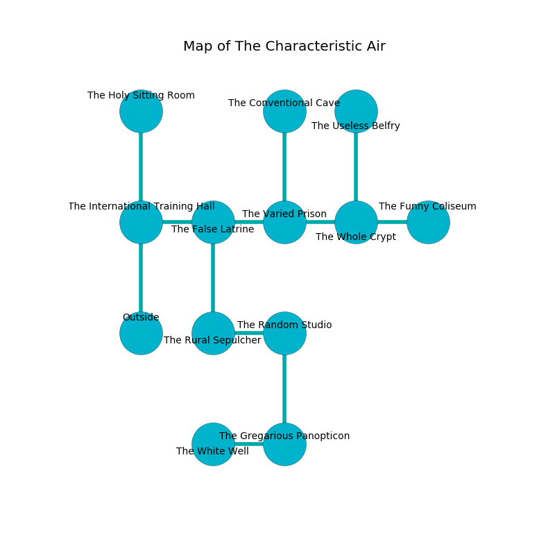

%Ruin Dogs

##The Characteristic Air
###Overview
The Characteristic Air is constructed on an alien city. Parts of it are unbearably cold. A lunar eclipse is happening outside. It is occupied by Demons. Hank Crespo The Patronizing, a Hill Giant is here. The Demons are ruled by Hank Crespo The Patronizing. He  is founding a new religion. 

###Artifact
####Iaeccmaii

Iaeccmaii looks like a smooth sphere. Air flows away from it. It is a light white color. When touched it illuminates its surroundings. 

###Locations

####the international training hall
The air smells like zedoary here. There are a Barbed Devil and a Bearded Devil here. One of the Demons is on watch, the rest are caring for babies. 

* To the east a narrow artery connects to [the false latrine](#the-false-latrine).
* To the north a dripping corridor connects to [the holy sitting Room](#the-holy-sitting-Room).
* To the south is the entrance.

####the false latrine
Green ferns are decaying from the walls. 

There is an engraving on a stone written in common. 

> An ear is an age
>
> nice, weekly, cute
>
> yet unique
>
> awake, huge, ample
>
> operational, medieval, attractive
>
> An ear is an age
>

* To the west a narrow artery leads to [the international training hall](#the-international-training-hall).
* To the east a twisted cave leads to [the varied prison](#the-varied-prison).
* To the south a narrow hall opens to [the rural sepulcher](#the-rural-sepulcher).

####the rural sepulcher
The air smells like feces here. The floor is glossy. 

* [Hank Crespo The Patronizing](#Hank-Crespo-The-Patronizing) is here.
* To the east a hazy artery connects to [the random studio](#the-random-studio).
* To the north a narrow hall opens to [the false latrine](#the-false-latrine).

####the random studio
Green mushrooms are sprouting from the ceiling. 

* There is a picture here.
* There is a stocking here.
* To the west a hazy artery leads to [the rural sepulcher](#the-rural-sepulcher).
* To the south a windy opening opens to [the gregarious panopticon](#the-gregarious-panopticon).

####the varied prison
The air smells like yeast here. Blue mushrooms are growing in a patch on the floor. 

* There is a root here.
* There is a branch here.
* To the west a twisted cave connects to [the false latrine](#the-false-latrine).
* To the east a narrow walkway connects to [the whole crypt](#the-whole-crypt).
* To the north a flooded passageway leads to [the conventional cave](#the-conventional-cave).

####the holy sitting Room
The glass walls are bloodstained. The floor is cluttered with rocks. Blue mushrooms are decaying in broken urns. 

* To the south a dripping corridor leads to [the international training hall](#the-international-training-hall).

####the whole crypt
White mushrooms are growing from the walls. 

* There is a belt here.
* [Iaeccmaii](#Iaeccmaii) is here.
* To the west a narrow walkway opens to [the varied prison](#the-varied-prison).
* To the east a windy hall leads to [the funny coliseum](#the-funny-coliseum).
* To the north a windy threshold opens to [the useless belfry](#the-useless-belfry).

####the funny coliseum
The floor is bloodstained. The air smells like oatmeal here. Blue mushrooms are growing in a patch on the floor. 

* There is a drawer here.
* To the west a windy hall connects to [the whole crypt](#the-whole-crypt).

####the gregarious panopticon
There are a Drow, a Giant Lizard, an Orog, and a Ghost here. The air tastes like root here. 

* To the west a dripping artery leads to [the white well](#the-white-well).
* To the north a windy opening opens to [the random studio](#the-random-studio).

####the white well
The floor is cluttered with ashes. 

There is an engraving on the ceiling written in common. 

> Oh my fate is sadistic
>
> it is never square
>
> wet and realistic
>
> cruelty is aware
>

* To the east a dripping artery leads to [the gregarious panopticon](#the-gregarious-panopticon).

####the conventional cave
The floor is smooth. 

* To the south a flooded passageway connects to [the varied prison](#the-varied-prison).

####the useless belfry
The floor is smooth. The air smells like pistachio here. The obsidion walls are ruined. Blue mushrooms are sprouting in broken urns. There are an Incubus, a Succubus, and an Imp here. One of the Demons is working a mechanism that can lock the exits. 

* To the south a windy threshold opens to [the whole crypt](#the-whole-crypt).

