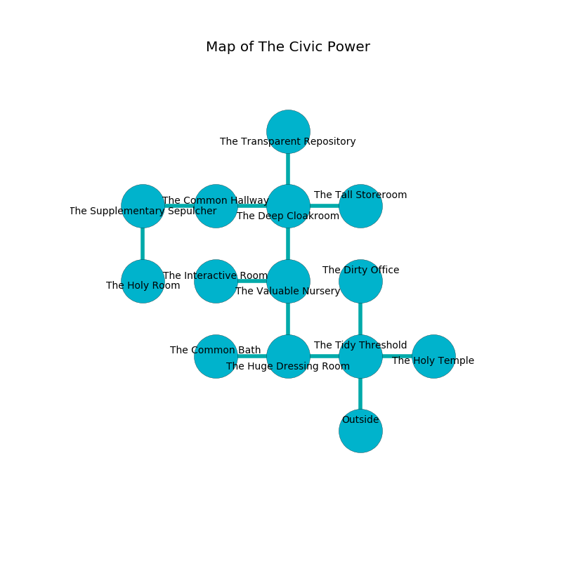

%Ruin Dogs

##The Civic Power
###Overview
The Civic Power is located under a haunted mountain. Regions of The Civic Power are foggy. A battle between raiders is happening outside. It is occupied by Sahuagin. Ben Clausen The Vague, an Incubus is here. The Sahuagin worship Ben Clausen The Vague. He  is trying to steal [Uflaf](#Uflaf). 

###Artifact
####Uflaf

Uflaf is a powerful artifact in the shape of a glassy figurine. Power bends away from it. When eaten it grants a wish. 

###Locations

####the tidy threshold
Red mushrooms are decaying from the ceiling. The air tastes like fruit here. The floor is sticky. 

* To the west a small corridor leads to [the huge dressing room](#the-huge-dressing-room).
* To the east a windy cave connects to [the holy temple](#the-holy-temple).
* To the north a long pathway leads to [the dirty office](#the-dirty-office).
* To the south is the entrance.

####the huge dressing room
Gray ferns are swaying from the walls. The floor is sticky. 

* To the west a small corridor leads to [the common bath](#the-common-bath).
* To the east a small corridor leads to [the tidy threshold](#the-tidy-threshold).
* To the north a long path leads to [the valuable nursery](#the-valuable-nursery).

####the common bath
The air smells like seaweed here. There is a Minotaur here. 

There is an engraving on the ceiling written in common. 

> Do not try cowering.
>

* There is a comb here.
* To the east a small corridor leads to [the huge dressing room](#the-huge-dressing-room).

####the dirty office
The air smells like jonquil here. 

* To the south a long pathway opens to [the tidy threshold](#the-tidy-threshold).

####the valuable nursery
The air tastes like tuberose here. The mirrored walls are unsettled. 

There is an engraving on a stone written in common. 

> I am sneaky.
>
> Maybe try cowering.
>

* To the west a hazy artery leads to [the interactive room](#the-interactive-room).
* To the north a small walkway opens to [the deep cloakroom](#the-deep-cloakroom).
* To the south a long path connects to [the huge dressing room](#the-huge-dressing-room).

####the interactive room
The brick walls are pristine. The floor is smooth. The air tastes like yuzu here. 

* [Ben Clausen The Vague](#Ben-Clausen-The-Vague) is here.
* To the east a hazy artery opens to [the valuable nursery](#the-valuable-nursery).

####the deep cloakroom
The crystal walls are caving in. The floor is flooded with four inch deep hot water. 

* To the west a hazy artery connects to [the common hallway](#the-common-hallway).
* To the east a small passageway leads to [the tall storeroom](#the-tall-storeroom).
* To the north a small path connects to [the transparent repository](#the-transparent-repository).
* To the south a small walkway leads to [the valuable nursery](#the-valuable-nursery).

####the holy temple
White mushrooms are decaying in cracks in the floor. There are a Kuo-Toa Whip, an Orog, a Giant Owl, and a Mule here. The floor is smooth. 

* To the west a windy cave connects to [the tidy threshold](#the-tidy-threshold).

####the common hallway
The crystal walls are bloodstained. Gray mushrooms are swaying in a patch on the floor. There are six Sahuagin here. The Sahuagin are crazy with bloodlust. 

* To the west a narrow pathway connects to [the supplementary sepulcher](#the-supplementary-sepulcher).
* To the east a hazy artery leads to [the deep cloakroom](#the-deep-cloakroom).

####the supplementary sepulcher
There are a Lizardfolk Shaman, a Black Bear, and a Piercer here. There is a trap here. When activated, a magical proximity detector will open a trapdoor in the floor. The air smells like root beer here. 

* There is a spring here.
* There is a baby here.
* [Uflaf](#Uflaf) is here.
* To the east a narrow pathway connects to [the common hallway](#the-common-hallway).
* To the south a torchlit path connects to [the holy room](#the-holy-room).

####the tall storeroom
The floor is bloodstained. The air tastes like vetiver here. There are six Sahuagin here. There is a trap here. When activated, a magical proximity detector will shoot a lightning bolt. Yellow mushrooms are sprouting in a patch on the floor. The Sahuagin are meditating. 

* To the west a small passageway opens to [the deep cloakroom](#the-deep-cloakroom).

####the transparent repository
The air smells like fat here. There are six Sahuagin here. The stone walls are scratched. The Sahuagin are berserk with rage. 

There is an engraving on a tablet written in Sahuagin Script. 

> I lost [Uflaf](#Uflaf).
>

* There is a shoe here.
* To the south a small path opens to [the deep cloakroom](#the-deep-cloakroom).

####the holy room
The air tastes like citrus peel here. The stone walls are scratched. Yellow lichens are decaying in a patch on the floor. There are a Mud Mephit, a Jackal, a Giant Scorpion, and a Vulture here. 

* To the north a torchlit path opens to [the supplementary sepulcher](#the-supplementary-sepulcher).

