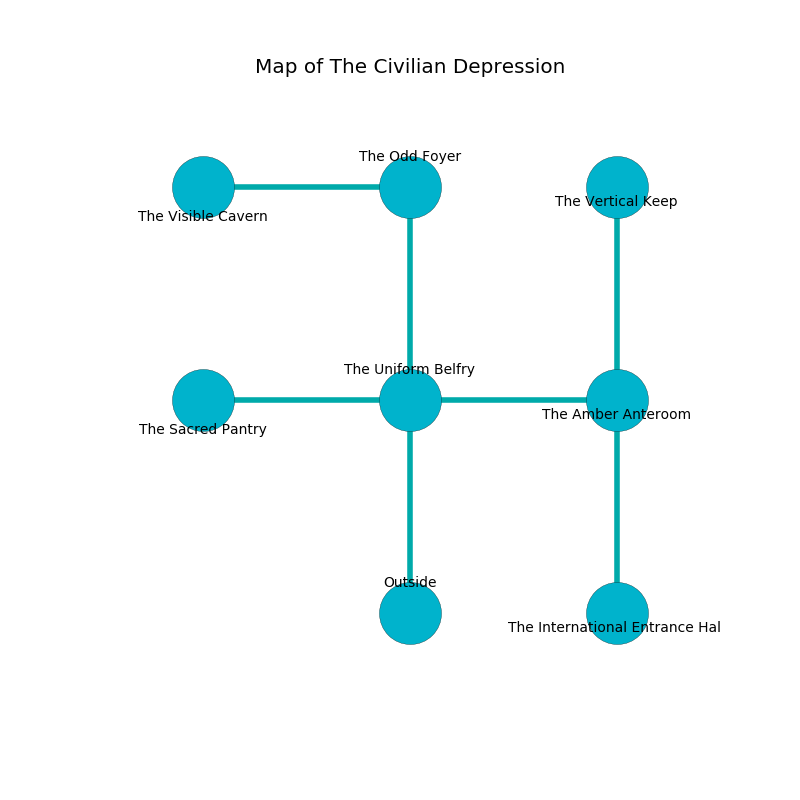

%Ruin Dogs

##The Civilian Depression
###Overview
The Civilian Depression is located in a spikey tree. Regions of it are incredibly cold. A massive flood is happening outside. It is occupied by Sahuagins. Thresa Flanigan The Sarcastic, a Hobgoblin Captain is here. The Sahuagins are battling Thresa Flanigan The Sarcastic. She  is founding a new religion. 

###Artifact
####The Interesting Grounds

The Interesting Grounds is a powerful artifact in the shape of a broken gem. It smells like stringent. Psychic energy flows near it. It is a shifting pink color. When rubbed it destroys itself. 

###Locations

####the uniform belfry
The floor is sticky. 

* There is an apple here.
* There is a spoon here.
* [Thresa Flanigan The Sarcastic](#Thresa-Flanigan-The-Sarcastic) is here.
* To the west a hazy walkway leads to [the sacred pantry](#the-sacred-pantry).
* To the east a dripping gap connects to [the amber anteroom](#the-amber-anteroom).
* To the north a dark passageway connects to [the odd foyer](#the-odd-foyer).
* To the south is the entrance.

####the sacred pantry
Green ferns are growing in cracks in the floor. The floor is flooded with two inch deep cold water. 

* To the east a hazy walkway connects to [the uniform belfry](#the-uniform-belfry).

####the amber anteroom

* To the west a dripping gap opens to [the uniform belfry](#the-uniform-belfry).
* To the north a dark walkway opens to [the vertical keep](#the-vertical-keep).
* To the south a flooded pathway connects to [the international entrance hall](#the-international-entrance-hall).

####the international entrance hall
The concrete walls are caving in. There are a Swarm of Ravens and a Grell here. The floor is glossy. 

* To the north a flooded pathway opens to [the amber anteroom](#the-amber-anteroom).

####the odd foyer
There is a trap here. When activated, a magical proximity detector will launch a rolling boulder. The floor is cluttered with ashes. There are a Shadow and a Yuan-Ti Malison here. White mushrooms are swaying in broken urns. 

* [The Interesting Grounds](#The-Interesting-Grounds) is here.
* To the west a torchlit gap leads to [the visible cavern](#the-visible-cavern).
* To the south a dark passageway leads to [the uniform belfry](#the-uniform-belfry).

####the vertical keep
Yellow lichens are decaying in cracks in the floor. There are a Giant Octopus, a Quaggoth, and a Warhorse Skeleton here. 

* There is a sheep here.
* There is a dagger here.
* To the south a dark walkway leads to [the amber anteroom](#the-amber-anteroom).

####the visible cavern
White ferns are growing in cracks in the floor. The air tastes like hyssop here. 

There is an engraving on a monolith written in common. 

> A wire is a cream
>
> good and active
>

* There is a fish here.
* There is a bucket here.
* To the east a torchlit gap connects to [the odd foyer](#the-odd-foyer).

