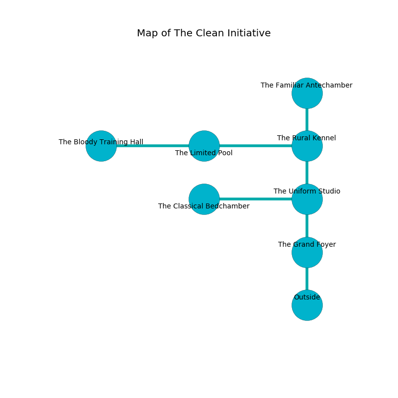

%Ruin Dogs

##The Clean Initiative
###Overview
The Clean Initiative is located on an alien city. Parts of The Clean Initiative are frozen. A solar eclipse is happening outside. It is occupied by Drows. Oliver Christmas The Vengeful, a Quaggoth Thonot is here. The Drows are the minions of Oliver Christmas The Vengeful. He  is trying to research [The Operational Ash](#The-Operational-Ash). 

###Artifact
####The Operational Ash

The Operational Ash has the form of a sharp cube. Fire flows towards it. It smells like laundered cloth. It is a pale brown color. When gazed upon it tunnels into the earth. 

###Locations

####the grand foyer
The floor is sticky. There are eight Drows here. Yellow razorgrass is swaying from the walls. The air tastes like chamomile here. One of the Drows is working a mechanism that can engulf the room in a fiery blaze. 

* To the north a windy hallway connects to [the uniform studio](#the-uniform-studio).
* To the south is the entrance.

####the uniform studio
The air tastes like candy here. There is a trap here. When activated, a magical proximity detector will fire a scything blade. White ferns are decaying from the walls. 

* To the west a dark gap opens to [the classical bedchamber](#the-classical-bedchamber).
* To the north a narrow gap opens to [the rural kennel](#the-rural-kennel).
* To the south a windy hallway connects to [the grand foyer](#the-grand-foyer).

####the rural kennel
The floor is smooth. 

* [Oliver Christmas The Vengeful](#Oliver-Christmas-The-Vengeful) is here.
* To the west a flooded cave leads to [the limited pool](#the-limited-pool).
* To the north a windy artery leads to [the familiar antechamber](#the-familiar-antechamber).
* To the south a narrow gap connects to [the uniform studio](#the-uniform-studio).

####the classical bedchamber
There is a trap here. When activated, a tripwire will open a trapdoor in the floor. Yellow ferns are decaying from the walls. The floor is flooded with three inch deep cool water. There are a Sea Horse and a Will-O’-Wisp here. The brick walls are bloodstained. 

* To the east a dark gap opens to [the uniform studio](#the-uniform-studio).

####the limited pool
There are eight Drows here. The metallic walls are caving in. The Drows are willing to negotiate. 

* There is a skirt here.
* There is a drawer here.
* [The Operational Ash](#The-Operational-Ash) is here.
* To the west a twisted cave opens to [the bloody training hall](#the-bloody-training-hall).
* To the east a flooded cave connects to [the rural kennel](#the-rural-kennel).

####the familiar antechamber
There are a Troglodyte, a Reef Shark, a Giant fire beetle, a Steam Mephit, and an Imp here. The air tastes like carrot seed here. The metallic walls are caving in. Red mushrooms are decaying in a patch on the floor. 

* To the south a windy artery connects to [the rural kennel](#the-rural-kennel).

####the bloody training hall
The floor is cluttered with bones. The air tastes like privet blossom here. 

There is an engraving on a stone written in common. 

> O! weak we
>
> always free
>
> tall, prolonged, unique
>
> sadness is weak
>

* To the east a twisted cave connects to [the limited pool](#the-limited-pool).

