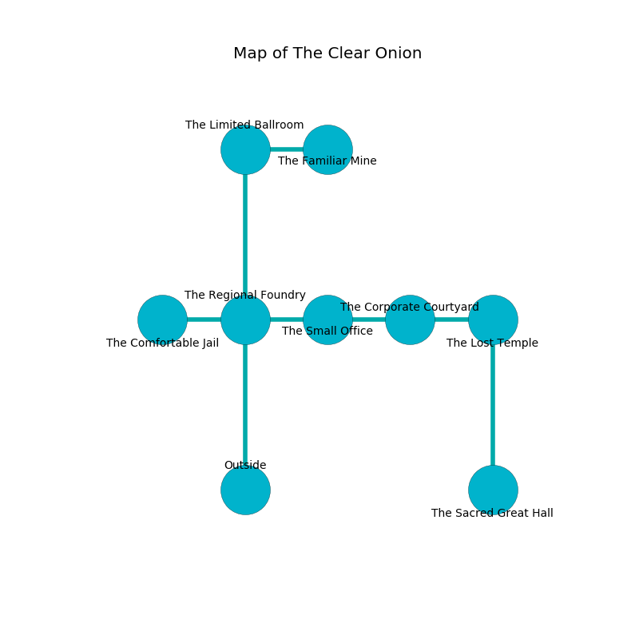

%Ruin Dogs

##The Clear Onion
###Overview
The Clear Onion is located in a volcanic city. Parts of it are foggy. The ruin is flooding. It is occupied by Humans. Elene Sowell The Inflexible, a Fire Giant is here. The Humans are ruled by Elene Sowell The Inflexible. She  is founding a new religion. 

###Artifact
####Ihud Hfuoml

Ihud Hfuoml is a powerful artifact in the shape of an opaque orb. Gravity glows near it. It smells like root. When held it burns the mind. 

###Locations

####the regional foundry
The stone walls are pristine. The floor is smooth. 

* To the west a torchlit pathway leads to [the comfortable jail](#the-comfortable-jail).
* To the east a dripping path leads to [the small office](#the-small-office).
* To the north a torchlit threshold connects to [the limited ballroom](#the-limited-ballroom).
* To the south is the entrance.

####the comfortable jail
The crystal walls are pristine. The floor is bloodstained. 

There is an engraving on the wall written in Humans Script. 

> Oh weak fate
>
> it is never great
>
> it is always productive
>
> cruelty is constructive
>

* To the east a torchlit pathway leads to [the regional foundry](#the-regional-foundry).

####the small office
Yellow lichens are growing in broken urns. 

There is an engraving on a monolith written in common. 

> O my fate is inhumane
>
> it is always invisible
>
> ever plain
>
> all is visible
>

* To the west a dripping path opens to [the regional foundry](#the-regional-foundry).
* To the east a dripping artery opens to [the corporate courtyard](#the-corporate-courtyard).

####the corporate courtyard
The air tastes like ginseng here. 

* To the west a dripping artery connects to [the small office](#the-small-office).
* To the east a flooded cave connects to [the lost temple](#the-lost-temple).

####the limited ballroom
There is a trap here. When activated, a tripwire will open a large pit in the floor. There are two Guards, a Veteran, a Commoner, two Bandit Captains, two Berserkers,  here. The Humans are performing a ritual. If not interrupted, the Humans will become more powerful. 

* There is a picture here.
* [Ihud Hfuoml](#Ihud-Hfuoml) is here.
* To the east a dripping cavern opens to [the familiar mine](#the-familiar-mine).
* To the south a torchlit threshold opens to [the regional foundry](#the-regional-foundry).

####the lost temple
The floor is smooth. There are a Silver Dragon Wyrmling, a Badger, a Gray Ooze, a Stone Giant, and a Treant here. 

* [Elene Sowell The Inflexible](#Elene-Sowell-The-Inflexible) is here.
* To the west a flooded cave opens to [the corporate courtyard](#the-corporate-courtyard).
* To the south a long hall connects to [the sacred great hall](#the-sacred-great-hall).

####the sacred great hall
The floor is sticky. The air tastes like yeast here. Green mushrooms are swaying in a patch on the floor. 

* There is an arch here.
* There is a fish here.
* To the north a long hall opens to [the lost temple](#the-lost-temple).

####the familiar mine
Yellow lichens are sprouting from the walls. 

* There is a door here.
* To the west a dripping cavern connects to [the limited ballroom](#the-limited-ballroom).

