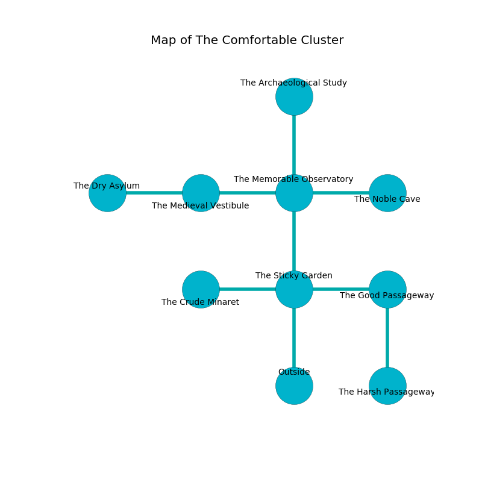

%Ruin Dogs

##The Comfortable Cluster
###Overview
The Comfortable Cluster is located in a poisoned mountain. Some rooms of it are somewhat cold. The ruin is collapsing slowly. It is occupied by Orcs. Randall Merriman The Selfish, a Cambion is here. The Orcs worship Randall Merriman The Selfish. He  is trying to hide [Ascaddaeum Ohcaf](#Ascaddaeum-Ohcaf). 

###Artifact
####Ascaddaeum Ohcaf

Ascaddaeum Ohcaf has the form of a glassy sphere. It is a pale purple color. Light slips near it. When worshipped it becomes a shielding force. 

###Locations

####the sticky garden
The floor is flooded with four inch deep lukewarm water. The air tastes like gasoline here. The glass walls are bloodstained. There are two Orc War Chiefs here. The Orcs are willing to fight to the death. 

* To the west a long corridor connects to [the crude minaret](#the-crude-minaret).
* To the east a windy threshold opens to [the good passageway](#the-good-passageway).
* To the north a narrow passageway connects to [the memorable observatory](#the-memorable-observatory).
* To the south is the entrance.

####the good passageway
The wooden walls are pristine. The floor is cluttered with shells. 

* To the west a windy threshold connects to [the sticky garden](#the-sticky-garden).
* To the south a dark hallway leads to [the harsh passageway](#the-harsh-passageway).

####the crude minaret
The air tastes like paint here. 

* To the east a long corridor leads to [the sticky garden](#the-sticky-garden).

####the memorable observatory
The air smells like ginger here. 

* [Ascaddaeum Ohcaf](#Ascaddaeum-Ohcaf) is here.
* To the west a flooded cave opens to [the medieval vestibule](#the-medieval-vestibule).
* To the east a long pathway opens to [the noble cave](#the-noble-cave).
* To the north a small artery connects to [the archaeological study](#the-archaeological-study).
* To the south a narrow passageway opens to [the sticky garden](#the-sticky-garden).

####the medieval vestibule
There is a trap here. When activated, a pressure plate will flood the room with water. There are an Orc War Chief and an Orc Eye of Gruumsh here. The Orcs are willing to negotiate. 

There is an engraving on a monolith written in common. 

> Oh weak fate
>
> unpleasant, senior, straight
>
> it is always premature
>
> death is pure
>

* To the west a long hall connects to [the dry asylum](#the-dry-asylum).
* To the east a flooded cave opens to [the memorable observatory](#the-memorable-observatory).

####the archaeological study
The floor is sticky. The concrete walls are ruined. There are an Orc War Chief and an Orc Eye of Gruumsh here. If the Orcs notice the Ruin Dogs, one of them will retreat and alert [Randall Merriman](#Randall-Merriman). 

* To the south a small artery leads to [the memorable observatory](#the-memorable-observatory).

####the harsh passageway
Yellow mushrooms are decaying in cracks in the floor. The air tastes like gardenia here. The wooden walls are pristine. 

There is an engraving on the ceiling written in Orcs Script. 

> Treasure here.
>

* There is a pendant here.
* There is a wand here.
* To the north a dark hallway leads to [the good passageway](#the-good-passageway).

####the dry asylum
The air tastes like elderflower here. There are a Copper Dragon Wyrmling, a Fire Elemental, a Giant Eagle, a Giant Spider, and a Giant Goat here. The stone walls are unsettled. 

There is an engraving on a monolith written in common. 

> Poor me! everything is sadistic
>
> it is never artistic
>
> yet explicit
>
> fate is implicit
>

* There is a net here.
* [Randall Merriman The Selfish](#Randall-Merriman-The-Selfish) is here.
* To the east a long hall connects to [the medieval vestibule](#the-medieval-vestibule).

####the noble cave
The floor is flooded with nine inch deep cold water. The air tastes like urine here. There are a Sprite and a Sahuagin Baron here. 

There is an engraving on a tablet written in common. 

> Go away.
>

* To the west a long pathway leads to [the memorable observatory](#the-memorable-observatory).

