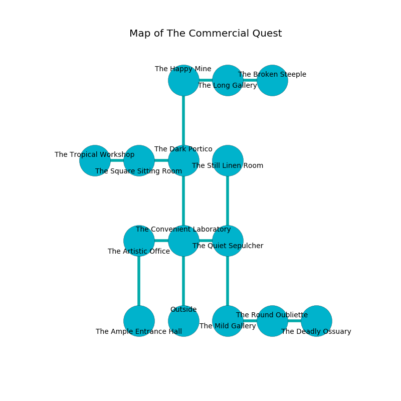

%Ruin Dogs

##The Commercial Quest
###Overview
The Commercial Quest is located under a crystal rift. Some areas of The Commercial Quest are foggy. The ruin is flooding. It is occupied by Dryads. Mac Finch The Conservative, a Drow Priestess of Lolth is here. The Dryads worship Mac Finch The Conservative. He  is trying to understand [The Basic Deprivation](#The-Basic-Deprivation). 

###Artifact
####The Basic Deprivation

The Basic Deprivation has the form of an opaque amulet. Magic pours around it. It is a bright black color. When cradled it makes its owner invisible. 

###Locations

####the convenient laboratory
There are a Pony, a Giant Ape, a Cultist, and a Commoner here. 

* To the west a hazy artery connects to [the artistic office](#the-artistic-office).
* To the east a dripping path connects to [the quiet sepulcher](#the-quiet-sepulcher).
* To the north a twisted hall connects to [the dark portico](#the-dark-portico).
* To the south is the entrance.

####the dark portico
The air tastes like cognac here. The floor is cluttered with debris. Blue moss is decaying from the ceiling. There are an Umber Hulk and a Mammoth here. 

There is an engraving on the floor written in Dryads Script. 

> I am lost in The Commercial Quest.
>

* There is a whip here.
* To the west a dripping gap leads to [the square sitting Room](#the-square-sitting-Room).
* To the north a long hallway connects to [the happy mine](#the-happy-mine).
* To the south a twisted hall connects to [the convenient laboratory](#the-convenient-laboratory).

####the quiet sepulcher
Gray moss is swaying in broken urns. 

* There is a girl here.
* To the west a dripping path leads to [the convenient laboratory](#the-convenient-laboratory).
* To the north a hazy path connects to [the still linen room](#the-still-linen-room).
* To the south a small opening connects to [the mild gallery](#the-mild-gallery).

####the square sitting Room
Red lichens are swaying in broken urns. The floor is flooded with four inch deep cool water. The air tastes like black currant here. 

There is an engraving on the ceiling written in common. 

> Hide here.
>

* There is a bird here.
* To the west a narrow passageway leads to [the tropical workshop](#the-tropical-workshop).
* To the east a dripping gap opens to [the dark portico](#the-dark-portico).

####the happy mine
The floor is smooth. The crystal walls are scratched. The air smells like cooked apple here. Green mushrooms are sprouting in cracks in the floor. 

* To the east a dark cavern leads to [the long gallery](#the-long-gallery).
* To the south a long hallway leads to [the dark portico](#the-dark-portico).

####the mild gallery
The obsidion walls are unsettled. The air tastes like corn here. Green moss is sprouting from the ceiling. 

* To the east a windy threshold opens to [the round oubliette](#the-round-oubliette).
* To the north a small opening leads to [the quiet sepulcher](#the-quiet-sepulcher).

####the still linen room
The floor is smooth. Yellow lichens are decaying from the walls. 

There is an engraving on a stone written in common. 

> O weak we
>
> it is always free
>
> domestic and wrong
>
> sadness is free
>

* To the south a hazy path connects to [the quiet sepulcher](#the-quiet-sepulcher).

####the tropical workshop
The floor is bloodstained. The air tastes like rose here. Gray razorgrass is sprouting in cracks in the floor. The brick walls are ruined. 

* To the east a narrow passageway connects to [the square sitting Room](#the-square-sitting-Room).

####the long gallery
The floor is cluttered with bones. The air smells like kiwi here. 

There is an engraving on the floor written in common. 

> Oh death is sadistic
>
> influential and realistic
>
> yet abnormal
>
> nothing is characteristic
>

* To the west a dark cavern leads to [the happy mine](#the-happy-mine).
* To the east a twisted pathway leads to [the broken steeple](#the-broken-steeple).

####the round oubliette
The brick walls are pristine. The air smells like spearmint here. 

There is an engraving on a monolith written in Dryads Script. 

> Dear me! sad fate
>
> but vicious
>
> it is always great
>
> everything is ambitious
>

* There is a stamp here.
* To the west a windy threshold opens to [the mild gallery](#the-mild-gallery).
* To the east a twisted walkway leads to [the deadly ossuary](#the-deadly-ossuary).

####the deadly ossuary
Blue moss is growing in cracks in the floor. 

* To the west a twisted walkway leads to [the round oubliette](#the-round-oubliette).

####the broken steeple
The metallic walls are pristine. The air smells like nasturtium here. Green ferns are decaying from the walls. 

* [Mac Finch The Conservative](#Mac-Finch-The-Conservative) is here.
* To the west a twisted pathway connects to [the long gallery](#the-long-gallery).

####the artistic office
The stone walls are pristine. There are a Poisonous Snake, a Poltergeist, a Brown Bear, and an Air Elemental here. The air tastes like orris here. 

* There is an orb here.
* [The Basic Deprivation](#The-Basic-Deprivation) is here.
* To the east a hazy artery connects to [the convenient laboratory](#the-convenient-laboratory).
* To the south a flooded artery opens to [the ample entrance hall](#the-ample-entrance-hall).

####the ample entrance hall
Blue razorgrass is growing in cracks in the floor. There are a Tribal Warrior, a Ghost, a Minotaur Skeleton, a White Dragon Wyrmling, and a Giant Centipede here. 

* There is a seed here.
* There is a frame here.
* There is a plate here.
* To the north a flooded artery connects to [the artistic office](#the-artistic-office).

