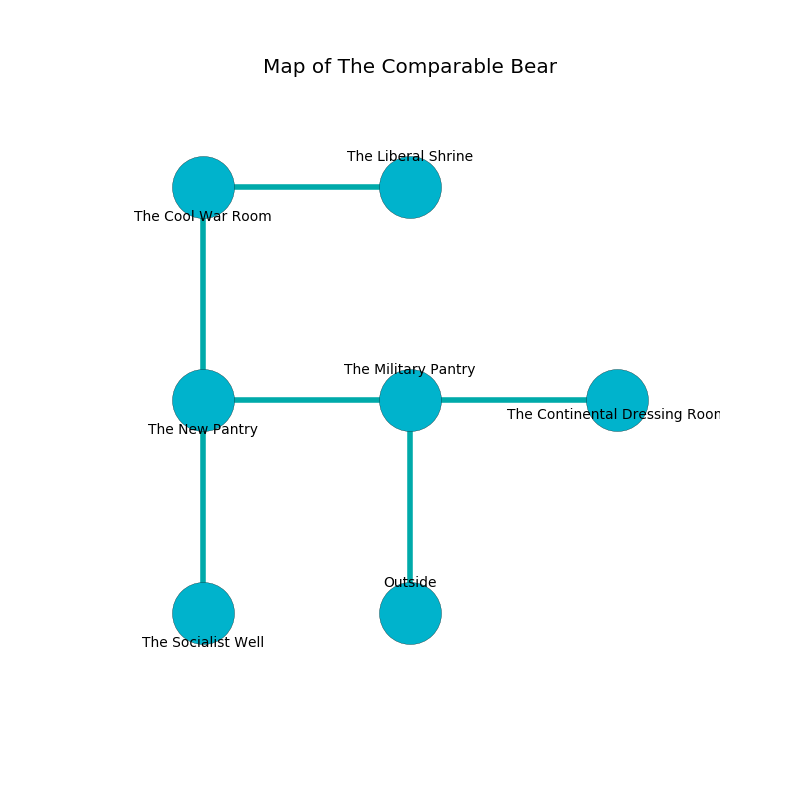

%Ruin Dogs

##The Comparable Bear
###Overview
The Comparable Bear is constructed on a flooded plain. Some rooms of The Comparable Bear are flooded. A massive storm is happening outside. It is occupied by Satyrs. Donnie Meier The Unpredictable, a Mind Flayer Arcanist is here. The Satyrs worship Donnie Meier The Unpredictable. She  is trying to find [Laeuaeiaeum Cumdfelaecdaeum](#Laeuaeiaeum-Cumdfelaecdaeum). 

###Artifact
####Laeuaeiaeum Cumdfelaecdaeum

Laeuaeiaeum Cumdfelaecdaeum has the form of an opaque meteorite. Psychic energy bends from it. When thrown it grants power to its owner. 

###Locations

####the military pantry
The air tastes like banana peel here. The floor is cluttered with rocks. The crystal walls are covered in mold. There is a trap here. When activated, a magical sound detector will open a large pit in the floor. 

* There is a bridge here.
* [Laeuaeiaeum Cumdfelaecdaeum](#Laeuaeiaeum-Cumdfelaecdaeum) is here.
* To the west a small threshold connects to [the new pantry](#the-new-pantry).
* To the east a torchlit hallway connects to [the continental dressing room](#the-continental-dressing-room).
* To the south is the entrance.

####the new pantry
The air tastes like deertongue here. The floor is sticky. 

* To the east a small threshold leads to [the military pantry](#the-military-pantry).
* To the north a flooded path opens to [the cool war Room](#the-cool-war-Room).
* To the south a flooded path leads to [the socialist well](#the-socialist-well).

####the cool war Room
The mirrored walls are ruined. White mushrooms are swaying from the ceiling. 

* [Donnie Meier The Unpredictable](#Donnie-Meier-The-Unpredictable) is here.
* To the east a dripping path connects to [the liberal shrine](#the-liberal-shrine).
* To the south a flooded path leads to [the new pantry](#the-new-pantry).

####the liberal shrine
The crystal walls are covered in mold. There are a Magma Mephit, a Frost Giant, and a Tyrannosaurus Rex here. The air tastes like apricot here. 

There is an engraving on a tablet written in common. 

> Do not try digging.
>

* To the west a dripping path opens to [the cool war Room](#the-cool-war-Room).

####the socialist well
There are an Oni, a Satyr, and a Revenant here. Red lichens are sprouting from the walls. The air tastes like amber here. The floor is flooded with nine inch deep lukewarm water. 

* To the north a flooded path opens to [the new pantry](#the-new-pantry).

####the continental dressing room
The air smells like sesame here. The wooden walls are bloodstained. Yellow razorgrass is swaying from the walls. There is a trap here. When activated, a tripwire will launch a rolling boulder. There are a Quaggoth Spore Servant, a Hippogriff, a Grick, and a Mezzoloth here. 

* There is a jewel here.
* There is a horse here.
* To the west a torchlit hallway connects to [the military pantry](#the-military-pantry).

