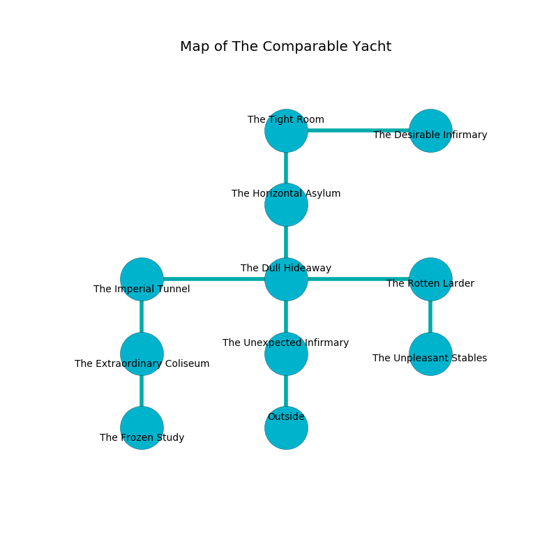

%Ruin Dogs

##The Comparable Yacht
###Overview
The Comparable Yacht is located on a flooded city. Regions of The Comparable Yacht are cursed. The ruin is coming to life. It is occupied by Quaggoths. Pierre Razo The Nervous, a Cloud Giant is here. The Quaggoths are the soldiers of Pierre Razo The Nervous. He  is trying to steal [The Single Sensation](#The-Single-Sensation). 

###Artifact
####The Single Sensation

The Single Sensation has the form of a soft monument. When gazed upon it shows an image of the future. 

###Locations

####the unexpected infirmary
Yellow lichens are sprouting in cracks in the floor. The floor is flooded with seven inch deep cold water. 

There is an engraving on the wall written in common. 

> O! terrible you
>
> it is always new
>
> yet great
>
> life is due
>

* There is a bee here.
* To the north a dripping artery connects to [the dull hideaway](#the-dull-hideaway).
* To the south is the entrance.

####the dull hideaway
The air tastes like parsley here. 

* There is a cake here.
* To the west a twisted hall opens to [the imperial tunnel](#the-imperial-tunnel).
* To the east a narrow cave opens to [the rotten larder](#the-rotten-larder).
* To the north a flooded gap leads to [the horizontal asylum](#the-horizontal-asylum).
* To the south a dripping artery opens to [the unexpected infirmary](#the-unexpected-infirmary).

####the imperial tunnel
There are a Wolf, a Grell, a Giant fire beetle, a Yeti, and a Mage here. The air smells like parsley here. Gray lichens are swaying in broken urns. 

* To the east a twisted hall leads to [the dull hideaway](#the-dull-hideaway).
* To the south a hazy walkway leads to [the extraordinary coliseum](#the-extraordinary-coliseum).

####the extraordinary coliseum
There are a Quaggoth Thonot and three Quaggoths here. The air tastes like zedoary here. The glass walls are scratched. If the Quaggoths notice the Ruin Dogs, one of them will retreat and alert [Pierre Razo](#Pierre-Razo). 

* To the north a hazy walkway leads to [the imperial tunnel](#the-imperial-tunnel).
* To the south a flooded corridor connects to [the frozen study](#the-frozen-study).

####the horizontal asylum
Green razorgrass is sprouting in a patch on the floor. 

* To the north a narrow cave connects to [the tight room](#the-tight-room).
* To the south a flooded gap leads to [the dull hideaway](#the-dull-hideaway).

####the frozen study
The brick walls are bloodstained. 

* [Pierre Razo The Nervous](#Pierre-Razo-The-Nervous) is here.
* To the north a flooded corridor opens to [the extraordinary coliseum](#the-extraordinary-coliseum).

####the tight room
The mirrored walls are pristine. The air tastes like animal here. The floor is cluttered with shells. Gray moss is sprouting in a patch on the floor. 

* There is a bag here.
* [The Single Sensation](#The-Single-Sensation) is here.
* To the east a flooded hall connects to [the desirable infirmary](#the-desirable-infirmary).
* To the south a narrow cave leads to [the horizontal asylum](#the-horizontal-asylum).

####the rotten larder
The concrete walls are ruined. The floor is glossy. There are two Quaggoth Thonots and two Quaggoths here. Yellow moss is sprouting in cracks in the floor. The Quaggoths are performing a ritual. If not interrupted, a powerful monster will be summoned. 

* There is a demon here.
* To the west a narrow cave leads to [the dull hideaway](#the-dull-hideaway).
* To the south a flooded hallway connects to [the unpleasant stables](#the-unpleasant-stables).

####the unpleasant stables
The floor is glossy. The wooden walls are scratched. 

* To the north a flooded hallway opens to [the rotten larder](#the-rotten-larder).

####the desirable infirmary
The floor is sticky. 

* To the west a flooded hall leads to [the tight room](#the-tight-room).

