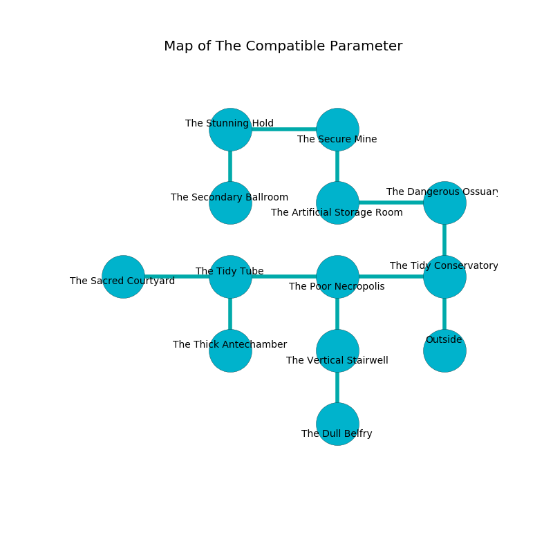

%Ruin Dogs

##The Compatible Parameter
###Overview
The Compatible Parameter is constructed on a ruined tree. Parts of The Compatible Parameter are somewhat cold. The ruin is larger on the inside than the outside. It is occupied by Sahuagin. Rafael Noll The Vague, a Spined Devil is here. The Sahuagin are battling Rafael Noll The Vague. He  is founding a new religion. 

###Artifact
####Gus Imaeahl

Gus Imaeahl is a powerful artifact in the shape of an opaque amulet. It is a dark purple color. It smells like grape. Power pours away from it. When held it ignites its surrroundings. 

###Locations

####the tidy conservatory
The air smells like lime here. There are six Sahuagin here. The Sahuagin are willing to negotiate. 

There is an engraving on the floor written in common. 

> Oh the memory of you is sadistic
>
> wrong and direct
>
> useful, strict, artistic
>
> life is perfect
>

* To the west a hazy passageway connects to [the poor necropolis](#the-poor-necropolis).
* To the north a torchlit pathway opens to [the dangerous ossuary](#the-dangerous-ossuary).
* To the south is the entrance.

####the poor necropolis
The air smells like cheese here. The floor is glossy. 

There is an engraving on the floor written in common. 

> [Gus Imaeahl](#Gus-Imaeahl)
>
> mutual, supplementary, incongruous
>

* To the west a torchlit artery opens to [the tidy tube](#the-tidy-tube).
* To the east a hazy passageway leads to [the tidy conservatory](#the-tidy-conservatory).
* To the south a windy artery leads to [the vertical stairwell](#the-vertical-stairwell).

####the vertical stairwell
The mirrored walls are covered in mold. Green lichens are growing in cracks in the floor. There are a Warhorse and a Grell here. The air tastes like sap here. 

There is an engraving on the floor written in common. 

> O the memory of you is sadistic
>
> established and characteristic
>
> it is never annual
>
> fate is manual
>

* [Gus Imaeahl](#Gus-Imaeahl) is here.
* To the north a windy artery connects to [the poor necropolis](#the-poor-necropolis).
* To the south a hazy corridor connects to [the dull belfry](#the-dull-belfry).

####the tidy tube
The floor is smooth. The stone walls are covered in mold. 

* There is a nut here.
* To the west a hazy cave leads to [the sacred courtyard](#the-sacred-courtyard).
* To the east a torchlit artery leads to [the poor necropolis](#the-poor-necropolis).
* To the south a torchlit threshold connects to [the thick antechamber](#the-thick-antechamber).

####the dangerous ossuary
The floor is smooth. The crystal walls are ruined. There is a trap here. When activated, a magical rune will fire a scything blade. The air smells like pine here. 

There is an engraving on the ceiling written in Sahuagin Script. 

> I am old.
>

* There is a door here.
* To the west a flooded path connects to [the artificial storage room](#the-artificial-storage-room).
* To the south a torchlit pathway connects to [the tidy conservatory](#the-tidy-conservatory).

####the artificial storage room
Yellow lichens are decaying in a patch on the floor. The air smells like pistachio here. The wooden walls are unsettled. 

* To the east a flooded path connects to [the dangerous ossuary](#the-dangerous-ossuary).
* To the north a narrow cave connects to [the secure mine](#the-secure-mine).

####the secure mine
There are a Minotaur Skeleton and a Bandit Captain here. The mirrored walls are caving in. The air tastes like absinthe here. The floor is sticky. 

* There is a skirt here.
* [Rafael Noll The Vague](#Rafael-Noll-The-Vague) is here.
* To the west a windy cavern connects to [the stunning hold](#the-stunning-hold).
* To the south a narrow cave opens to [the artificial storage room](#the-artificial-storage-room).

####the stunning hold
The air smells like pistachio here. The wooden walls are caving in. 

* To the east a windy cavern leads to [the secure mine](#the-secure-mine).
* To the south a dripping hallway opens to [the secondary ballroom](#the-secondary-ballroom).

####the thick antechamber
There are six Sahuagin here. White moss is growing in a patch on the floor. The floor is flooded with seven inch deep cool water. The air tastes like spearmint here. If the Sahuagin notice the Ruin Dogs, one of them will retreat and alert the others. 

* To the north a torchlit threshold opens to [the tidy tube](#the-tidy-tube).

####the secondary ballroom
The obsidion walls are scratched. The floor is cluttered with ashes. There are six Sahuagin here. If the Sahuagin notice the Ruin Dogs, one of them will retreat and alert the others. 

* There is a snake here.
* To the north a dripping hallway connects to [the stunning hold](#the-stunning-hold).

####the sacred courtyard
There are six Sahuagin here. The floor is glossy. The air tastes like passion fruit here. White lichens are sprouting in cracks in the floor. The Sahuagin are defending this room from intruders. 

* To the east a hazy cave connects to [the tidy tube](#the-tidy-tube).

####the dull belfry
The floor is sticky. The air tastes like grass here. 

There is an engraving on the ceiling written in common. 

> Poor me! everything is woe
>
> shallow, odd, low
>
> irrelevant, necessary, fragrant
>
> sadness is slow
>

* To the north a hazy corridor leads to [the vertical stairwell](#the-vertical-stairwell).

