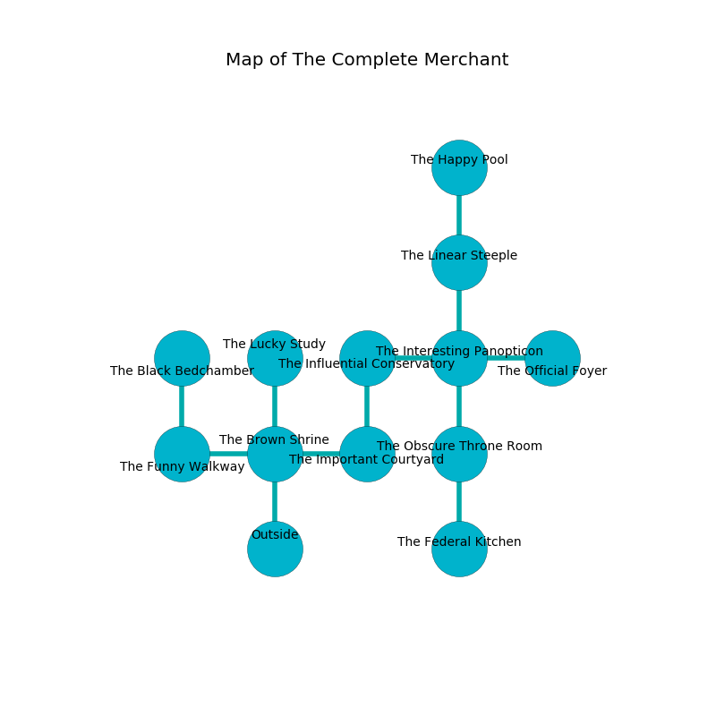

%Ruin Dogs

##The Complete Merchant
###Overview
The Complete Merchant is constructed on a flooded tree. Parts of it are corrupted. A solar eclipse is happening outside. It is occupied by Kenku. Colby Olvera The Gullible, a Fire Giant is here. The Kenku have been charmed by Colby Olvera The Gullible. He  is founding a new religion. 

###Artifact
####Faehaedwi

Faehaedwi has the form of a hard spear. It is a light white color. Psychic energy slips near it. When worshipped it frightens children. 

###Locations

####the brown shrine
The air smells like toffee here. The floor is flooded with four inch deep hot water. 

* To the west a twisted hall leads to [the funny walkway](#the-funny-walkway).
* To the east a long corridor leads to [the important courtyard](#the-important-courtyard).
* To the north a narrow hall connects to [the lucky study](#the-lucky-study).
* To the south is the entrance.

####the important courtyard
Blue mushrooms are sprouting from the ceiling. 

There is an engraving on a stone written in Kenku Script. 

> I tried hiding.
>

* To the west a long corridor connects to [the brown shrine](#the-brown-shrine).
* To the north a long hall connects to [the influential conservatory](#the-influential-conservatory).

####the funny walkway
The floor is flooded with seven inch deep lukewarm water. 

* There is a bucket here.
* To the east a twisted hall connects to [the brown shrine](#the-brown-shrine).
* To the north a torchlit threshold leads to [the black bedchamber](#the-black-bedchamber).

####the influential conservatory
There are a Riding Horse, a Young Silver Dragon, a Rust Monster, a Homunculus, an Axe Beak, and an Elk here. The air smells like caraway here. The floor is flooded with seven inch deep scalding water. White razorgrass is swaying from the walls. 

* [Colby Olvera The Gullible](#Colby-Olvera-The-Gullible) is here.
* To the east a flooded gap opens to [the interesting panopticon](#the-interesting-panopticon).
* To the south a long hall opens to [the important courtyard](#the-important-courtyard).

####the black bedchamber
The air tastes like cranberry here. The obsidion walls are unsettled. The floor is flooded with five inch deep hot water. There are forty Kenkus here. Red razorgrass is growing in cracks in the floor. One of the Kenku is on watch, the rest are feasting. 

* To the south a torchlit threshold leads to [the funny walkway](#the-funny-walkway).

####the interesting panopticon
There are forty Kenkus here. The air tastes like pomegranate here. The floor is sticky. The Kenku are performing a ritual. If not interrupted, [Colby Olvera](#Colby-Olvera) will be magically alarmed. 

* To the west a flooded gap leads to [the influential conservatory](#the-influential-conservatory).
* To the east a windy walkway connects to [the official foyer](#the-official-foyer).
* To the north a windy corridor leads to [the linear steeple](#the-linear-steeple).
* To the south a hazy opening opens to [the obscure throne room](#the-obscure-throne-room).

####the obscure throne room
The floor is glossy. The concrete walls are caving in. 

There is an engraving on the floor written in common. 

> They are sorrowful
>
> characteristic and unpleasant
>
> A branch is an arrangement
>
> ever judicial
>
> soft, tropical, useless
>
> always conventional
>
> you will be destroyed
>

* [Faehaedwi](#Faehaedwi) is here.
* To the north a hazy opening leads to [the interesting panopticon](#the-interesting-panopticon).
* To the south a torchlit passageway opens to [the federal kitchen](#the-federal-kitchen).

####the official foyer
There are an Umber Hulk and a Bulette here. The air tastes like logenberry here. 

There is an engraving on a stone written in Kenku Script. 

> A bird is a statistics
>
> fragrant and wild
>
> [Faehaedwi](#Faehaedwi)
>
> dominant, solar, relative
>
> [Faehaedwi](#Faehaedwi)
>
> democratic, imperial, stable
>
> thoughtful and obvious
>

* To the west a windy walkway connects to [the interesting panopticon](#the-interesting-panopticon).

####the linear steeple
The air tastes like animal here. The obsidion walls are pristine. Yellow mushrooms are swaying from the walls. 

* There is a basket here.
* To the north a torchlit hallway leads to [the happy pool](#the-happy-pool).
* To the south a windy corridor leads to [the interesting panopticon](#the-interesting-panopticon).

####the lucky study
The air tastes like pineapple here. White moss is decaying in a patch on the floor. The stone walls are pristine. There are a Mummy, a Tribal Warrior, a Merrow, a Kuo-Toa, a Giant Goat, a Yuan-Ti Pureblood, a Black Dragon Wyrmling, a Killer Whale, and a Vulture here. 

There is an engraving on a tablet written in common. 

> A clock is a conglomerate
>
> positive, strong, comfortable
>
> always unlawful
>
> angry and ordinary
>

* To the south a narrow hall leads to [the brown shrine](#the-brown-shrine).

####the happy pool
The brick walls are unsettled. Green mushrooms are swaying from the ceiling. The floor is bloodstained. 

* There is a whip here.
* There is an ant here.
* To the south a torchlit hallway connects to [the linear steeple](#the-linear-steeple).

####the federal kitchen
Green mushrooms are swaying from the walls. 

* To the north a torchlit passageway leads to [the obscure throne room](#the-obscure-throne-room).

