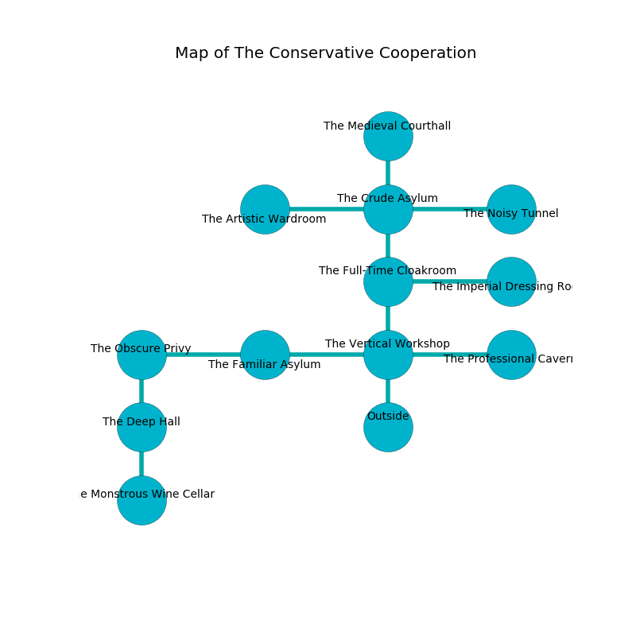

%Ruin Dogs

##The Conservative Cooperation
###Overview
The Conservative Cooperation is located in a poisoned rift. Some areas of The Conservative Cooperation are unbearably cold. The ruin is coming to life. It is occupied by Vampires. Nada Briggs The Untrustworthy, a Mind Flayer Arcanist is here. The Vampires are the slaves of Nada Briggs The Untrustworthy. She  is founding a new religion. 

###Artifact
####Dohhad

Dohhad looks like a sharp figurine. When worshipped it becomes a deadly projectile. 

###Locations

####the vertical workshop
Gray mushrooms are decaying in broken urns. There are two Vampire Spawns here. The Vampires are meditating. 

* To the west a small walkway opens to [the familiar asylum](#the-familiar-asylum).
* To the east a torchlit hall opens to [the professional cavern](#the-professional-cavern).
* To the north a flooded cavern opens to [the full-time cloakroom](#the-full-time-cloakroom).
* To the south is the entrance.

####the full-time cloakroom
There are a Wight, a Winter Wolf, a Dryad, an Elk, and a Pegasus here. Blue mushrooms are growing in cracks in the floor. 

There is an engraving on a monolith written in common. 

> Try praying.
>

* There is a sponge here.
* To the east a twisted path connects to [the imperial dressing room](#the-imperial-dressing-room).
* To the north a torchlit pathway leads to [the crude asylum](#the-crude-asylum).
* To the south a flooded cavern opens to [the vertical workshop](#the-vertical-workshop).

####the imperial dressing room
Gray moss is sprouting in a patch on the floor. The air tastes like beef here. The obsidion walls are scratched. The floor is smooth. 

* To the west a twisted path connects to [the full-time cloakroom](#the-full-time-cloakroom).

####the professional cavern
The wooden walls are pristine. White lichens are decaying in broken urns. The air tastes like chicken here. 

* There is a bridge here.
* To the west a torchlit hall connects to [the vertical workshop](#the-vertical-workshop).

####the familiar asylum
The crystal walls are scratched. The floor is glossy. 

There is an engraving on the wall written in common. 

> A trap ahead.
>

* To the west a torchlit threshold opens to [the obscure privy](#the-obscure-privy).
* To the east a small walkway connects to [the vertical workshop](#the-vertical-workshop).

####the crude asylum
Blue lichens are sprouting in broken urns. The air smells like roasted peanut here. 

There is an engraving on a stone written in common. 

> I am lost in The Conservative Cooperation.
>

* [Dohhad](#Dohhad) is here.
* To the west a dripping hallway leads to [the artistic wardroom](#the-artistic-wardroom).
* To the east a flooded gap opens to [the noisy tunnel](#the-noisy-tunnel).
* To the north a torchlit cavern leads to [the medieval courthall](#the-medieval-courthall).
* To the south a torchlit pathway connects to [the full-time cloakroom](#the-full-time-cloakroom).

####the obscure privy
The air tastes like cooked apple here. The crystal walls are scratched. There are two Vampire Spawns here. The Vampires are feasting. 

* To the east a torchlit threshold leads to [the familiar asylum](#the-familiar-asylum).
* To the south a twisted pathway opens to [the deep hall](#the-deep-hall).

####the artistic wardroom
There is a trap here. When activated, a magical proximity detector will collapse a column. Green moss is swaying in broken urns. 

* To the east a dripping hallway opens to [the crude asylum](#the-crude-asylum).

####the noisy tunnel
There are a Shield Guardian, a Zombie, a Cultist, and a Bronze Dragon Wyrmling here. The floor is cluttered with bones. The crystal walls are bloodstained. Gray razorgrass is sprouting from the walls. 

* To the west a flooded gap opens to [the crude asylum](#the-crude-asylum).

####the deep hall
White moss is sprouting from the walls. The floor is glossy. 

There is an engraving on the floor written in Vampires Script. 

> O! our fate is woe
>
> it is never low
>
> adequate and visible
>
> cruelty is slow
>

* To the north a twisted pathway leads to [the obscure privy](#the-obscure-privy).
* To the south a torchlit corridor leads to [the monstrous wine cellar](#the-monstrous-wine-cellar).

####the monstrous wine cellar
There are a Frog, an Orog, a Spider, an Assassin, a Smoke Mephit, and a Kobold here. The floor is bloodstained. 

* [Nada Briggs The Untrustworthy](#Nada-Briggs-The-Untrustworthy) is here.
* To the north a torchlit corridor connects to [the deep hall](#the-deep-hall).

####the medieval courthall
The crystal walls are pristine. The floor is cluttered with shells. 

There is an engraving on the wall written in common. 

> I thought about swimming.
>

* To the south a torchlit cavern opens to [the crude asylum](#the-crude-asylum).

