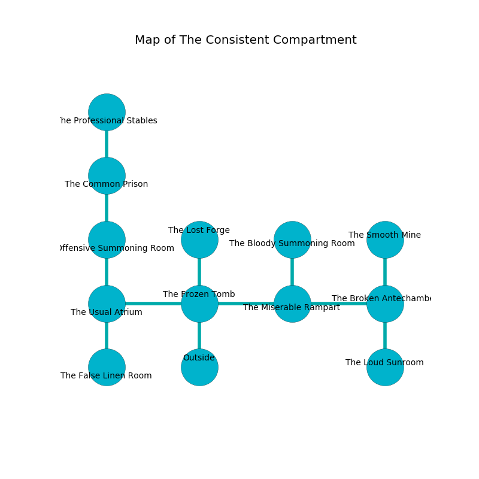

%Ruin Dogs

##The Consistent Compartment
###Overview
The Consistent Compartment is constructed on an obsidion rift. Regions of The Consistent Compartment are frozen. The ruin is larger on the inside than the outside. It is occupied by Goblins. Jimmy Roush The Bossy, an Assassin is here. The Goblins have been charmed by Jimmy Roush The Bossy. He  is trying to steal [Hefhaec](#Hefhaec). 

###Artifact
####Hefhaec

Hefhaec is a powerful artifact in the shape of a soft monument. It is a pale yellow color. Water incinerates around it. When held it tunnels into the earth. 

###Locations

####the frozen tomb
The air tastes like styrene here. There are an Imp, a Hell Hound, a Guard, a Thug, a Hobgoblin Warlord, a Bat, two Dire Wolves, and  here. 

* To the west a hazy hallway opens to [the usual atrium](#the-usual-atrium).
* To the east a dark walkway leads to [the miserable rampart](#the-miserable-rampart).
* To the north a long hallway opens to [the lost forge](#the-lost-forge).
* To the south is the entrance.

####the miserable rampart
The floor is cluttered with debris. 

* There is a box here.
* To the west a dark walkway opens to [the frozen tomb](#the-frozen-tomb).
* To the east a dark hall connects to [the broken antechamber](#the-broken-antechamber).
* To the north a narrow passageway connects to [the bloody summoning room](#the-bloody-summoning-room).

####the broken antechamber
There are two Goblins, a Hobgoblin Warlord, a Hobgoblin Captain, and  here. The metallic walls are scratched. The air smells like cocoa here. One of the Goblins is pointing a ballista at the entrance. 

* There is a stocking here.
* To the west a dark hall opens to [the miserable rampart](#the-miserable-rampart).
* To the north a dark path leads to [the smooth mine](#the-smooth-mine).
* To the south a dripping opening leads to [the loud sunroom](#the-loud-sunroom).

####the smooth mine
Blue moss is decaying from the walls. The floor is bloodstained. The concrete walls are bloodstained. The air tastes like tamarind here. There are a Guard, a Dryad, a Banshee, a Werebear, and a Rat here. 

There is an engraving on the floor written in common. 

> I am lonely.
>

* To the south a dark path leads to [the broken antechamber](#the-broken-antechamber).

####the lost forge
Green ferns are growing from the walls. The concrete walls are bloodstained. There are a Goblin, two Hobgoblins, two Hobgoblin Captains, a Hobgoblin Warlord,  here. One of the Goblins is on watch, the rest are sleeping. 

There is an engraving on a stone written in common. 

> Dig here.
>

* To the south a long hallway leads to [the frozen tomb](#the-frozen-tomb).

####the usual atrium
Blue moss is sprouting from the ceiling. The floor is bloodstained. There are an Ochre Jelly, a Tribal Warrior, a Cyclops, a Giant Bat, a Flesh Golem, and a Piercer here. 

* There is a jewel here.
* To the east a hazy hallway opens to [the frozen tomb](#the-frozen-tomb).
* To the north a dark cavern leads to [the offensive summoning room](#the-offensive-summoning-room).
* To the south a long walkway opens to [the false linen room](#the-false-linen-room).

####the loud sunroom
There are a Giant Constrictor Snake, an Ochre Jelly, an Eagle, a Merfolk, a Myconid Adult, and a Sahuagin Baron here. Gray razorgrass is sprouting from the walls. 

There is an engraving on a tablet written in common. 

> We are love
>
> cautious, weekly, political
>

* To the north a dripping opening connects to [the broken antechamber](#the-broken-antechamber).

####the offensive summoning room
The crystal walls are ruined. The floor is smooth. There are a Barbed Devil, a Helmed Horror, and an Acolyte here. 

* To the north a dark artery connects to [the common prison](#the-common-prison).
* To the south a dark cavern opens to [the usual atrium](#the-usual-atrium).

####the bloody summoning room
Gray razorgrass is growing in cracks in the floor. The air tastes like grapefruit here. There are a Hobgoblin and two Hobgoblin Warlords here. The brick walls are ruined. One of the Goblins is on watch, the rest are fighting amongst themselves. 

* There is a key here.
* To the south a narrow passageway leads to [the miserable rampart](#the-miserable-rampart).

####the false linen room
The air tastes like earth here. The wooden walls are bloodstained. Red ferns are sprouting from the ceiling. There are a Hobgoblin Warlord and a Hobgoblin Captain here. The Goblins are sleeping. 

* To the north a long walkway opens to [the usual atrium](#the-usual-atrium).

####the common prison
There are a Goblin, a Hobgoblin Warlord, and a Hobgoblin Captain here. The floor is cluttered with ashes. The Goblins are performing a ritual. If not interrupted, the ruin dogs will be weakened. 

* [Hefhaec](#Hefhaec) is here.
* To the north a twisted threshold connects to [the professional stables](#the-professional-stables).
* To the south a dark artery connects to [the offensive summoning room](#the-offensive-summoning-room).

####the professional stables
The air smells like fudge here. There are a Hobgoblin, a Hobgoblin Captain, and a Hobgoblin Warlord here. The floor is cluttered with debris. If the Goblins notice the Ruin Dogs, one of them will retreat and alert the others. 

There is an engraving on a stone written in Goblins Script. 

> I am sneaky.
>

* There is a tome here.
* There is a knot here.
* [Jimmy Roush The Bossy](#Jimmy-Roush-The-Bossy) is here.
* To the south a twisted threshold opens to [the common prison](#the-common-prison).

